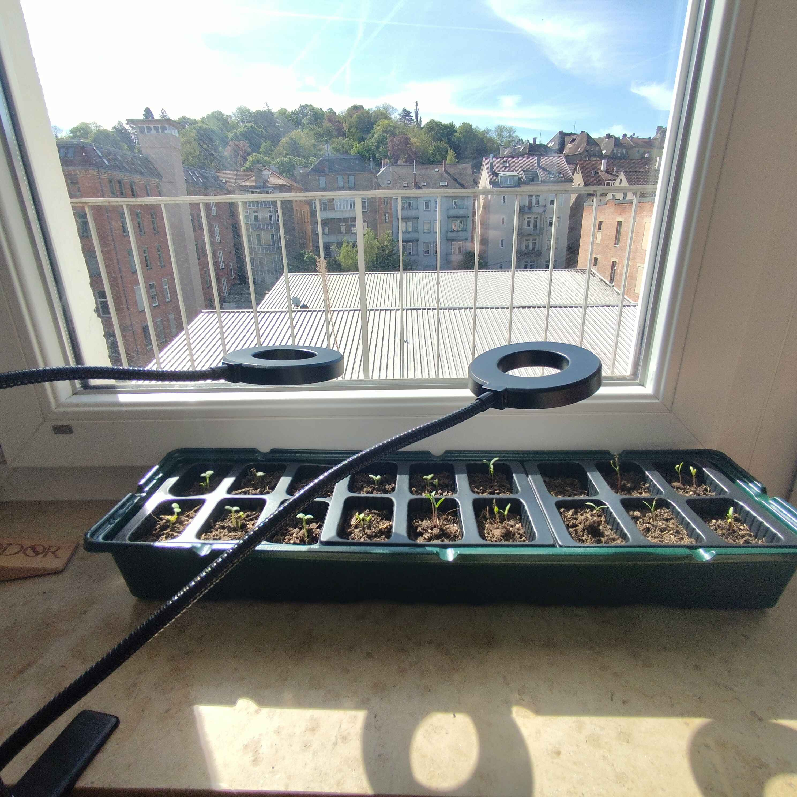
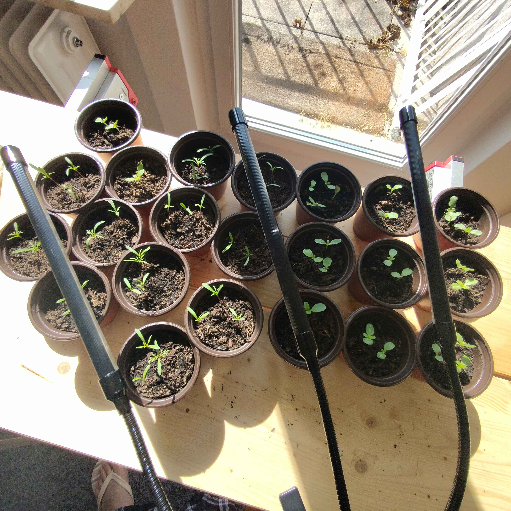
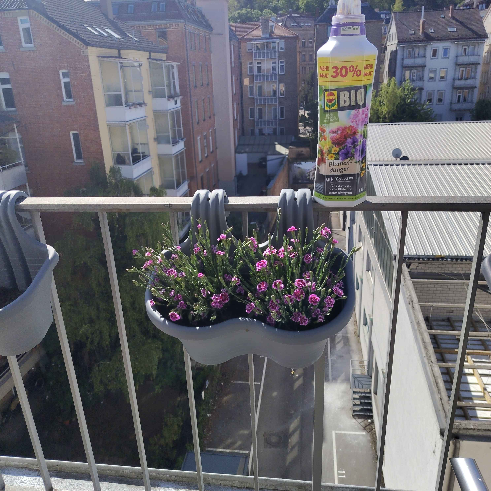
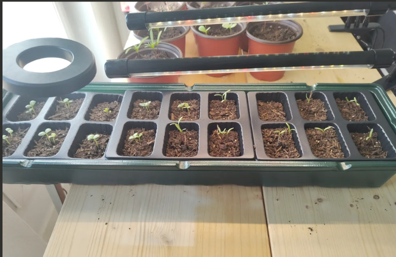
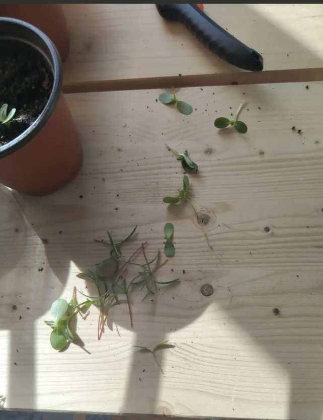
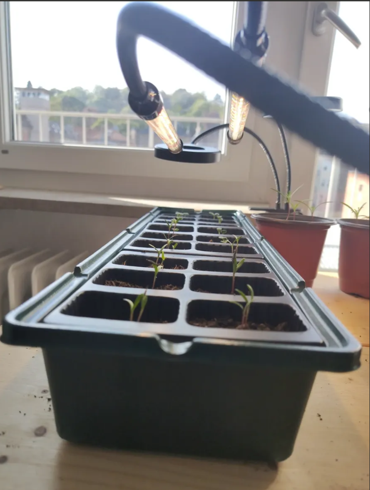

# Photo Gallery — Emma's Garden Journey

**Every garden starts somewhere — here's where Emma's story begins!**

---

## The Supply Haul — "Let's Do This!"

The adventure kicked off with a trip to the store and a table full of possibilities. Three bags of soil, a dream, and zero idea what to do next — the perfect starting point for every first-time gardener.

From left to right: the **orchid soil** (sneaky imposter — NOT for flowers!), the trusty **Compo Bio seed starting mix** (the real MVP), and a bag of **Blumenerde** flower soil. Emma was locked and loaded.

---

## Seeds & Bulbs — "So Many Choices!"

The full seed and bulb collection, laid out like a treasure map to summer blooms. Top row: **Cosmos** (Schmuckkörbchen) with their cheerful daisy faces, and **Zinnias** in a riot of pinks, reds, and oranges. Bottom left: **Duft-Lavendel** (Munstead lavender) — the slow and steady one that'll be worth the wait.

And the star of the show? That big **Brodiaea Queen Fabiola** 25-pack of bulbs front and center — those little violet-blue beauties are going to steal the show come June. You can even see the individual bulbs peeking through the packaging!

---

## The Railing Planters — "These Are Perfect!"

Brand new **gray double-hook railing planters**, fresh out of the box and looking like they were made for this balcony. These wavy-edged beauties will hang right on the railing and hold the brodiaea bulbs for their summer debut.

The double-hook design means they'll stay secure even on windy Stuttgart days. Also, shoutout to whatever's on HGTV in the background — multitasking at its finest.

---

## Filled & Ready — "Getting Our Hands Dirty!"

This is where it gets real! Both planters are now out on the balcony, filled with rich dark **Compo Bio soil** and ready for bulbs. Emma's trusty **pink garden trowel** made its debut here — small but mighty, just like this garden.

You can see the soil bag peeking in from the left — the assembly line was in full swing. This is the moment it stopped being an idea and started being a garden.

---

## Bulbs In Position — "They Look Like Little Treasures!"

The **Brodiaea Queen Fabiola bulbs** are placed on the soil surface before being pushed down to their final depth. Look at those gorgeous little golden-brown corms — each one holding a future cluster of violet-blue star-shaped flowers inside.

Eight bulbs perfectly spaced across the planter, sitting at the surface and ready to be tucked in 8-10 cm deep. By June, each one of these will send up a tall stem topped with a burst of purple blooms. Hard to believe right now, but that's the magic of bulbs!

---

## Holes Dug — "Almost There!"

The final step before the bulbs go in! Neat little holes poked into the soil, each one about **8-10 cm deep** — the perfect cozy bed for a brodiaea bulb. After this photo, the bulbs went in, got covered with soil, and received their first gentle watering.

This planter is now officially planted. These holes are basically tiny apartments for flowers that'll pay rent in blooms all summer long.

---

---

# Day 2 — April 16, 2026: Seeds Go In!

---

## The Sowing Station — "We're Really Doing This!"

The table has been transformed into a proper seed-starting command center! An **18-cell seed tray** sits front and center, all cells filled with rich brown Compo Bio soil. The cosmos and zinnia seed packets are open and scattered on the table alongside a pair of scissors (for opening packets), and both the **pink and blue trowels** have reported for duty.

You can see a few stray seeds on the table surface — the tiny dark specks that are about to become a whole summer's worth of flowers. Nine cells for cosmos, nine for zinnias. Each cell got a little 1 cm indent, 1–2 seeds dropped in, and a light cover of soil on top. Assembly line gardening at its finest!

---

## The Gear — "A Mini Greenhouse!"

Before any soil went in, here's what the setup looked like: the **18-cell seed tray** sitting on the table next to a **gray spray bottle** that's about to become Emma's best friend for the next week. That clear lid in front? That's the **humidity dome** — it turns the whole tray into a mini greenhouse, trapping warmth and moisture to give the seeds the best possible start.

The tray comes in three snap-together sections of six cells each — clever design that makes it easy to separate varieties later if needed.

---

## On the Windowsill — "Now We Wait!"

And there it is — the **seed tray in its new home** on a bright indoor windowsill, with the clear humidity lid sitting right in front, ready to go on top. Through the window you can see the balcony where the brodiaea bulbs are already planted and waiting for summer.

This windowsill is about to become the most watched spot in the apartment. Every morning for the next 5–10 days, someone's going to peek at those cells looking for the tiniest hint of green. When the first sprouts appear, the lid comes off and the real growing begins!

**The countdown is on:** Cosmos and zinnias typically germinate in 5–10 days, so expect first signs of life around **April 21–26.**

---

---

# Day 3 — April 17, 2026: The OBI Haul!

---

## The Gift Arrangement & New Friends — "Look at All That Color!"

This photo is pure spring energy. The **gift flower arrangement** is sitting on the balcony in all its crowded, colorful glory — bright yellow **daffodils** stretching tall, red and pink **ranunculus** bursting open like little roses, deep purple **pansies** filling in the gaps, sunny **primrose** peeking through, delicate blue **forget-me-nots** adding that dreamy touch, and spindly **pussy willow** branches reaching up from the back.

Next to it sits the newcomer — a potted **pink dianthus**, looking prim and ready for its own hanging planter. There's a second dianthus just out of frame. These are the kind of flowers that'll bloom all summer with regular deadheading.

The spray bottle stands guard on the left — always within reach!

---

## Babiana Bulbs — "More Bulbs, More Blooms!"

Michael's holding up the **Babiana "Mischung"** (mixed colors) bulb packet — 15 bulbs! — over the gray railing planter where holes have already been dug and are ready for planting. The pink trowel is peeking in from the left, fresh from digging duty.

Babiana are related to freesias and gladiolus, and produce gorgeous clusters of purple, blue, and white star-shaped flowers. These will add another wave of color to the balcony alongside the brodiaea that are already planted next door.

This is what happens when you go to the store "just for pots" — you come home with bulbs too. Classic gardener behavior!

---

## Basil — "Fresh Herbs on the Balcony!"

A lush, leafy **basil plant** (Basilikum) sitting in its new **black 27cm TEDI pot** on the balcony floor. Those big, bright green leaves are practically glowing in the sunlight. This is a plant that's clearly happy to be in a sunny spot.

The key to keeping basil like this: **pinch the tops regularly**. Every time you snip from the top, the plant branches out and gets bushier. Once it flowers, the leaves turn bitter — so keep pinching, keep using, and enjoy fresh basil all summer. Caprese salads, pesto, pasta toppings — this plant is going to earn its spot on the balcony!

---

## Chocolate Mint — "The Solo Artist"

**Chocolate mint** in its own black TEDI pot, sitting solo on the balcony — exactly where it should be. Those dark-tinged green leaves give off an incredible chocolatey-mint scent when you brush past them.

Why is it alone? Because mint is the most aggressive plant in the garden world. It sends out underground runners in every direction and will absolutely colonize any pot it shares within weeks. Chocolate mint gets its own pot, its own space, and its own watering schedule (slightly more moisture than the flowers). Think of it as the talented but difficult roommate who needs to live alone.

Bonus: mint makes amazing tea, mojitos, and dessert garnishes. And it'll grow back no matter how much you harvest!

---

---

# Day 4 — April 18, 2026: Dianthus Day (and a Hose!)

---

## Pink Dianthus on the Railing — "They Found Their Home!"

After an afternoon shopping run to TEDI, the two **pink dianthus** finally got their own place: a **€4 gray saddle planter (37 × 28cm)** — same gray finish as the brodiaea planters, properly deep, and wide enough for the pair to sit comfortably side-by-side. Drainage hole confirmed on the spot.

They went in in the evening (cooler temperatures = less transplant stress), crowns level with the soil (never bury the crown — that's how dianthus rot), spaced 15–20cm apart, backfilled with brown Compo, and given a slow thorough drink until water ran out the bottom. Then straight up onto the sunny railing alongside the rest of the gray planters.

The view from the balcony is something else — Stuttgart rooftops stretching out behind them, and now there's a perfect little pop of pink in the middle of that gray railing lineup. This is exactly what **curb appeal from 4 stories up** looks like.

---

## The New Hose — "No More Watering Can Marathons!"

Peak gardener energy: Emma ordered an **expandable garden hose** and got it installed on the balcony wall today. Green hose with a black protective outer sleeve (the expandable kind that stretches 3x when the water's on, then retracts back to storage size), a multi-pattern spray nozzle in green, and brass quick-connect fittings to the wall tap.

Mounted to the wall hanger so it stays tidy between uses — no hose-snake situation on the floor. This is going to transform the watering routine: no more trooping back and forth between the kitchen sink and the balcony with a full can, no more spills, and the spray nozzle means gentle shower mode for seedlings and full blast for cleanup.

---

## Workstation Cleaned — "A Tidy Garden is a Happy Garden"

First job for the new hose: a proper wash-down of the balcony workstation area. The tiled floor got hosed off, the crate of supplies sits neat on its stand in the corner, and all the soil dust and potting debris from the past few days is gone.

This is the corner where all the real work happens — pots get filled, bulbs get sorted, seedlings get fussed over. Having it clean and ready to go makes the next planting session feel effortless. That's a lesson most gardeners learn eventually: **the workstation matters almost as much as the plants.**

---

---

# Day 5 — April 19, 2026: WE HAVE SPROUTS!

---

## First Sprouts — "The Tray is ALIVE!"

Three days. That's all it took. Sown on **April 16**, peeking through the soil on **April 19** — ahead of schedule and absolutely right on the money for a humidity-dome-plus-bright-windowsill setup.

Look at them! Tiny curled yellow-green **cotyledons** (that's the technical name for the first pair of seed leaves) pushing through the soil in several cells. These aren't the "real" leaves yet — those come next — but they're the proof that germination worked. Every one of these little green specks is a seed that cracked, pushed a root down, and then reversed direction and shoved a shoot UP through the soil toward the light. It's the most ordinary miracle in all of gardening.

The speedy ones are almost certainly the **zinnias** — they're famous for germinating in 3–7 days. The cosmos usually take a touch longer, so expect more cells to wake up over the next 3–5 days. Some cells may never sprout, and that's fine — Emma sowed 1–2 seeds per cell specifically to account for that.

**Big change today:** the humidity lid comes OFF (or gets propped open). Once there's green showing, the dome starts working against you — too much moisture around sprouts invites **damping off**, the fungal disease that collapses seedlings overnight. From here on, the tray wants bright light, gentle air circulation, and water from below (pour into the outer green tray — the cells wick it up without flattening the sprouts).

**Pro tip already in play:** rotate the tray 180° every day. Sprouts lean HARD toward the brightest light, and a half-turn daily keeps them growing straight instead of permanently tilted.

**What's next on the seedling watch:**
- More cells waking up over the next week
- **First true leaves** (1–2 weeks from now) — the signal to start a gentle feeding routine
- **Hardening off** starts early May — a week of gradual outdoor exposure before the full move
- **May 15+** — the big transplant outdoors after Stuttgart's Eisheiligen frost risk passes

This is the moment every seed-starting gardener lives for. The balcony just became a nursery.

---

## Basil After Replanting — "Look at Those Leaves!"

The **basil** got replanted and is absolutely thriving. Those big, lush green leaves are filling out the pot beautifully — clearly loving the fresh soil and the morning sun. This is a basil plant that's ready to start earning its keep in the kitchen. The replanting gave it room to spread out, and it's responding with the kind of vigorous growth that says "I'm happy here."

Freshly watered and glistening on the patio tiles — this is what a well-settled herb looks like.

---

## Mint After Replanting — "The Comeback Kid"

The **chocolate mint** is bouncing back after its replanting with fresh bright green shoots pushing up through the dark soil. You can see several new growth points — each one of those little leaf clusters is going to become a full stem within a week or two. Mint is famously resilient, and this one is proving the point.

Sitting by the window ledge with plenty of light, the mint is wasting no time establishing itself in its refreshed pot. Give it a couple of weeks and this pot will be overflowing with fragrant leaves.

---

---

# Day 6 — April 20, 2026: The Babies Are Here!

---

## Sproutlings Progress — "Oh My God, They're Alive!"

The moment every first-time gardener dreams about — and Emma's reaction was exactly what you'd expect. She headed straight to the windowsill first thing in the morning, coffee forgotten, phone in hand, ready to document everything.

And what a sight! The **18-cell seed tray** is buzzing with life. Approximately **70% of cells** now have visible sprouts — tiny green shoots standing upright, pushing through the dark Compo Bio soil. Cosmos and zinnias, both sprouting strong. The seeds were sown on April 16, first sprouts appeared on April 19 (just 3 days!), and by this morning they're well ahead of the 5–10 day estimate.

The humidity dome is off — you can see it pushed to the side. The **zinnia seed packet** sits on the table like a proud birth certificate, and there's even a **wine cork** nearby that was offered as a dome-propping solution (turns out the dome has a built-in slider vent — problem solved!). Through the window behind the tray, the balcony is visible where the brodiaea and babiana bulbs are quietly doing their underground work.

The soil is dark and wet — too wet, actually. Today's care plan: no watering (let it dry back), dome off during sunny hours for airflow, dome back on at night for warmth, and a daily 180° rotation so the sprouts grow straight instead of leaning toward the light.

**Emma's emotional state during this session:** nervous, anxious, hovering, utterly devoted. Had to be told three times to step away and go make coffee. Classic first-time plant parent energy — and honestly? The sprouts are lucky to have her.

---

---

---

# Day 7 — April 22, 2026: Tray 2 & The Grow Light!

---

## The Indoor Nursery Levels Up — "Succession Sowing + Real Light!"

The indoor setup finally looks the part. A **dual-head gooseneck LED ring grow light** arched over **Tray 1** (leggy cosmos and zinnia sprouts stretching for the window), with **Tray 2** in the back — freshly sown, dome on, waiting out its germination window. Stuttgart rooftops glow in the evening light through the balcony railing behind it.

Tray 2 got the same treatment as Tray 1 (TEDI lidded cell tray, Compo Sana Qualitäts-Blumenerde, 1–2 seeds per cell, covered with ~0.5 cm of soil, misted) — but this time positioned right under the grow light from day one. Expected sprouts in ~3 days.

The grow light was initially too high (~25–30 cm up) and got **lowered to 10–15 cm** above the seedling tops, set on a **16-hour timer** with 8 hours of consecutive darkness. Tray 1's leggy sprouts will tighten up over the next 2–4 days under the proper light, and any remaining stretched stems will get **buried deep at transplant** — cosmos and zinnia root along the buried portion of the stem, turning the stretch into extra anchoring.

---

---

# Day 8 — April 23, 2026: Dianthus In, The Nook Is Born!

---

## Dianthus Thriving on the Railing — "Pink Heaven!"

Five days after planting and the two pink **dianthus** are showing what they were bought for: full, bushy foliage, pink blooms open, and dozens of unopened buds promising weeks of color ahead. The €4 gray TEDI saddle planter is doing exactly what it was picked for — sitting pretty on the railing, framing a view of the Stuttgart rooftops.

Care from here is easy: **let the top 2 cm of soil dry** between waterings (dianthus hate soggy roots), and **deadhead** spent blooms (pinch them off once they fade and brown) to keep new ones coming all season. It rained two days ago, so no watering today — the saddle planter is draining well and the soil is still moist a knuckle deep.

---

## Michael's Nook — "A Little Green On The Granite Sill"

A new chapter for the apartment: **Michael's Nook**. The granite windowsill is now home to three carefully chosen plants, lined up left to right and soaking up the afternoon sun over Stuttgart's rooftops.

- **Snake plant (Sansevieria trifasciata 'Laurentii')** — that compact upright rosette with bold yellow-edged green leaves. Picked over the silvery 'Moonshine' because the yellow margins play perfectly off the granite.
- **Haworthia "Safari"** (tiger aloe) — tiny, white-speckled rosette. Stood in for the Aloe vera (the ones at OBI looked overwatered and floppy). The speckled pattern echoes the snake plant's banding.
- **Mini pineapple (Ananas nanus)** — the bromeliad with the decorative fruit crown, picked for the greenest, freshest fruit on the shelf.

They're still in their nursery pots for now — proper pots with drainage holes and saucers are arriving from Amazon on Saturday (12 cm for the snake plant and mini pineapple, 10–11 cm for the tiger aloe). Soil is already ready: **OBI Kakteen- und Bonsaierde torffrei** (peat-free cactus/bonsai mix).

Until then: no watering, rotate each pot a quarter-turn every couple of days, and enjoy the view.

---

---

# Day 10 — April 24, 2026: The Evergreen Project!

---

## The OBI Haul — "We Came, We Saw, We Bought Everything"

This is what happens when you walk into OBI with a refined plan and a purpose. The **setup table** is completely covered: a bag of **Compo Cactea** peat-free succulent soil on the left, a **measuring jug** for precise soil and fertilizer dosing, the new **Compo BIO Blumendünger** (the yellow bottle with "Mit Kalium" — potassium for more blooms, less leaves), a pair of **OBI bypass pruners** with that orange safety lock, and the stars of the show — the **NORA anchor pots** in metallic grey, stacked and ready.

The big dark pot in the center is one of the anchor pots up close — formwerk GmbH, made in Germany, 26-28cm diameter. Four of these came home today, though only two are going into service immediately. The other two? Reserve pots. Because as Emma's already learned: "plenty is never bad."

Behind everything, you can spot the existing plants on the railing — the brodiaea planters and dianthus still doing their thing in the sun. The garden is growing in every direction.

---

## The Euonymus Pair — "Matching But Different"

Meet the newest residents: two **Euonymus fortunei** shrubs, sitting pretty in their nursery pots on the balcony. **Golden-variegated** on the left — bright lime-green and gold leaves that practically glow in the sunlight. **White-variegated** on the right — darker green with crisp white edges, a cooler contrast.

These are evergreen shrubs that'll provide year-round structure on the balcony long after the annuals have gone to sleep. They're tucked in **partial shade** for now — variegated leaves are scorch-prone and need a day or two to acclimate before they can handle full sun. Tomorrow they'll move into the freed-up black 27x24cm pots (the ones that used to house the basil) with straight Compo Sana soil. Matched pair, matched pots — visual balance on the balcony.

The key decision here: Euonymus was originally considered for the anchor pots alongside the Sempervivum, but its woody 30-60cm spread would have crowded everything out. Separate pots, separate soil, better for everyone.

---

## New Dianthus + Hanging Planter — "The Band Is Getting Bigger"

Two more **pink dianthus** have joined the squad! These little charmers are still in their nursery wraps on the workstation, sitting next to the **grey hanging planter** that's about to become their home. Look at those delicate pink and purple blooms — already flowering and ready to perform.

This new pair will go into the hanging planter tomorrow and join the existing 37x28cm Dianthus pot on the railing for a matched visual setup. Straight Compo Sana soil, good drainage, full sun position. The dianthus care playbook is simple: deadhead the spent blooms, don't overwater, and they'll keep flowering all summer.

Behind them you can see the decorative glass block wall and the railing planters holding their own in the background — the balcony is filling up with life at every level.

---

## Dual Grow Lights — "The Nursery Goes Pro"

This is what serious seedling care looks like. **Two Niello 3-head grow lights** — **5 goosenecks total** — arcing over the seed tray like some kind of botanical space station. The original unit had 2 heads; this second unit adds 3 more, giving much better coverage now that the bigger cell trays have arrived.

The seedlings are visible in the cells below — sturdy little green shoots that have come a long way since Day 3. The setup sits on a dark wooden table by the window, getting both natural light from the balcony door and supplemental LED coverage on a **16-hour cycle**. Heads are positioned **10-15cm above the tallest seedlings** and spaced evenly to eliminate shadows.

The bigger cell trays (also arrived today) are for upsizing the seedlings before the May 15 outdoor transplant. These babies are getting the VIP treatment, and it shows.

---

---

# Day 11 — April 25, 2026: The Big Planting Day!

> *"No rest for the wicked."* — Emma, mid-transplant

---

## The OBI Haul — "Soil for Days"

The day kicked off with a run to OBI for **~20 L of Compo Sana Qualitäts-Blumenerde** — the good stuff, and exactly enough to get through the Euonymus repot and the Sempervivum anchor blend. The supply crate came home loaded up, and a small **Lavandula angustifolia** (OBI Grow line, €3.49) hopped in too — healthy roots, already budding, perfect candidate for the all-grey wall on Zone B. Lavandula angustifolia was on the wishlist since April 23, when only the wrong species (Lavandula stoechas — not winter-hardy in Stuttgart) was in stock. ✅ closed.

Aside: the tile-joint weed situation got researched on the way home. **Chemical herbicides are illegal in Germany on paved surfaces (§12 PflSchG)**, so the legal toolkit is a Fugenkratzer (joint scraper), boiling water, or a heat gun. Filed under "tomorrow."

---

## Pot-Up Cells Ready — "Amazon Came Through"

The Amazon pot order landed Saturday morning right on cue, and 18 of the brand-new **10 cm copper-pink propagation cups** got laid out on the patio worktable. Tray 1 (sown April 16) had hit Day 9, the cosmos were leggy, and these cups were exactly the next-step-up that the seedlings needed: enough room to grow real roots without so much extra soil that the small root balls would sit wet.

Drainage holes confirmed in every cup. Soil pre-moistened. Spray bottle within arm's reach. Workstation set.

---

## Tray 1 Potted Up — "The Leggy Get a Lifeline"

The big move. **24 cells worth** of cosmos and zinnia got popped out of the seed tray and tucked into their new individual cups. Working outside on the **shaded patio table** doubled as a soft hardening-off step — first time these seedlings have felt outdoor air.

The legginess strategy:

- **Cosmos** (left/center, narrow cotyledons, stretched stems) → buried below the cotyledons. Cosmos roots along the buried portion of the stem, so the stretch becomes extra anchoring instead of a weakness.
- **Zinnia** (right, broader cotyledons) → handled by the leaves, not the stem. Zinnia stems don't re-root the same way, so burying them is just rot risk for no benefit.

After potting, everything came back inside under the **5-gooseneck grow light** setup that just went up on April 24 — but with the lights raised and the timer cut to **12 hr for the next 24–48 hr** to ease the transplant shock. **No water tomorrow** unless the soil surface is bone dry to the touch.

---

## Third Dianthus Pair — "The Railing Trio Is Complete"

The dianthus pair purchased on April 24 finally got their grey hanging planter on the railing — a third one matching the pair already up there. **Three pink dianthus planters now line the railing**, and the rhythm is exactly what the gray-pot lineup needed visually: pink → pink → pink against the gray rail and the Stuttgart rooftops.

Used leftover Compo Sana from the Euonymus job — no waste. Watered in. Done.

---

## Euonymus Fortunei — "Zone A Backbone"

The matching pair of **Euonymus fortunei** (golden-variegated + white-variegated, acclimated overnight per the April 24 plan) went into the **freed-up black 27×24 cm ex-mint pots** — straight Compo Sana, no Cactea blend. Same depth as the nursery pots, **stems NOT buried**. Watered to runoff.

Each pot is a multi-stemmed plant kept intact — single plant per pot, do *not* separate the stems. Doing so would destabilize the root ball and stress an evergreen that doesn't need any extra drama to start its first season on the balcony. When they go to Zone A (the short wall, black-pot zone), they'll face their bushiest side outward.

This is the **Evergreen Project** finally landing — same concept that's been on the table since April 23 and refined on April 24.

---

## Sempervivum Anchor Pots — "Hens, Chicks, and Rocks"

The Sempervivum 6-pack from April 23 finally got its real home. The 6-pack split across **two of the four NORA anchor pots**, with the **40/60 Cactea/Sana blend** worked out on April 24 (lean enough for the alpine roots, rich enough that cosmos/zinnia can later share the pot). Crowns kept at soil level — *never buried*, which is how Sempervivum rot in days. Then a **full alpine-style rock top-dress** to finish: pale gravel covering all the bare soil, framing each rosette.

The mix landed up beautifully — green rosettes, deep burgundy/purple rosettes, and a few **S. arachnoideum** (the cobweb-haired one with white silk strands across the rosette).

**Care non-negotiables (already established April 24):**

- **NO water for 3–5 days.** The roots need to heal first; watering now invites rot.
- **NEVER fertilize.** Sempervivum want lean soil. Feeding kills them just as surely as overwatering.

The **other two NORA anchor pots stay in reserve**: one for the lavender (tomorrow), one for the cosmos/zinnia overflow post-May 15.

---

## The Patio Battlefield — "Worth It"

By the end of the day the workstation was a scene. Trowel down, soil dust everywhere, the lavender sitting on the bench waiting for tomorrow, the reading chair pushed aside. Emma called it a battlefield.

Around **9 hours start to finish** — morning OBI run through the final rock placement on the second Sempervivum pot. Mid-day was the rough stretch (the leggy seedling work is nerve-racking when you've watched these things sprout from nothing). Working in shade on the patio table was good for the plants and fine for the back and wrists. Lessons logged for next time:

- **Always pre-moisten new soil** before transplanting — fluffy dry soil eats roots when you firm it down.
- **Decorative rock placement around individual rosettes** ate way more time than it added value. Next time: dump and spread.
- **Order dinner BEFORE the 9-hour work session, not after.**

---

## Bonus — Mint Propagation Worked!

Emma's mint pot now has tiny new plants sprouting from the deleafed stems she replanted earlier in the project. **Confirmation that stem-cutting propagation is a working method to redirect or replace mint** — useful intel for keeping the chocolate mint pot productive long-term. Stays isolated from everything else, of course (mint is invasive and will colonize anything sharing its container).

---

## Final Balcony Zoning — "Locked In"

End-of-day map:

- **Zone A (short wall, BLACK pots):** 2× Euonymus in the black ex-mint pots ✅. Matches the existing black pot at the far end. Sunny morning exposure.
- **Railing (GREY hangers):** dianthus — 4 plants in 2 pots ✅.
- **Zone B (long sunny wall, ALL GREY):** 2× NORA anchor pots with Sempervivum ✅, 1× NORA pot reserved for the lavender (tomorrow), 1× NORA pot reserved for cosmos/zinnia overflow post-May 15. Reading chair to be relocated.

Year-round backbone in place; seasonal rotation can now layer on top of it.

---

---

# Day 12 — April 26, 2026: End-of-April Closeout!

---

## Lavender + Sempervivum — "The Zone B Wall Is Alive!"

The sunny stucco wall finally has its permanent residents. Three grey pots lined up against the white wall: **Sempervivum** anchor pots flanking a freshly planted **Lavandula angustifolia** in the center. All three are top-dressed with the same 5–10mm gravel — it keeps the crowns dry, prevents rot at soil level, and looks clean against the grey pots.

The lavender went in with a 60% Kakteenerde / 40% Sana soil blend — grittier even than the Sempervivum mix, because lavender is Mediterranean and wants all the drainage it can get. Crown placed at or above the soil line (buried crown = the #1 lavender killer). One deep watering to settle, then nothing — lean soil, full sun, benign neglect. This is a plant that thrives on being ignored.

The Sempervivum rosettes are already showing their colors — reds and greens and bronzes catching the afternoon light. They'll multiply all summer, sending out chicks on runners until the pots are full.

---

## The Nook — "All Grown Up!"

**Michael's Nook** is officially finished. The three plants that arrived in OBI nursery pots on April 23 are now in their proper homes — matching white pots with drainage mesh discs, filled with straight Kakteenerde. Left to right on the granite sill: the bold **Sansevieria 'Laurentii'** with its yellow-edged leaves, the **mini pineapple** with its tiny fruit crown in the center, and the compact **Aloe variegata "Safari"** with its white-speckled rosettes.

The Stuttgart rooftops frame the scene through the window behind them. This is the view from the reading chair — the Poäng, the granite sill, the plants, the city. Not bad for a first-time gardener's apartment.

No watering for 5–7 days post-repot — root wounds need to callus. First drink around May 1–3.

---

## The Balcony — "April Baseline"

This is it. The **April 2026 baseline** — the reference shot for comparing how everything looks in July when the cosmos are towering, the zinnias are blazing, and the brodiaea are (hopefully) putting on a violet-blue show.

Clean tiles (tile weeds tackled with the new Fugenkratzer), Poäng chairs in position, plants dotting the railing and the sunny wall. The hanging planters with brodiaea and babiana are visible along the railing, the dianthus in their saddle planter catching sun, and the Euonymus and herb pots tucked along the edges. The workstation area is clear. The glass block wall filters the afternoon light.

This balcony went from bare concrete to a living garden in twelve days. Coffee, view, Poäng. That's the life.

---

## Tray 2 — "Day 4 Under The Dome"

Tray 2 (sown April 22) on day 4 of germination. The humidity dome is still on — healthy condensation droplets lining the inside, and through the plastic you can spot **~6 sprouts** breaking through the soil. Right on schedule.

The dome cracking sequence starts in 2–3 days: prop one corner first, then half-off, then fully off over about 3 days. Same careful transition that worked for Tray 1. These babies are following the playbook.

---

---

# Day 13 — April 27, 2026: Dome Off, True Leaves Up!

---

## Tray 2 Graduates — "Dome's Off, We're Flying Free"

Day 5 and **16 of 18 cells** have germinated. The dome's job is done — off it comes entirely. Cotyledons are fully open, cells evenly tall (cosmos at one height, zinnia at another, no legginess within either group). The two laggards may still pop in the next couple of days, but the dome staying on would risk damping-off at this point.

Tray 2 now joins Tray 1 in the open-air nursery phase: fan on, lights at 10–12cm, and the protective microclimate behind it.

---

## Tray 1 True Leaves — "They're Actually Growing"

Day 11 from sow, Day 2 post-pot-up, and the **first true leaves** are here. The zinnias are the clearest — pointed leaves emerging between the rounded cotyledons. The cosmos are showing the same on most pots. Deep green throughout, no purpling, no yellowing. Photosynthesis is ramping up.

You can also see the doubles — several pots have two seedlings competing for the same cup. Those get thinned in the next 3–5 days: snip the weaker one at soil level with the bypass pruners, never pull (pulling disturbs the keeper's roots).

The pot-up clearly didn't shock them. Two days post-transplant and they're already pushing new growth. Clean win.

---

## Dianthus First Feed — "Breakfast on the Railing"

The dianthus got their first proper meal: **Compo BIO Blumendunger at half strength** (10ml in 2L water). Soil was already moist, so no pre-watering needed — just mixed, swirled, and poured at soil level. The yellow BIO bottle perched on the railing like a proud sponsor.

Expect a flower flush within 10–14 days. Next feed ~May 11–18, every 2–3 weeks through bloom season.

---

---

# Day 14 — April 28, 2026: First Thinning & Spring Setup Wraps

> **Content is user-generated and unverified.**

---

## Tray 1 Pre-Thin — "One Last Look Before the Cut"

The toddlers (sown Apr 16, potted up Apr 25) hit Day 3 in their 10cm cells. True leaves emerging across the tray — time to thin. This is the last photo with doubles and triples still competing for space.

Morning sun coming through the balcony window, Tray 2 cells visible in the foreground. The whole nursery lit up by goosenecks and daylight.

---

## The Thinned Ones — "They Did Their Job"

The hard part. One keeper per cell, weakest snipped at soil line — never pulled, because pulling disturbs the keeper's roots. Cosmos selection: reddest stem (Bipinnatus pigment correlates with vigor) + least leggy. Zinnia selection: biggest true leaves + greenest stem.

These little guys are laid out on the bench. They confirmed the keepers were the strongest. OBI bypass pruners did the job — alcohol-swabbed and fully dried before use.

---

## Tray 1 Post-Thinning — "One Strong Keeper Per Cell"

Top-down view after the thinning is done. Each cell now holds one strong keeper with full root volume to claim. No more competition — every seedling gets the whole cup to itself.

The cosmos (narrow leaves) and zinnias (broader leaves) are all clearly pushing true leaves. Deep green throughout, no stress visible.

---

## Tray 2 Babies — "Even Green, Settling In"

The babies (sown Apr 22, dome off Apr 27) settling into open air on Day 6. Final germination: 17 of 18 — one no-show, normal attrition. Color and heights uniform with one mild stretcher (genetic, not a concern). Light dropped from 15cm to 10cm to encourage compact growth.

---

## The Story So Far

Forty-seven photos across fourteen days. Tray 1 has been thinned — one keeper per cell, the hardest call yet. Tray 2 is settling into open air at 17/18 germination. The spring outdoor setup is officially wrapped: zones established, railing complete, tile joints cleaned.

Emma's garden now has:
- **Bulbs** in the railing planters (brodiaea) and hanging planter (babiana)
- **Two trays of seedlings** under grow lights — Tray 1 thinned to one keeper per cell, Tray 2 at 17/18
- **Lavender** planted on the Zone B sunny wall
- **Sempervivum** in anchor pots
- **Euonymus** pair (Zone A backbone) looking sharp
- **Dianthus** — 4 plants in 2 grey hanging pots on the railing, first feed done Apr 27
- **Michael's Nook** — repotted and resting, first water ~May 1–3
- **Chocolate mint** thriving solo + propagating
- **Capillary mat** received and banked for May trip

**Coming up:**
- Tray 1 checkpoint ~Apr 30 — new true leaves, stem strength
- First Nook watering (~May 1–3)
- Tray 2 pot-up window: ~May 8–12
- Capillary mat trial run before May 26–28 trip
- Pre-trip shopping: Blumat carrots, timer plug
- May 20–25: travel (watering automation in place)
- ~May 26–28: THE BIG TRANSPLANT — cosmos and zinnias go outdoors!

> Fourteen sessions in. The toddlers survived thinning. The babies are settling in. The spring setup is wrapped. Now we wait, water, and watch them grow.

---

*Photos from April 14–28, 2026 — Days 1 through 14 of Emma's Garden*
