# Progress Report — Emma's Balcony Flower Garden

**Stuttgart, Germany | Started April 2026**

---

## Milestones

| Date | Milestone | Status |
|------|-----------|--------|
| April 14, 2026 | First-ever gardening session — learned the basics | Done |
| April 15, 2026 | Full project planned — all supplies inventoried | Done |
| April 15, 2026 | Brodiaea bulbs planted in both railing planters | Done |
| April 16, 2026 | Seed tray purchased, cosmos & zinnias sown indoors | Done |
| April 16, 2026 | Lavender postponed to next season | Done (decision) |
| April 17, 2026 | Babiana bulbs planted in hanging planter | Done |
| April 17, 2026 | OBI run — basil, mint, dianthus, pots, 17L soil | Done |
| April 17, 2026 | Basil and chocolate mint potted in TEDI pots | Done |
| April 18, 2026 | TEDI run — €4 gray saddle planter for dianthus | Done |
| April 18, 2026 | 2 pink dianthus planted in 37×28cm saddle planter | Done |
| April 18, 2026 | Expandable hose installed on balcony wall | Done |
| April 18, 2026 | Balcony workstation cleaned and hosed down | Done |
| April 19, 2026 | First sprouts! Cosmos/zinnia seedlings up on Day 3 | Done |
| April 19, 2026 | Basil & mint improving after replanting | Done |
| April 20, 2026 | ~70% sprouted, dome management shifted | Done |
| April 22, 2026 | Tray 2 sown (cosmos + zinnia succession) | Done |
| April 22, 2026 | Grow light arrived and set up at 10–15 cm | Done |
| April 22, 2026 | Dicot weeds removed from bulb planters | Done |
| April 23, 2026 | Michael's Nook — OBI trip, 3 plants acquired | Done |
| April 23, 2026 | Sempervivum 6-pack bought — evergreen backbone starts | Done |
| April 23, 2026 | Pot-up containers ordered (100× 10cm KPYZLBD) | Done |
| April 24, 2026 | OBI run — Euonymus, anchor pots, Cactea soil, BIO fertilizer, pruners, new Dianthus pair | Done |
| April 24, 2026 | Basil pulled — pots repurposed for Euonymus | Done |
| April 24, 2026 | Second grow light installed (5 goosenecks total) | Done |
| April 24, 2026 | Fertilizer strategy set — BIO Blumendünger with potassium | Done |
| April 25, 2026 | Tray 1 potted up — 18 cells into 10cm cups | Done |
| April 25, 2026 | Third dianthus pair planted in grey hanging planter | Done |
| April 25, 2026 | Euonymus fortunei pair potted (Zone A backbone) | Done |
| April 25, 2026 | Sempervivum split across 2 NORA anchor pots, alpine rock top-dress | Done |
| April 25, 2026 | OBI run — ~20L Compo Sana + Lavandula angustifolia (€3.49) | Done |
| April 25, 2026 | Final balcony zoning plan locked in (Zone A black / Zone B grey) | Done |
| April 26, 2026 | Lavandula angustifolia planted in grey pot (Zone B sunny wall) | Done |
| April 26, 2026 | Nook repotted — snake plant, pineapple, tiger aloe in proper pots | Done |
| April 26, 2026 | Balcony fully cleaned and organized — April baseline established | Done |
| April 26, 2026 | Travel plan locked: May 20–25, transplant delayed to ~May 26–28 | Done (decision) |
| April 27, 2026 | Tray 2 dome removed entirely — 16 of 18 cells germinated by Day 5 | Done |
| April 27, 2026 | Tray 1 true leaves emerging — Day 11 from sow, Day 2 post-pot-up | Done |
| April 27, 2026 | Fan strategy refined — 3–4 hr/day split sessions, speed 1, indirect | Done |
| April 27, 2026 | First Compo BIO feed — Dianthus, half strength (10ml in 2L) | Done |
| April 27, 2026 | 6 additional Niello goosenecks acquired — 11 total across both trays | Done |
| April 28, 2026 | Tray 1 toddlers thinned — one keeper per cell, snipped at soil line | Done |
| April 28, 2026 | Tray 2 final germination: 17/18 up, light dropped to 10cm | Done |
| April 28, 2026 | Tray 2 light lowered from 15cm to 10cm for compact growth | Done |
| April 28, 2026 | Tile-joint weed cleanup with Fugenkratzer — spring outdoor setup wrapped | Done |
| April 28, 2026 | Capillary mat received (Apr 27), held for May 26–28 trip auto-watering | Done (decision) |
| April 29, 2026 | Haworthia "Safari" flower stalk discovered during Nook check-in (potted Apr 26) | Done |
| April 29, 2026 | Aumtrly clip-on grow light setup reference compiled (pre-arrival spec sheet) | Done |
| April 29, 2026 | Patio corner tree options scouted — olive vs Meyer lemon shortlist drafted | Done |
| April 30, 2026 | Aloe "Safari" pup #2 confirmed at base of lower leaf | Done |
| April 30, 2026 | Brodiaea Pot 2 first sprout — Day 14 post-planting | Done |
| April 30, 2026 | Zinnia light-bleach diagnosed — sun + grow light combo | Done |
| April 30, 2026 | Aumtrly grow lights installed — 4 over Tray 1, 1 over Tray 2 | Done |
| April 30, 2026 | Seedling table relocated to dedicated indoor "seedlings room" | Done |
| May 1, 2026 | Brodiaea Pot 2 — 3 shoots total (2 new since Apr 29), Day 16 | Done |
| May 1, 2026 | Brodiaea Pot 1 — first shoot emerged at pot edge, both pots now confirmed viable | Done |
| May 1, 2026 | Babiana mineral salt crust diagnosed — cosmetic efflorescence from hard water, no action needed | Done (diagnosis) |
| May 1, 2026 | Tray 2 bottom-watered, 18/18 germination confirmed (100% success rate) | Done |
| May 1, 2026 | Tray 1 diagnosed: persistent post-bleaching pigmentation, not nutrient deficiency | Done (diagnosis) |
| May 1, 2026 | Decision: hold fertilizer on Tray 1 — pale color is metabolic shadow, not deficiency | Done (decision) |
| May 1, 2026 | Possible third tray discussed — deferred until post-trip (~May 27–30) | Done (decision) |
| May 2, 2026 | Nook first watering — Cobra (light edge), Machali (deep base, no rosette pour), Phyllis (soil only, no cup) | Done |
| May 2, 2026 | Phyllis the pineapple — **5 pups** discovered around the base | Done (discovery) |
| May 2, 2026 | Nook plants named — Cobra (Sansevieria), Phyllis (pineapple), Machali (Aloe variegata) | Done |
| May 2, 2026 | Brodiaea Pot 2 — 5 shoots total (2 new today), Pot 1 still solo | Done |
| May 2, 2026 | Tray 1 visibly recovering — uniform pale green shifting greener, second true leaves on cosmos | Done (observation) |
| May 2, 2026 | Outdoor watering paused — 3 days rain forecast Sun–Tue (~11mm) plus damp Wed | Done (decision) |
| May 2, 2026 | Wed May 6 overnight window-close planned — forecast low 8°C crosses 10°C threshold | Done (decision) |
| May 26–28, 2026 | Transplant seedlings outdoors (delayed from May 15 for travel) | Upcoming |
| June 2026 | First brodiaea blooms expected | Upcoming |
| June–July 2026 | First cosmos and zinnia blooms | Upcoming |
| July–August 2026 | Plan fall/winter sowing | Upcoming |

---

## Session Log

### Session 1 — April 14, 2026 — "First Time Planting"

**Emma's very first gardening experience!**

Emma introduced herself as a first-time gardener with a pot, some seeds, and starter soil. She asked for help knowing what to do. The basics were covered:

1. Fill the pot with starter soil to about 1 inch below the rim (don't pack too hard)
2. Make small holes for seeds — about 1/4 to 1/2 inch deep, following the seed packet
3. Drop seeds in and cover with soil
4. Water gently — soil should be moist like a wrung-out sponge, not soaking
5. Place in a sunny spot — windowsill with good light is perfect

Session ended with Emma ready to get started. The adventure begins!

---

### Session 2 — April 15, 2026 — "Full Project Planning"

**The big session — everything came together.**

Emma shared photos of all her supplies. The following were identified and catalogued:

**Seeds:**
- Cosmos (Schmuckkörbchen) — full sun, start indoors, transplant after May 15
- Zinnia Field Mix — full sun, start indoors, transplant after May 15
- Lavender (Duft-Lavendel, Munstead) — slow grower, start indoors, be patient

**Bulbs:**
- Brodiaea Queen Fabiola — 25-pack, plant 8–10 cm deep, blooms June–August

**Supplies identified:**

- 2 gray railing planters (double hook style)
- Compo Bio Anzucht- und Krautererde (brown bag) — main seed starting soil
- Neudorff Kokohumus (coco coir brick) — mix in for better drainage
- Orchid soil (white/OBI bag) — flagged as NOT suitable for flowers (bark-based, orchids only)

**Key decisions made:**
- Balcony confirmed as full sun — ideal for all chosen plants
- Cosmos, zinnias, and lavender will be started indoors first
- May 15 is the transplant-outside date (last frost, Stuttgart)
- Emma wants to expand the whole balcony with more pots and flowers over time

**Achievement unlocked: Brodiaea Bulbs Planted!**

Both gray railing planters were filled with brodiaea bulbs during this session — approximately 8–10 bulbs per planter, placed 8–10 cm deep. These will bloom June through August.

**Gift flower arrangement documented:**

A mixed gift arrangement needs to be separated and repotted:
- Daffodils
- Ranunculus
- Pansies
- Primrose
- Forget-me-nots
- Pussy willow

Each plant to be separated into its own pot with Compo Bio soil.

---

### Session 3 — April 16, 2026 — "Seeds In the Ground!"

**The first seeds are officially planted — this garden is really happening!**

Michael helped Emma set up the seed starting station today. A brand new **18-cell seed tray** was unboxed — it comes in three sections of six cells each, with a clear plastic humidity lid to keep things warm and moist while the seeds germinate.

**The plan:** 9 cells for cosmos, 9 cells for zinnias. A clean 50/50 split.

**Sowing process:**
1. Filled all 18 cells with brown Compo Bio soil — first fill was too shallow, so they topped up to about 1 cm from the rim
2. Light press to settle the soil (not packed hard — roots need room to breathe!)
3. Made a small ~1 cm indent in each cell
4. Dropped 1–2 seeds per cell
5. Covered lightly with soil — no hard pressing on top
6. Sprayed everything down with the spray bottle until evenly moist

**Placement:** The tray went straight to a bright indoor windowsill with the humidity lid on top. The lid stays on until the first sprouts peek through, then it comes off to let air circulate. Expected germination: **5–10 days** — could see the first tiny green shoots by April 21–26!

**The lavender decision:** After some consideration, the lavender seeds were set aside for a future season. The reasons make sense — lavender needs cold stratification (2–4 weeks in the fridge before sowing), has slow germination (another 2–4 weeks), and the timing was just too tight to get viable seedlings before the May 15 transplant date. The seeds will keep! If Emma wants lavender on the balcony this summer, a starter plant from the garden center is the way to go.

**Soil status:** About 2–2.5 liters of the brown Compo soil remain — not enough for repotting the gifted flower arrangement. More brown Compo has been ordered and is on the way!

---

### Session 4 — April 17, 2026 — "OBI Run & The Garden Expands!"

**The balcony garden just leveled up — new plants, new bulbs, new pots, and a big bag of soil!**

Today was a big day. Michael and Emma hit OBI with a plan to grab some long pots for greenery, and came home with way more than expected — in the best possible way.

**The OBI haul:**
- 3x **27cm TEDI pots** (black, practical, perfect for herbs)
- **Basil** (Basilikum) — a kitchen garden classic
- **Chocolate mint** — sounds delicious, looks gorgeous, and smells amazing
- 2x **Pink dianthus** — cheerful, low-maintenance summer bloomers
- **17L bag of brown Compo** (Qualitats-Blumenerde) — the good stuff, and plenty of it this time!

**What got planted:**

The **Babiana bulbs** (15-pack!) went into the **53cm hanging planter** — one of the gray railing-style planters. Holes were dug, bulbs were dropped in, and everything got a good watering. These will bloom in late spring to summer with stunning purple-blue and white flowers.

**Basil** got its own 27cm TEDI pot and is already looking lush and bushy on the balcony. Key care tip: pinch the top leaves regularly to keep it bushy and delay flowering — once basil flowers, the leaves turn bitter.

**Chocolate mint** also got its own solo pot — and this is important, because mint is the plant world's most aggressive roommate. It sends out runners and will absolutely strangle anything sharing its pot within a month. Solo living only!

**The dianthus** are waiting for a smaller hanging planter — shopping trip planned for tomorrow (April 18). They'll want full sun, well-draining soil, and regular deadheading to keep the pink blooms coming all summer.

**What they almost bought (and wisely didn't):**
- Indoor houseplants from the *Zimmerpflanzen* section — would die on a Stuttgart balcony with near-freezing nights
- Petunias — frost-tender, need to wait until after May 15 (Eisheiligen)

**German garden shopping tip learned today:** Look for labels saying *winterhart* (winter-hardy), *Kubelpflanzen* (container plants), *Stauden* (perennials), *Krauter* (herbs), or *Balkonpflanzen* (balcony plants) — NOT *Zimmerpflanzen* (houseplants)!

**Soil status:** With the new 17L bag of brown Compo, there's now plenty on hand for potting up the dianthus, repotting the gift arrangement, and having soil left over. The orchid bag remains banished to the corner.

---

### Session 5 — April 18, 2026 — "Dianthus Day (and a Hose!)"

**Three mini-sessions in one day — morning plan, afternoon shopping, evening planting.**

#### Morning — Watering Check-In

Quick check before heading out for a hike. Nothing planted yesterday needed a real drink yet — everything was still holding moisture from the initial watering. The two pink dianthus were parked in a shady spot on the balcony, which meant the hot sunny day ahead wouldn't stress them. Evening repotting confirmed as the better play (cooler, less transplant shock).

#### Afternoon — TEDI Shopping Run

The hunt was on for a hanging planter for the two pink dianthus. First candidate: a 40 × 15 × 12.5cm railing box — wrong shape and way too shallow (12.5cm of root room isn't enough for dianthus, which want 20cm+).

Second candidate was the winner: a **€4 gray TEDI saddle planter, 37 × 28cm** — same gray finish as the brodiaea planters already on the railing, proper depth, wide enough for both dianthus side-by-side, and a drainage hole already cut. Green-lit on the spot.

#### Evening — Planting the Dianthus

Step-by-step walkthrough:

1. **Prep the planter** — flat surface, checked drainage hole was clear
2. **Add soil** — filled about ⅔ with brown Compo, loose (not packed)
3. **Unpot the dianthus** — gentle squeeze, teased out any circling roots
4. **Position** — 15–20cm apart, crowns level with the final soil line (critical: crowns buried = rot)
5. **Backfill** — firm gently around each plant, leaving ~2cm gap below the rim
6. **Water in** — slow thorough soak until water drained out the bottom
7. **Mount & place** — hooked onto the sunny railing alongside the brodiaea planters

Spacing on point, crowns at the right height, freshly watered, and now catching full afternoon sun — exactly what dianthus want for continuous summer blooms.

#### Bonus — The Hose Arrived!

Emma's ordered expandable garden hose arrived and got installed on the balcony wall. Green hose with a black protective sleeve, multi-pattern spray nozzle, brass fittings, mounted to the wall hanger for clean storage between waterings. No more hauling watering cans back and forth from the kitchen sink.

First job for the new hose: cleaning down the balcony workstation. The tiled floor got a proper hose-down — no more soil dust, potting debris, or stray leaves around the staging area.

**Current balcony state after today:**
- Brodiaea — 2 gray railing planters
- Cosmos + zinnia — 18-cell tray on windowsill (still waiting on sprouts)
- Babiana — 53cm hanging planter
- Basil — solo in 27cm TEDI pot
- Chocolate mint — solo in 27cm TEDI pot
- **2 pink dianthus — 37×28cm gray TEDI saddle planter** ✨ NEW
- **Expandable hose installed on the wall** ✨ NEW

**Still on hand:** 1 spare 27cm TEDI pot, some brown Compo left. The gift arrangement is the next repotting job.

---

### Session 6 — April 19, 2026 — "WE HAVE SPROUTS!"

**Day 3 after sowing and the first green is already up!**

Emma peeked at the windowsill tray this morning and there they were — **tiny yellow-green seedlings** pushing through the soil in several cells, curled cotyledons breaking free. Sown on April 16, so today is **Day 3 post-sow** — ahead of the 5–10 day window and a sign that the humidity dome + bright windowsill combo is working exactly as intended.

**Basil & mint update — replanted and improving!**

Emma also checked in on the basil and mint today. Both were replanted and are looking noticeably healthier — the basil is pushing out lush, full leaves and the mint is sending up fresh bright green shoots. The replanting clearly agreed with them.

**What we're looking at:** the first cotyledons (seed leaves) — not the "true" leaves yet, but the sign that germination is complete. Zinnias are known for quick germination (3–7 days) so these early risers are almost certainly zinnias. Cosmos usually take a few more days.

**Immediate care changes now that things are sprouting:**

1. **Lid off (or propped open).** Once sprouts are visible, the humidity dome starts working against you — too much moisture = damping off, the fungal disease that collapses seedlings overnight. Better to let air circulate.
2. **Light, light, light.** Sprouts stretch toward the brightest source. Keep the tray on the brightest spot available and **rotate the tray 180° each day** to prevent leaning.
3. **Water from below if possible.** Seedlings are fragile — misting from above can flatten them. Pour water into the outer green tray and let the cells wick it up.
4. **No fertilizer yet.** The cotyledons carry the seed's own food reserves. First feeding comes when the first pair of true leaves appears.
5. **Watch for the rest.** More cells will wake up over the next 5–7 days. Empty cells aren't failures — patience first.

**Next milestone:** First true leaves — typically 1–2 weeks after germination. That's the green light to start thinking about transplanting up to bigger pots (if they outgrow the cells) before the **May 15 outdoor transplant date**.

---

### Session 7 — April 20, 2026 — "The Babies Are Here!"

**Day 2 of sprout life — and Emma is officially a plant parent!**

The cosmos and zinnia seeds sown on April 16 defied expectations. First sprouts appeared on April 19 — just 3 days after sowing, well ahead of the 5–10 day estimate. By this morning (April 20), approximately **70% of cells have visible sprouts**. They're green, standing upright, and showing no signs of legginess. Ahead of schedule!

Emma headed straight to the sprouts first thing in the morning — full plant-parent mode activated. The soil was quite wet with heavy condensation on the dome, so the session focused on managing airflow and moisture.

**Key decisions made:**

- **Dome off during the day:** The humidity dome comes off during sunny daytime hours to let air circulate and prevent damping off. Dome goes back on at night when Stuttgart temperatures drop, with the built-in vent slider left open.
- **Skip watering today:** Soil is saturated — dark and wet with heavy condensation. Next watering will be **bottom-watering** (add water to the tray underneath, not from above) once the soil dries back.
- **Daily rotation:** Turn the tray 180° every day so sprouts grow straight instead of leaning toward the window light.
- **Grow light not needed:** The sunny windowsill + late-April Stuttgart daylight (14+ hours) is more than enough. Only reconsider if sprouts become leggy (tall, thin, pale, flopping).
- **Vent tool sorted:** The dome has a built-in slider vent — no need for pencils or chopsticks. A wine cork laid on its side works as a stable prop if more airflow is needed.

**Watch list for the coming week:**

- **Legginess** in stems → would signal need for more light
- **True leaves** (second set, different shape from the round first pair) → readiness milestone for full sun and transplant prep
- **Damping off** (fungal collapse at stem base) → risk from soggy soil + warm dome; prevented by venting and letting soil dry back
- **Soil moisture** → water only when drying back; always bottom-water from now on

**Emma's emotional state:** Nervous, anxious, utterly devoted. Had to be told three times to go make coffee and stop hovering over the sprouts. Classic first-time plant parent energy!

### Session 8 — April 22, 2026 — "Tray 2 & The Grow Light Arrives!"

**Succession sowing day — plus the grow light finally showed up to rescue the leggy seedlings.**

Day 7 of the garden, and the windowsill real estate is officially at capacity. Tray 2 got sown with a fresh batch of cosmos and zinnia for a staggered bloom window, an investigation of mystery sprouts in the bulb planters turned up some weeds, and the dual-head gooseneck LED grow light landed just in time.

**Tray 2 — cosmos + zinnia succession sowing:**

Same process that worked for Tray 1, with a few tweaks:

- TEDI lidded cell tray (matching Tray 1)
- Compo Sana Qualitäts-Blumenerde (new bag)
- Cells filled to ~2 cm from the rim
- Small hole poked in the center of each cell, 1–2 seeds dropped in, covered with ~0.5 cm of soil
- Gentle mist watering with the new spray bottle
- Dome on, placed indoors by the window on the wooden dresser

Expected sprouts in ~3 days based on Tray 1's timing.

**Bulb planters — the mystery sprout investigation:**

Tiny green sprouts showed up in both the Brodiaea (2 gray railing planters) and the Babiana (53 cm hanging planter). Close inspection revealed **dicot cotyledons** — paired round leaves. Brodiaea and Babiana are monocots and would emerge as thin grass-like blades, so these weren't the bulbs.

Verdict: **weeds**, almost certainly from weed seeds in the Compo potting mix. Pulled to avoid nutrient and water competition with the bulbs below.

**Grow light — arrived, set up, adjusted:**

Dual-head gooseneck LED ring grow light. First attempt placed it too high (~25–30 cm above the seedlings). Lowered to **10–15 cm above seedling tops**. Set on a **16-hour timer** (8 hours of consecutive darkness). A regular LED strip was considered as a supplement but rejected — decorative strips aren't the right spectrum.

**Tray 1 — status check:**

Sprouts looking leggy (tall thin stems, cotyledons stretched toward the light). Cause: insufficient light before the grow light arrived. Plan: at transplant (after May 15), **bury the stretched stem deep**, up to just below the cotyledons — cosmos and zinnia will root along the buried portion.

**Notes for the next few days:**

- Check Tray 2 dome daily for condensation — vent if heavy droplets form
- Remove dome as soon as sprouts appear (prevents damping-off)
- Expect Tray 1 growth to come in tighter and sturdier under the grow light within 2–4 days
- Rotate trays 180° daily once sprouts emerge
- Skip watering Tray 2 until sprouts are visible
- Gentle stem ruffling or a low fan helps strengthen stems
- Sunny days ahead — natural light will supplement nicely

---

### Session 9 — April 23, 2026 — "Dianthus In, Nook Born, Backbone Begins"

**A big day — the dianthus are thriving, Michael's Nook came together at OBI, the evergreen backbone concept kicked off, and pot-up containers were ordered. Lots of plans locked in.**

**Morning check-in on the nursery:**

- **Tray 1 (cosmos + zinnia, sown April 16):** Soil surface a little dry on top — not a concern (mild surface dryness helps keep damping-off at bay). No wilting, so no water today. Next watering will be **bottom-watered** to avoid flattening the leggy stems further.
- **Tray 2 (cosmos + zinnia, sown April 22):** Barely any condensation on the dome. Day 1 after sowing is when the humid microclimate matters most. Plan: lift the dome, knuckle-deep moisture check, mist or bottom-water briefly if drying, then reseat firmly for a proper seal.
- **Grow light schedule correction:** Was left on overnight by accident — switched off in the morning, back on for the day, and off at 22:00 to give plants a proper dark period. Timer to be verified.

**Outdoor — herbs (separate pots):**

Mint and basil are kept in separate pots. Mint lives in a shaded spot, deliberately away from everything else — it's famously aggressive and will bully anything sharing a container.

- **Mint:** doing well. Once it has 3–4 sets of leaves, pinch the top pair just above a leaf node to force branching. Repeat every few weeks.
- **Basil:** leggy, weak stems, probably not going to recover. This was a crowded supermarket/commercial pot (many seedlings competing from day one) — not a reflection on the care. Next attempt: sow from seed or split a commercial root ball into 3–4 separate clumps at transplant.

**Dianthus — thriving in their saddle planter!**

The two pink dianthus are looking great on the railing — full foliage, lots of unopened buds, vivid pink blooms. No watering today; it rained two days ago and dianthus prefer to dry out between waterings (soggy roots = trouble).

Watering rule of thumb: stick a finger ~2 cm into the soil — water only if dry at that depth. **Deadhead** spent blooms (pinch off flowers once they fade and brown) to keep new ones coming all season.

**Outdoor — Babiana & Brodiaea bulb pots:**

Finger-tested the soil on the bulb pots — still moist a knuckle deep. No watering today. Same principle as dianthus: let the top dry slightly before the next water.

**Pot-up containers ordered (Option 1 chosen):**

Ordered the **KPYZLBD pack of 100× 10 cm plastic propagation pots** with drainage holes (~$15.20, ~$0.15/pot). Right size for the first pot-up from the cell trays (fits the 7–9 cm guidance) and reusable across seasons. 100 count is intentional — this balcony garden is becoming a year-round project.

Rejected: Option 2 (biodegradable paper-fiber) — dries out too fast, mold risk indoors under the grow light, and "plant the whole pot" doesn't apply to balcony containers. Option 3 (13.6 cm) — too big as a first step-up; excess soil around a small root ball stays wet too long and risks root rot.

**Year-round garden planning — a new direction:**

The project is shifting from "spring sowing" to a full year-round rotation:

- **July–August:** Plan fall/winter sowing (candidates for Stuttgart: pansies, violas, ornamental kale, parsley, chives, maybe spinach or mâche)
- **Late winter (Jan–Feb 2027):** Plan next spring's sowing
- **Ongoing:** Note what thrived vs. struggled to inform next year

**Design concept — the evergreen backbone:**

New direction: build each large pot around an **evergreen backbone** (hardy foliage that stays green year-round) and rotate seasonal flowers around it. Keeps the balcony looking alive in winter — no empty, sad pots — and gives continuity across seasons.

Concept: 1–2 evergreen structural plants per large pot + rotating seasonal flowers (cosmos/zinnia in summer → pansies/violas in fall → hellebores/primroses in late winter).

Candidate evergreens (Stuttgart zone 7, container-suitable):

- **Heuchera** ("coral bells") — compact, evergreen in mild winters, purple/lime/caramel/silver foliage
- **Carex** (ornamental grasses) — graceful, with evergreen varieties
- **Dwarf conifers** — tiny spruces, junipers, or thuja for real structure
- **Euonymus fortunei** — variegated green/gold or green/white, very hardy
- **Ivy (Hedera)** — classic trailing evergreen
- **Lavender** (angustifolia) — semi-evergreen, silvery-green year-round, bonus summer blooms

**Michael's Nook — the OBI trip:**

An afternoon at OBI to finalize plants and soil for the Nook (the granite-sill reading spot overlooking Stuttgart's rooftops). The original plan was snake plant + small aloe vera + mini pineapple. The snake plant and mini pineapple stayed on the list; the Aloe vera got swapped after seeing what was in stock.

**Final plant selection:**

- **Snake plant (Sansevieria trifasciata 'Laurentii')** — bold yellow-edged green leaves, compact upright rosette. Picked over the silvery 'Moonshine' because the yellow margins complement the granite sill.
- **Haworthia / small aloe "Safari"** — compact upright rosette with white-speckled pattern. Replaced the true Aloe vera (the Aloe veras at OBI looked overwatered and floppy). The speckled pattern pairs beautifully with the snake plant's banding.
- **Mini pineapple (Ananas nanus)** — picked the specimen with the freshest, greenest fruit crown (longer-lasting decoration).

**Soil:**

- **Kakteen- und Bonsaierde torffrei** (OBI "grow" brand, 5 L, peat-free) — for the three Nook plants. Lechuza-Pon was rejected (wrong substrate — that's for self-watering Lechuza planters only).
- Additional Compo compost picked up for general balcony use (top-ups, repotting outdoor plants).

**Pots — ordering from Amazon:**

The terracotta pots at OBI either lacked drainage or weren't the right size. Ordering 3× pots with drainage + saucers (Untersetzer) from Amazon:

| Plant | Diameter | Height | Rationale |
|-------|----------|--------|-----------|
| Snake plant | 12 cm | 12–13 cm | Slightly more width than depth suits spreading rhizomes |
| Tiger aloe "Safari" | 10–11 cm | 9–10 cm | Smallest plant, shallow roots |
| Mini pineapple | 12 cm | 11–12 cm | Small root system — resist oversizing |

Sill is ~40 cm deep — plenty of room. Saucers essential to protect the granite from water stains. **Estimated arrival: Saturday April 25.**

**Care until pot-up:**

Plants are acclimating. Minimize stress — no fertilizing, no major interventions, stable conditions.

- **Light:** sunny window is ideal. Quarter-turn each pot every couple of days to grow evenly. Watch the aloe for leaf scorch in midday sun.
- **Watering:** don't water for now. Nursery pots arrive moist; enough residual moisture for several days. **Overwatering after transition is the #1 killer of succulents.** Wait until the soil is fully dry (a week or more).
- **Temperature:** 18–25°C, no cold drafts.

Once potted up:

- Snake plant: deep soak, then let soil dry completely. Winter: every 4–6 weeks.
- Tiger aloe: deep soak, dry fully between. Wrinkled leaves = thirsty.
- Mini pineapple: pour a little water into the central "cup" of the rosette; refresh every 1–2 weeks. Keep soil barely moist, not wet.

Watch for: yellow/mushy leaf bases → overwatering. Wrinkled leaves → underwatering. White cottony spots in crevices → mealybugs.

Mini pineapple fruit: will slowly dry and eventually fall off (weeks to months). Normal. The plant keeps living and may produce "pups" (baby plants) at the base for later propagation.

**OBI trip — evergreen backbone scouting:**

Browsed the full garden section. Only one buy today, but a clear shortlist for the next trip:

- **Sempervivum 6-pack (€7.99) ✅ bought** — mixed red/green/burgundy rosettes. Truly evergreen, hardy in Stuttgart winters, self-multiplies. Will go in a wide shallow pot with Kakteenerde.
- Hosta ❌ deciduous and shade-loving — wrong plant for the year-round sunny balcony goal
- Sedum "Spot On" / Mauerpfeffer ❌ semi-evergreen at best, and too similar in habit to Sempervivum
- Heuchera / Purpurglöckchen ❌ not stocked today — keep looking
- Carex / Segge ❌ not the right look
- Euonymus fortunei / Kriechspindel ❌ specimens looked leggy — revisit when stock improves
- Buchsbaum (boxwood) ❌ looked healthy but skipped — widespread boxwood moth (Buchsbaumzünsler) problem in Stuttgart. **Ilex crenata (Japanische Stechpalme)** is the recommended moth-free alternative
- Lavendel ❌ only Lavandula stoechas 'Anouk' (Schopf-Lavendel / French lavender) in stock — hardy only to -5 to -10°C, won't survive Stuttgart winters. Want **Lavandula angustifolia (Echter Lavendel / English lavender)**, hardy to -20°C

**Sempervivum — placement and pot plan:**

Planned location: the sunny wall where the reading chair sits. White stucco reflects light and warmth — perfect for Sempervivum, and ideal for cosmos/zinnia transplants later.

Design: two matching anchor pots flanking the chair, each combining the evergreen Sempervivum backbone with seasonal flowers on rotation (cosmos/zinnia in summer → pansies/violas in autumn → etc.).

Pot specs to add to the Amazon order:

- Quantity: **2 pots** (symmetrical — one per side of the chair)
- Size: **~30–35 cm diameter, ~25–30 cm deep** — fits Sempervivum around the perimeter + cosmos/zinnia in the center, deep enough that cosmos won't topple at full height (60–90 cm)
- Material: terracotta (classic, breathable, pairs with stucco), or frost-proof plastic (frostfest) as alternative
- Must-have: drainage holes + saucers or pot feet

**Planting plan per anchor pot (once pots arrive and Tray 1 is ready):**

- Backbone: 3 Sempervivum rosettes around the front/perimeter (splits the 6-pack: 3 per pot)
- Seasonal center: 2–3 cosmos or zinnia seedlings transplanted from Tray 1 after May 15
- Optional later: low trailing filler (alyssum, lobelia) to soften the edges

**Care until pot-up (Sempervivum):** leave in a sunny spot on the balcony, don't water unless bone dry, tuck somewhere covered if heavy rain is forecast (so water doesn't pool in nursery cells). Bulletproof in Stuttgart spring temperatures.

**Follow-ups (rolling list):**

- Check Tray 2 soil moisture under the dome; mist or bottom-water if drying
- Watch Tray 1 for first true leaves → pot up into 10 cm pots, burying leggy stems deep
- Pinch mint once it has 3–4 sets of leaves
- Plan replacement basil (seed-sown or split commercial pot)
- Deadhead dianthus as blooms fade
- Monitor bulb pots and dianthus — water only when top 2 cm feels dry
- Babiana planter: finish removing dicot weeds (carried over from April 22)
- Pots arriving Sat 25 Apr — ready for first pot-up when Tray 1 shows true leaves
- July–August: revisit fall/winter sowing plan
- Next OBI trip: Lavandula angustifolia, Ilex crenata, healthier Euonymus fortunei, Heuchera
- Pot up Nook plants (snake plant, tiger aloe, mini pineapple) in Kakteenerde once pots arrive
- Pot up Sempervivum split across 2 anchor pots with Kakteenerde once those arrive
- After May 15: plant 2–3 cosmos/zinnia per anchor pot alongside the Sempervivum

---

### Session 10 — April 24, 2026 — "The Evergreen Project"

**OBI run day — new plants, new soil, new tools, and the second grow light goes up!**

Emma and Michael refined the Evergreen Project design and hit OBI with a serious shopping list. The haul was big: two variegated Euonymus shrubs, metallic grey NORA anchor pots, Compo Cactea soil, BIO flower fertilizer, bypass pruners, a measuring jug, and a mixing bucket. Most planting is deferred to tomorrow (Apr 25) when Michael brings additional soil — but the plan is locked in.

**Key decisions made:**

- **Sempervivum = alpine succulents.** Created a soil tension with the cosmos/zinnia anchor pot plan. Resolved with a 40% Cactea / 60% Compo Sana blend — lean enough for Sempervivum, rich enough for annuals. Cosmos and zinnias actually prefer leaner soil anyway (less nitrogen = more flowers, fewer leaves).
- **Anchor pot dimensions loosened.** Revised from strict 30-35cm wide / 25-30cm deep to 28cm+ wide, 20cm+ deep. Sempervivum are rock-crevice plants — diameter and drainage matter more than depth.
- **Euonymus gets its own pots.** Initially considered joining the anchor pots, but Euonymus is a woody shrub (30-60cm spread) that would crowd out everything else and wants richer, more moisture-retentive soil. Separate pots it is.
- **Basil pulled.** Not Emma's interest — was Michael's influence. Freed up two black pots (27x24cm) from the mint area, now repurposed as Euonymus pots. Matched pair = visual balance.

**Fertilizer strategy — switched to BIO Blumendünger:**

Originally planned Compo Universal-Flüssigdünger. Switched to **Compo BIO Blumendünger 1.3L** at the shelf — flower-specific ("Mit Kalium" / with potassium) for more blooms, BIO/organic for gentler feeding with less burn risk at half strength, and better value at €8.46/L. Skipped Düngestäbchen (sticks) — can't dial back once inserted, risky near Sempervivum.

**Critical rule: Sempervivum — NEVER fertilize.** Feeding causes soft weak growth, washed-out colors (reds/purples/bronzes fade to bland green), leggy open rosettes, rot risk, and reduced winter hardiness. The Cactea soil's 8-week built-in nutrients are already more than they need.

**Second grow light — intentional, not duplicate:**

Second Niello 3-head unit arrived as planned. Bigger cell trays also arrived today, so 5 goosenecks total give much better coverage than 2. Setup: 10-15cm above tallest seedlings, 16hr cycle, heads spaced evenly across the expanded tray footprint.

**New tools:** OBI bypass pruners with orange safety-lock slider. Care: wipe blades after each use, engage safety lock when storing, occasional pivot oil, alcohol-disinfect between plants if one is diseased. Upcoming uses: deadheading Dianthus, trimming ratty Euonymus leaves, thinning seedlings at transplant.

**Tomorrow's plan (Apr 25):**
- Michael brings +20L Compo Sana from OBI
- Pot up new Dianthus pair into hanging planter
- Pot up 2 Euonymus into freed-up black pots
- Plant Sempervivum in 2 anchor pots (3 per pot around rim)
- Leave center of anchor pots empty until May 15 cosmos/zinnia transplant
- Top-dress Sempervivum with balcony rocks (check size first)

**Overnight plant placement:** Dianthus and Sempervivum in sun (already adapted). Euonymus in partial shade (variegated leaves scorch-prone, need 1-2 day acclimation). No watering — stressed plants + transplant pending = rot risk.

---

### Session 11 — April 25, 2026 — "The Big Planting Day"

> *"No rest for the wicked."* — Emma, mid-transplant

**Massive planting day. Four projects completed, two deferred to tomorrow. ~9 hours start to finish, patio looked like a battlefield by the end. Worth it.**

**Morning OBI run:**

- ~20 L **Compo Sana Qualitäts-Blumenerde** — for the Euonymus and the Sempervivum anchor blend
- 1× **Lavandula angustifolia** (OBI Grow line, €3.49) — healthy roots, already budding. One for now; scale later if it thrives.
- Tile-joint weed solution **deferred** — chemical herbicides are illegal in Germany on paved surfaces (§12 PflSchG). Legal options: Fugenkratzer (joint scraper), boiling water, or a Heißluftgerät (heat gun).

#### 1 — Tray 1 potted up (cosmos + zinnia → 10 cm cells)

The Amazon pot order showed up right on cue, and Tray 1 (sown April 16, leggy by Day 9) finally graduated. **24 cells worth** of cosmos and zinnia got transplanted into 10 cm cups — worked outside on the shaded patio table, which doubled as a soft hardening-off step.

Identification on the table:

- **Cosmos** (left/center) — leggy, narrow cotyledons → buried below the cotyledons to fix the legginess (cosmos roots along the buried stem)
- **Zinnia** (right) — broader cotyledons → handled by the leaves, not the stem (zinnia stems don't re-root the same way)

After potting, everything went back inside under the dual grow light setup (now 5 goosenecks total since April 24):

**Recovery plan:** lights raised / cut to 12 hr for the next 24–48 hr to let them recover from the transplant shock. **No water tomorrow** unless the surface is dry to the touch.

#### 2 — Third dianthus pair → grey hanging planter

The pair purchased April 24 went into their new grey hanging planter. Used leftover soil opportunistically (no point letting it go to waste). Watered in. **Three pink dianthus planters now run along the railing** — a beautiful repeating rhythm that ties the whole gray-pot lineup together.

#### 3 — Euonymus fortunei → Zone A (short wall, black pots)

Both Euonymus into the **freed-up black 27×24 cm ex-mint pots** (the ones repurposed when the basil was pulled on April 24). Straight Compo Sana — no Cactea blend, since Euonymus prefers regular potting mix. Same depth as the nursery pot, stems NOT buried, watered to runoff.

**Multi-stemmed plants kept intact** — single plant per pot, do *not* separate the stems (would destabilize the root ball). When they go to Zone A, they'll face their bushiest side outward.

The matching pair: **golden-variegated + white-variegated** — the contrast will read well against the black pots and the short wall.

#### 4 — Sempervivum (Hens & Chicks) → Zone B anchor pots

The 6-pack split across **2 grey NORA anchor pots**, **40/60 Cactea/Sana blend** (per the soil tension resolved on April 24). Crowns kept at soil level — *never buried*. Full rock top-dress for the alpine garden look.

The mix included green rosettes, burgundy/purple, and **S. arachnoideum** (the cobweb-haired one).

**Care non-negotiables (already established April 24):**
- **NO water for 3–5 days** — the roots need to heal first
- **NEVER fertilize** — Sempervivum want lean soil; feeding kills them

The remaining 2 NORA anchor pots stay reserved for the lavender (tomorrow) and the cosmos/zinnia post-May 15 overflow.

**Bonus — mint propagation worked:** the mint pot now has tiny new plants sprouting from the deleafed stems Emma replanted earlier. Confirms stem-cutting propagation as a working method to redirect/replace mint. Stays isolated from everything else (mint is invasive).

**The patio at the end of the day:**

#### Final balcony zoning plan (locked in)

**Zone A — short wall (BLACK pot zone):**
- 2× Euonymus in black ex-mint pots ✅
- Matches the existing black pot at the far end
- Sunny morning exposure

**Zone B — long sunny wall (ALL GREY zone):**
- 2× NORA anchor pots: Sempervivum ✅
- 1× NORA anchor pot: Lavandula angustifolia (tomorrow)
- 1× NORA anchor pot: reserved for cosmos/zinnia overflow post-May 15
- Reading chair to be relocated
- Scope to scale: more lavender or more Sempervivum varieties

**Railing between zones:** dianthus in 2 grey hangers (2 plants each) ✅

#### Deferred to tomorrow

- [ ] Lavender repot — 1 NORA pot, 60/40 Cactea/Sana, drainage non-negotiable
- [ ] Michael's Nook repot — pots arrived; Sansevieria + Aloe Safari + Ananas nanus into drainage pots
- [ ] Final placement of Euonymus + Sempervivum in their zones, rotate Euonymus bushy-side outward
- [ ] Patio cleanup — soil sweep, store Compo bags
- [ ] Tile-joint weeds — Fugenkratzer or boiling water pass

#### Active care reminders

- **Sempervivum:** NO water 3–5 days, NEVER fertilize
- **Tray 1 seedlings:** lights eased 24–48 hr, no water unless surface dry
- **Tray 2:** dome on, day 3, germination expected Tue–Wed
- **Cosmos/zinnia outdoor transplant:** after May 15
- **Compo BIO Blumendünger:** half-strength every 2–3 wks, start ~1 wk post-May 15 transplant
- **Dianthus:** optional light feed every 2–3 wks
- **Brodiaea/Babiana:** no feed year 1
- **Pruners:** wipe + lock + oil pivot; alcohol disinfect only if disease present

#### Notes for next time

- ~9 hours start (morning check) to finish (final rocks). Mid-day was rough — the leggy seedling work is nerve-racking.
- Working in shade on the patio table = good for plants, fine for back/wrists.
- **Always pre-moisten new soil** before transplanting.
- Decorative rock placement around individual rosettes ate time without adding much value — next time, dump and spread.
- **Order dinner BEFORE the work, not after.**

---

### Session 12 — April 26, 2026 — "End-of-April Closeout"

**Three big items off the list: lavender planted, Nook repotted, balcony fully cleaned. Travel plan locked. April baseline established.**

End-of-April closeout day. The kind of session where the garden stops looking like a construction site and starts looking like somewhere you'd actually sit with a coffee. Three major tasks knocked out, a travel contingency plan locked in, and the balcony photographed as the official April 2026 baseline.

**Morning check — the nursery:**

Tray 1 (sown April 16, potted up into 10cm cells April 25) is looking healthy on Day 1 in cells. Cosmos cotyledons paired up nicely, and the zinnias on the right are already pushing true leaves — the feathery second pair. Color is good, no yellowing. A few sparse or empty cells to investigate next session. Grow lights eased 24–48hr post pot-up; back to normal 10–15cm distance tomorrow.

Tray 2 (sown April 22, dome day 4) has ~6 sprouts breaking through the soil. Dome condensation is healthy at this stage. The crack-the-dome sequence starts in 2–3 days: prop corner, half-off, off entirely over ~3 days.

**Lavender planted!**

Finally — **Lavandula angustifolia** goes in! The winter-hardy variety (skipped L. stoechas, which can't handle Stuttgart winters). Planted in a reserved grey pot on the Zone B sunny long wall. Soil mix: 60% OBI Kakteenerde / 40% Sana — slightly grittier than the Sempervivum blend because lavender wants even more drainage. Crown placed at/above the soil line (buried crown = rot, the #1 lavender killer). Top-dressed with the same 5–10mm gravel as the Sempervivum pots. Watered in once deeply. No fertilizer — lavender prefers lean soil.

Initially placed in semi-shade out of transplant-stress habit, but Mediterranean plants don't actually need this. Moving to full Zone B sun in 1–2 days.

**Nook repotted!**

The three Nook plants finally got out of their OBI nursery pots and into proper homes. Full repot session into the Amazon pots that arrived yesterday. Final arrangement (L → R): Sansevieria 'Laurentii' (12cm pot), Ananas nanus mini pineapple (12cm pot, center), Aloe variegata "Safari" tiger aloe (10–11cm pot). All pots have drainage mesh discs — they prevent soil washout and pest entry without impeding drainage. Soil: straight OBI Kakteen-und Bonsaierde torffrei.

Care plan: no water for 5–7 days post-repot (root wounds need to callus). Direct sun is fine. Watch for leaf yellowing/mushiness. First watering ~May 1–3.

**Balcony cleanup and April baseline:**

Tile weeds tackled with the new Fugenkratzer (telescopic, modular heads, bought Apr 25). Combo strategy: pull toward you on dry joints, boiling water for stubborn deep roots, then scrape after 24–48 hours. Empty pots, soil bags, and tools organized. Chairs returned to position. The balcony is clean and ready for sitting season.

**Travel plan — May 20–25 (5 days):**

Decision: delay cosmos/zinnia outdoor transplant from May 15 → ~May 26–28 (post-return). Reasoning: slightly rootbound seedlings beat transplant-shocked-then-abandoned. Risk assessment: cosmos/zinnia are highest risk (delay transplant), tray seedlings medium (capillary mats), dianthus and mint medium (Blumat carrots + 1.5L PET bottles), everything else drought-tolerant (no action needed). Pre-trip shopping: 1–2 capillary mats, 3–4 Blumat carrots + PET bottles, 1× timer plug. Grow lights stay on 16hr timer, raised to 20–25cm, dimmed to 70–80% if possible.

---

### Session 13 — April 27, 2026 — "Dome Off, True Leaves Up, Fan Cranked"

> *"I planted lots of stuff that I even start losing track."* — Emma, mid-walk-through

**Tray 2 graduates from the nursery, Tray 1 pushes its first true leaves, and the airflow rules get tuned. Plus the first Compo BIO feed for the Dianthus.**

Day 12 of the garden. Morning check turned into a full balcony walk-through — both trays got assessed, the outdoor side looked solid (no watering needed anywhere), and the first Dianthus feed got mixed and applied.

**Tray 2 — dome OFF entirely:**

16 of 18 cells germinated by Day 5 — the two laggards may still pop in the next 2–3 days, but the dome's job is officially done. Cotyledons fully open, cells evenly tall (cosmos at one height, zinnia at another, no legginess within either group). Lights holding at 10–15cm.

The dome had to come off for two reasons: damping-off risk (trapped humidity + warm soil = fungal collapse), and the sprouts have outgrown the protected microclimate phase. Tray 2 is now in the open-air nursery phase, same as Tray 1 was after Day 4.

**Tray 1 — true leaves emerging:**

Day 11 from sow, Day 2 post-pot-up. The zinnias are clearly pushing their first true leaves — the pointed pair emerging between the rounded cotyledons. Cosmos showing the same on most pots. Color is deep green throughout — no purpling, no yellowing, photosynthesis ramping up.

Several pots have doubles that will need thinning in the next 3–5 days. Method: snip the weaker one at soil level with the bypass pruners — never pull, since pulling disturbs the keeper's roots.

The pot-up clearly didn't shock them. Two days post-transplant and they're already pushing new growth — clean win.

**Fan strategy bumped:**

Was running the fan ~2hr/day on speed 1 from the back of the room (gentle breeze, slight stem movement, no direct blast). With Tray 2 dome off, bumped to 3–4hr/day total, split morning + afternoon. Just enough thigmomorphogenesis stimulus to thicken stems without drying out the tray.

The cracked window above the trays remains a hard NO — cold downdraft risk too high. Indirect breeze from across the room is safer and gives the same stem-strengthening result.

**More lights — 5 to 11 goosenecks:**

2 more Niello 3-head units acquired today — going from 5 to 11 goosenecks total. Plan: dedicate full coverage to each tray independently. Tray 1 (post-pot-up, larger leaf area) at ~15cm; Tray 2 stays at 10–12cm until true leaves come in.

**Outdoor walk-through — all green, no water needed:**

- Chocolate mint (isolated): good color, soil moist (knuckle test), no water
- Euonymus pair (Zone A, potted Apr 25): sharp leaf color on both golden + white-var, soil still moist
- Lavandula angustifolia (Zone B, planted Apr 26): holding as planted, ready to move to full Zone B sun
- Sempervivum (2x NORA grey, planted Apr 25): holding dry on purpose, Day 2 of 3–5 day no-water heal-in
- Brodiaea (Apr 16) + Babiana (Apr 20): no above-ground sprouts yet, within the 2–4 week window — let them be
- Dianthus (railing, 2 pots): flowers holding, no big flush yet — feeding planned today

**Dianthus first feed — Compo BIO Blumendunger:**

Half-strength application across both pots. Mix: 5ml per 1L water (= 10ml in 2L). Soil already moist — no plain pre-water needed. Watered at soil level, avoided splashes on leaves and flowers. Used the full 2L same-day (organic feed can ferment if it sits). Expect a flower flush within 10–14 days. Repeat every 2–3 weeks through bloom season.

**Active care reminders:**

- Tray 2: dome off, fan 3–4hr/day, lights 10–12cm, watch the 2 missing cells through Apr 30
- Tray 1: thin doubles in 3–5 days with bypass pruners, ease watering frequency
- Sempervivum: still no water until Day 5+ post-plant (~Apr 30)
- Lavender: ready to move to full Zone B sun (acclimation period complete)
- Dianthus: next feed ~May 11–18 (every 2–3 weeks)
- Nook: first water ~May 1–3, no action today
- Lights: install the 6 new goosenecks, dedicate per tray

---

### Session 14 — April 28, 2026 — "First Thinning & Spring Setup Wraps"

> *"That was heartbreaking, but it's done."*

> **Content is user-generated and unverified.**

**Tray 1 toddlers thinned to one keeper per cell, Tray 2 babies at 17/18, light dropped, capillary mat banked for May, and spring outdoor setup officially wrapped.**

Day 14 of the garden. The toddlers (sown Apr 16, potted up Apr 25) hit Day 3 in their 10cm cells today — true leaves emerging across the tray, ready to thin.

**Tray 1 — the hard part:**

The rule is simple but emotionally real: one keeper per cell, weakest snipped at soil line — never pulled, because pulling disturbs the keeper's roots. A few cells had three sprouts; some had two; the call was to thin all multiples down to one for cleanest outcome and full root volume per keeper.

Selection criteria: cosmos = reddest stem (Bipinnatus pigment correlates with vigor) + least leggy. Zinnia = biggest true leaves + greenest stem. Snipped at soil line with the OBI bypass pruners (alcohol-swabbed and fully dried before use).

**Tray 2 — Day 6, settling in:**

The babies (sown Apr 22, dome off Apr 27) are settling into open air well. Final germination: 17 of 18. One no-show — normal attrition, not a concern. Color and heights uniform across the tray with one mild stretcher (genetic, not a concern). Light dropped from 15cm to 10cm to encourage compact growth now that humidity is no longer in play.

**Capillary mat — received and banked:**

Capillary mat (received Apr 27) deliberately held off for now. Toddlers want a mild wet/dry cycle to drive roots downward; constant wicking would keep them shallow. Mat reserved for the May 26–28 trip auto-watering setup.

**Spring outdoor setup — wrapped:**

Tile-joint weed cleanup completed with the Fugenkratzer telescopic scraper. Zone A Euonymus, Zone B Sempervivum + lavender, railing display, and now joint-cleanup — spring outdoor setup officially wrapped.

**Active care reminders (today + next 48hr):**

- Tray 1 keepers: Bottom-water 10–15 minutes today (1–2cm deep tray, pull at the 10-min mark when soil surface just feels cool/damp). No fertilizer this week — let disturbed roots recover
- Watch for wilt in Tray 1 keepers tomorrow — minor droop is normal stress, persistent flop = root damage
- Tray 2: Light at 10cm, watch for the stretcher to even out in 1–2 days
- Lights: Tray 1 = 14cm, Tray 2 = 10cm, 16hr photoperiod for both

**Next care notes — all plants:**

*Seedlings (indoor, under lights):*
- Tray 1 toddlers: Bottom-water 10–15min today; then mild dry cycle. Light 14cm, 16hr. No fert this week
- Tray 2 babies: Side-pour or gentle mist (no overhead). Light 10cm, 16hr. No fert until pot-up (~May 8–12)

*Outdoor — Railing Display:*
- Dianthus trio: Water when top 2–3cm dry. Next feed window ~mid-May, Compo BIO half-strength
- Brodiaea (Apr 16, 2 railing planters): Water when top 2–3cm dry. No fertilizer year 1
- Babiana (Apr 20, 53cm hanging): Water when surface dries. No fertilizer year 1

*Outdoor — Zone A (Sun 12pm–sunset):*
- Euonymus fortunei (golden + white-var): Water deeply when top 3–4cm dry; let cycle to dry. No fertilizer for 4–6 weeks

*Outdoor — Zone B (Sunny long wall):*
- Sempervivum (2 NORA pots): Water only when soil is fully dry. NEVER fertilize
- Lavandula angustifolia: Lean dry. Water when top 4–5cm dry. No fertilizer

*Outdoor — Mint (permanent shade spot):*
- Likes consistent moisture; water when surface is just dry. Skip fertilizer

*Indoor — The Nook (Emma's learning focus):*
- Currently in no-water window through ~May 1–3 (3+ days post-repot Apr 26)
- Sansevieria 'Laurentii': First water May 1–3 should be LIGHT. Going forward: let soil dry FULLY between waters (~every 3 weeks summer)
- Aloe variegata "Safari": First water May 1–3 should be DEEP and INFREQUENT — saturate, then bone-dry. Going forward: every 2–3 weeks active growth
- Ananas nanus (mini pineapple): First water May 1–3 should be MORE GENEROUS + small pour into central rosette cup. Keep cup water at all times once active
- All three: bright indirect-to-direct light at sealed sunny window. Fertilizer = 1 diluted feed in June, 1 late summer

**Notes for next time:**
- Tray 1 next checkpoint: ~Apr 30 (2 days post-thin). Look for new true leaves; check stem strength
- Tray 2 pot-up window: ~May 8–12, once true leaves emerge and roots fill cells
- Capillary mat trial run: Test a few days before May 26–28 trip to dial in reservoir flow rate
- First Nook watering (~May 1–3): Soil should be dust-dry by then. Use room-temp water (filtered if possible)
- Dianthus first feed already done Apr 27. Next feed window ~mid-May
---

### Session 15 — April 29, 2026 — "The Nook Blooms (and Trees on the Brain)"

**A quieter check-in after the April 26–28 stretch — but with a real surprise: the Haworthia is sending up a flower stalk. Plus the Aumtrly clip-on grow light reference got finalized ahead of arrival, and the patio corner tree question (olive vs Meyer lemon) finally got a proper shortlist.**

#### 1 — Michael's Nook: Haworthia "Safari" — flower stalk discovered

Quick check on the Nook plants potted up on April 26. Snake plant and mini pineapple holding fine in their respective 12 cm pots, no-water window still in effect through ~May 1–3. The Haworthia "Safari" in its **white ceramic 10–11 cm pot** on the granite sill, however, had a surprise.

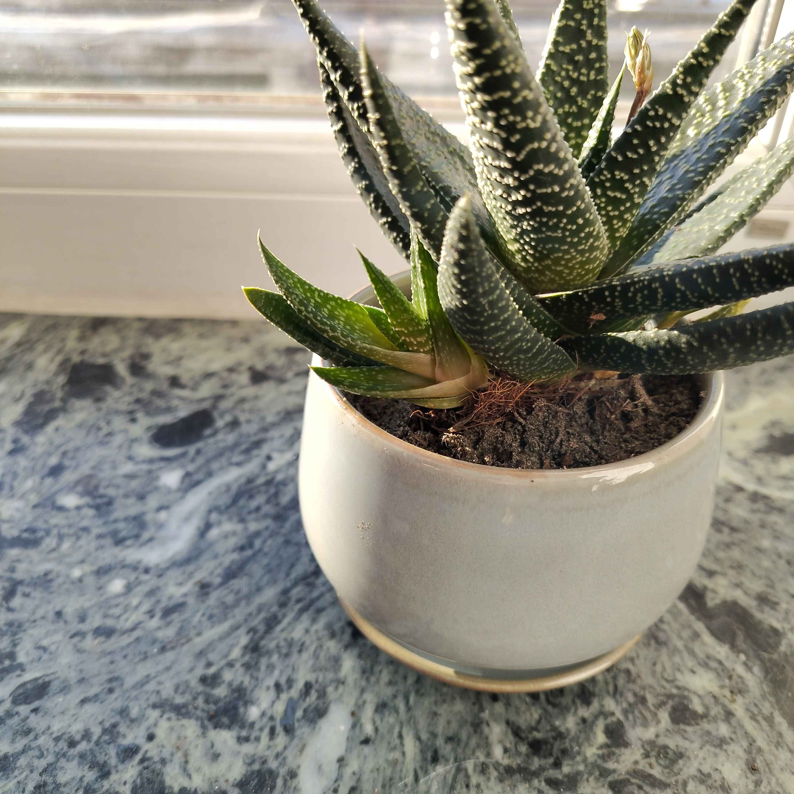

**The discovery — a flower stalk!**

Top-down inspection caught something that wasn't visible on the OBI shelf, on April 23 setup day, or even at the April 26 repot: a **flower stalk is emerging from the dead center of the rosette**. That little budded stem pushing up through the leaves means this Haworthia is gearing up to bloom — usually small tubular pink/white flowers on a long thin stalk, weeks-long display.

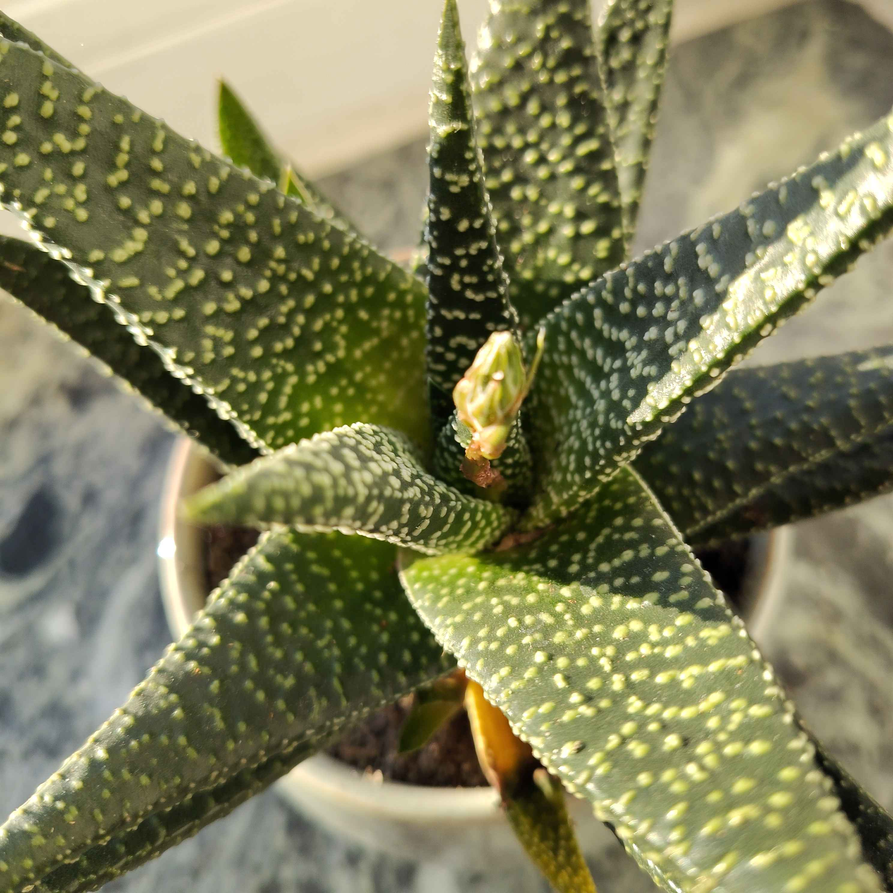

**Care implications for a flowering Haworthia:**

- **Don't cut it off.** The flower stalk is a happy-plant signal. Let it run its course.
- **Resist the urge to fertilize.** Flowering doesn't change the rule — succulents on lean soil. The Cactea/Bonsai mix has plenty.
- **Slightly more sun helps the stalk grow strong** — the Nook's afternoon light is already ideal.
- **Don't move the pot now.** Sudden light changes can abort the bloom.
- **Unlike Sempervivum, Haworthia is NOT monocarpic** — flowering doesn't kill the rosette. Bonus.

The repot timing (Apr 26) didn't trigger this — the bud was almost certainly underway before then; it just happened to clear the leaves during the post-repot acclimation. Good news either way.

#### 2 — Concern at the base — red circle investigation

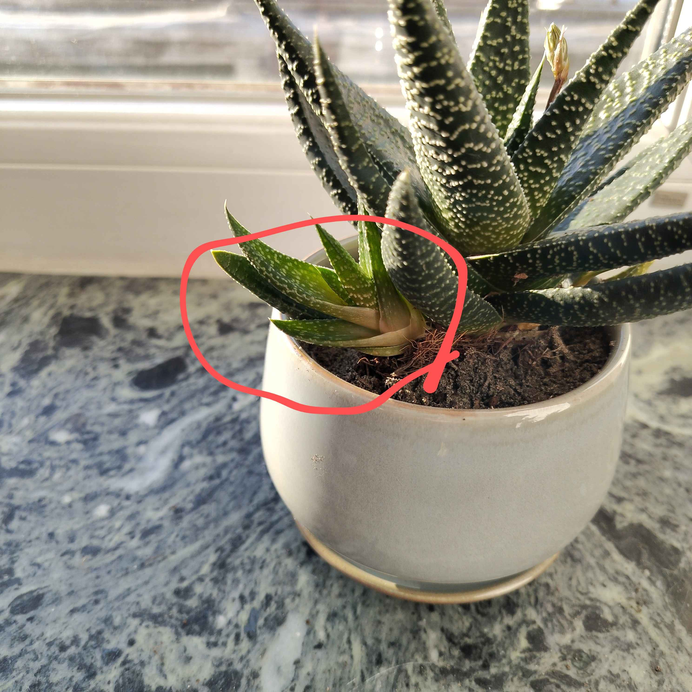

Emma circled an area at the base of the rosette to ask "is this a problem?" Close-up confirms it's:

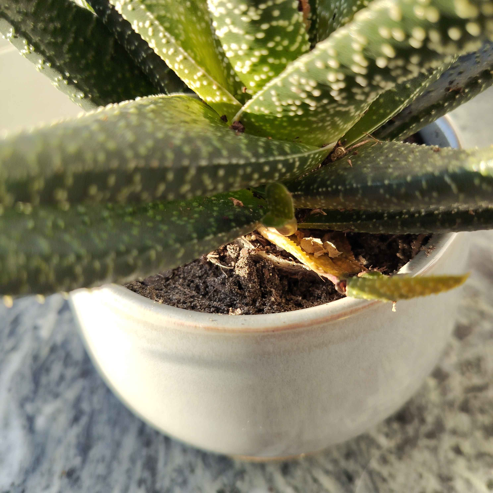

- **Yellowed/dried outer leaf tips** — the bottom-most leaves naturally die back as the rosette ages. Normal. Pull the fully papery ones off with a gentle tug; don't yank green tissue.
- **Reddish-brown fibers** — coir/bark scraps from the original nursery substrate, not roots. Cosmetic only.
- **No mushy black tissue, no white cottony spots, no soft base** — meaning **no rot, no mealybugs**. The two real failure modes are absent.

**Verdict: not a problem.** Wipe the yellow scrap off, leave the plant alone for the rest of the no-water window.

#### 3 — Aumtrly grow light setup reference (pre-arrival)

Compiled the full setup reference for the **Aumtrly Clip-On Plant Lamps, 2-Pack (BL-J20B)** that's en route. Captured into the research doc ([Gardening Research → Section 18](GARDENING-RESEARCH#18-aumtrly-clip-on-grow-light-2-pack-bl-j20b)) so the day-of-arrival flow is locked in:

- 4 heads (2 per lamp), goosenecks bent to **20–25 cm above seedling canopy**
- **Mixed (full spectrum) mode**, brightness **level 3 of 5 (~60%)** for current seedling stage
- **16 h timer**, ~6:00 AM start → ~10:00 PM end (no late-night room glow)
- **Power-blip test** before the May 20–25 trip — confirm timer auto-resumes after a 30-second unplug
- Coverage target: ~108 × 54 cm of the 120 × 60 cm table (90%)

Also documented the adjustment schedule for **Tray 2 pot-up (May 8–12)** — heads up to 25–30 cm, brightness to level 4 — and the **pre-trip dim-down (May 18–19)** to reduce water demand for the capillary mat trial that's on standby for the May 20–25 trip (per Session 14).

This 2-pack will run **alongside the existing 11-gooseneck Niello setup** (per Session 13's two-tray dedicated coverage plan), not replace it — more redundancy, and one set is portable enough to migrate to the Nook for evening succulent supplementation if needed (warm-white-only mode for living-room ambiance).

#### 4 — Patio corner tree options — Emma vs Michael, scouted

Emma wants a Meyer lemon. Michael wants an olive. Today's session was honest scouting before the next OBI itch. The full shortlist with constraints lives in [Future Ideas → Patio Corner Tree](FUTURE-IDEAS#patio-corner--potted-tree-options) and the care detail in [Gardening Research → Section 19](GARDENING-RESEARCH#19-patio-corner-potted-tree-candidates).

**Top two:**

- **🫒 Olive** (Michael's pick) — Mediterranean, sculptural, low-effort, **winter-hardy in Stuttgart with fleece on the coldest nights**, can stay in pot outside year-round. Slow growing, won't fruit reliably this far north (decorative).
- **🍋 Meyer Lemon** (Emma's pick) — fragrant blooms, real fruit, dramatic statement plant. **Must come inside below ~5°C** (October–April) → needs a bright cool indoor winter spot. Higher-effort, fussier feed/water.

**Lower-maintenance alternatives** if neither lands well: **Bay Laurel** (evergreen, edible, hardy), **Fig** (surprisingly hardy in Stuttgart, dramatic leaves, fruit-capable), or **Ilex crenata** as an architectural single-statement pot (Emma already prefers this over boxwood for moth reasons — see Session 9 notes).

**Constraints (locked):**

- ✅ Must be portable in a pot (rental + annual lease cycles)
- ✅ Season-by-season approach (no multi-year commitments to ground planting or trellises)
- ✅ Drainage non-negotiable
- ✅ Terracotta / stone-look pot aesthetic
- ❌ No boxwood (moth), no Lavandula stoechas (already established rules)
- ⚠️ If citrus: confirm indoor winter spot before purchase

**Decision rule:** let the next OBI inventory + Emma's eye decide between olive and lemon. Both are good picks; they just optimize differently. **Not urgent — pull this back up next time the OBI itch strikes.**

#### Active care reminders (refresh)

- **Haworthia (Nook):** still inside the no-water window through ~May 1–3 (5–7 days post-repot Apr 26). Don't cut the flower stalk; don't fertilize; don't move the pot.
- **Snake plant + mini pineapple (Nook):** same no-water window; first watering ~May 1–3 (light for the snake plant; deep+infrequent for the others; small pour into the pineapple's central rosette cup).
- **Sempervivum (Zone B):** post first-water window — dry-cycle going forward. NEVER fertilize.
- **Lavandula angustifolia (Zone B):** acclimation done — full sun position. Lean dry going forward.
- **Tray 1 keepers:** post-thinning recovery (Apr 28). Light at 14 cm, 16 h, no fertilizer this week.
- **Tray 2 babies:** light at 10 cm, watch the 17/18 stretcher even out, no fertilizer until pot-up (~May 8–12).
- **Aumtrly grow light:** unbox checklist on file (mode/brightness/timer cycling, gooseneck check, clamp pad inspection) — see research doc Section 18.
- **Patio tree:** scouting only, no rush.

---

### Session 16 — April 30, 2026 — "The Seedlings Get Their Own Room"

> *"It's their room for real — we even whisper whenever we talk around them."*

> **Content is user-generated and unverified.**

**A long, busy session that started with the simple observation of a second aloe pup and ended with a complete relocation of the seedling operation from the balcony window into a dedicated indoor space. Along the way: a zinnia diagnosis, a Brodiaea milestone, a TEDi run, the long-awaited Aumtrly lamp arrival, and a few existential reflections about the gardening fever.**

#### 1 — The Nook: Aloe "Safari" — pup #2 confirmed

The morning started innocently enough with what looked like a tiny pup near where the yellow leaf had been removed yesterday. A closer look confirmed it: a second offset pushing up at the base of one of the lower mother leaves. As of today, Aloe "Safari" is producing a flower spike *and* two pups simultaneously, all within five days of repotting and before the first scheduled watering.

The plant clearly approves of the pot, the soil mix, and the sealed-window placement. No protocol changes — first watering still tracking for May 1–3, deep but infrequent. Both pups stay attached to mama for now; pup separation is a much-later conversation once they have their own root systems.

The yellow leaf was removed cleanly. No pests, no rot, just senescing foliage being cycled out as the plant redirects energy into the new growth.

#### 2 — Tray 1 — the zinnia mystery

A morning inspection revealed the zinnias looking pale yellow-green across the board. Cosmos in adjacent pots looked healthy. The paleness was uniform across all zinnias, which pointed away from nutrient or watering issues and toward an environmental cause.

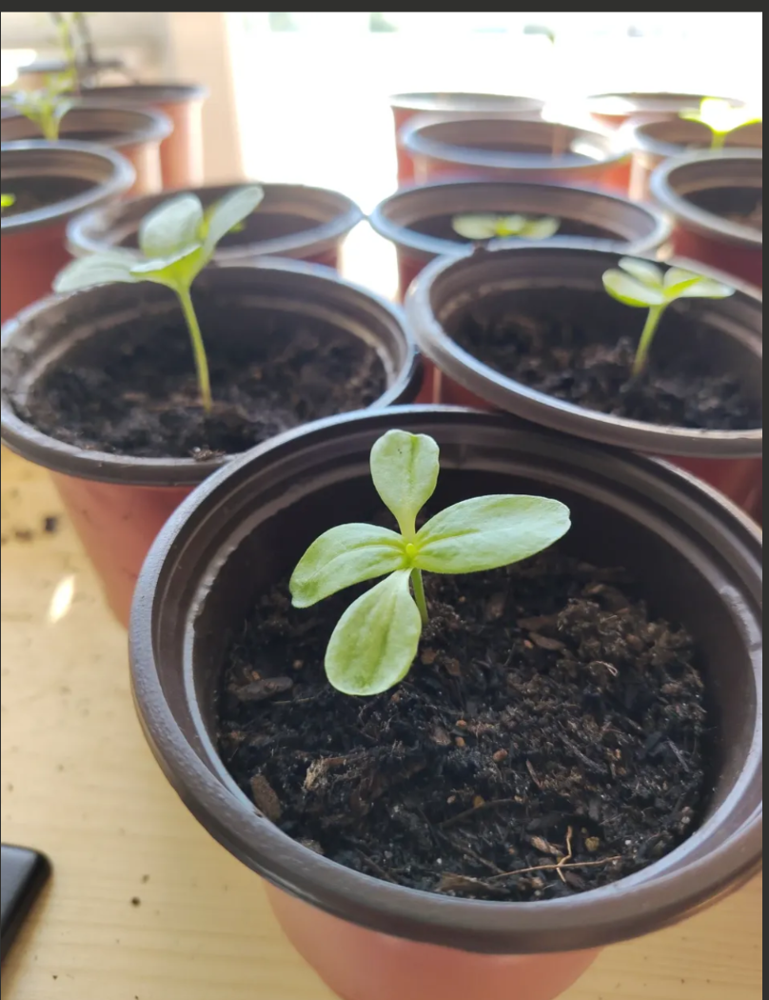

Working theory: **light bleaching** from the combination of direct window sun and the gooseneck grow lights running simultaneously. Zinnias are more sensitive to high-intensity light than cosmos, especially during the cotyledon-to-true-leaf transition. The cosmos handling the same conditions without stress confirmed the theory.

Immediate response:

- Lowered the blinds to block direct sun
- Cracked the window for airflow only
- Decided to relocate the entire setup to a shaded interior spot once the new lamps arrived

Fertilizer was paused. No point feeding plants under environmental stress; we'll resume once color stabilizes under the new lighting.

#### 3 — Tray 2 — steady growth, no drama

Day 8 post-sowing. About 8 of 18 cells showing seedlings, with the most advanced cosmos and zinnia cells starting to push true leaves between the cotyledons. A few cells still nothing — normal for staggered germination.

Notable observation: Tray 2 seedlings are visibly sturdier and tighter than Tray 1 was at the same stage. The reason is straightforward — Tray 2 had grow light from the moment the dome came off (Apr 27), so they never went through the leggy stretch phase that Tray 1 dealt with. **Lesson for next year's spring sowing: grow light the moment the dome comes off, not later.**

#### 4 — Outdoor walk-through — steady state

Everything in good shape; nothing needed watering today.

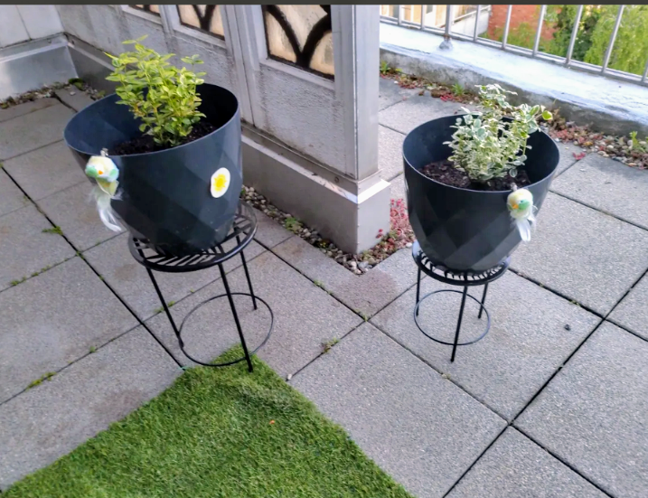

- **Zone A Euonymus** (golden + white-variegated): Both healthy, vibrant color, soil still moist. Decorative birds added to the pots — small touches that turn the corner from "plants in pots" into "this space has personality."
- **Zone B Sempervivum:** Got a small drink yesterday when soil was bone dry. Burgundy varieties showing their characteristic stress-color in full sun (healthy, not problematic). Cobweb variety webbing visible — another good sign.
- **Zone B Lavender:** Flower buds forming on the spike tips. Hard to see in bright sun until you look closely. Should be in obvious bloom within a week or two.

- **Dianthus:** Both railing pots thriving. The older pot wants deadheading — spent papery flowers visible along several stems. Saving deadheading for a calmer morning session.
- **Babiana planter:** Day 10 post-planting, no surface activity yet. Normal — corms typically take 3–4 weeks for foliage emergence.
- **Brodiaea Pot 2: first sprout!** Small bright green pointed shoot through the bark mulch. Day 14 post-planting, right on schedule. Pot 1 still nothing, also normal — Brodiaea corms can stagger emergence by 1–2 weeks within the same planting.

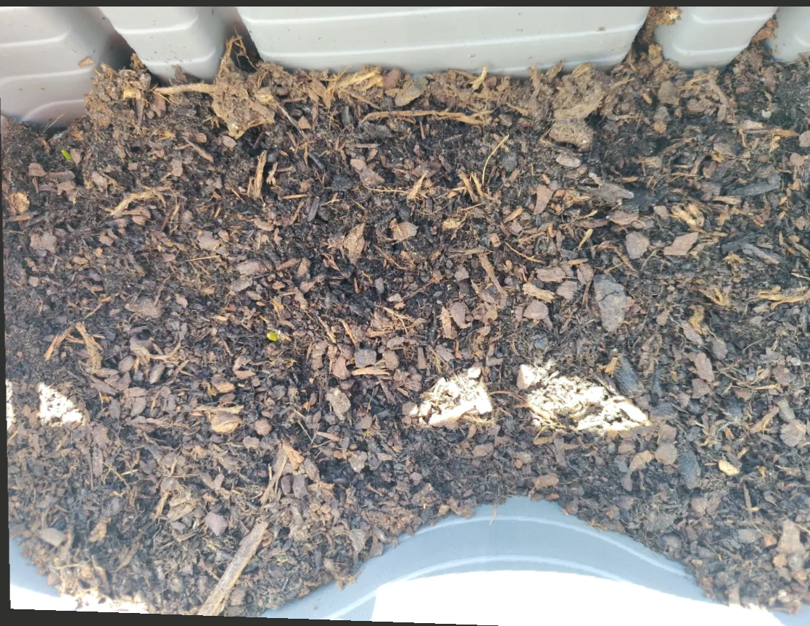

- **Mint:** Half healthy, half doing nothing. Peak mint behavior. No intervention needed.

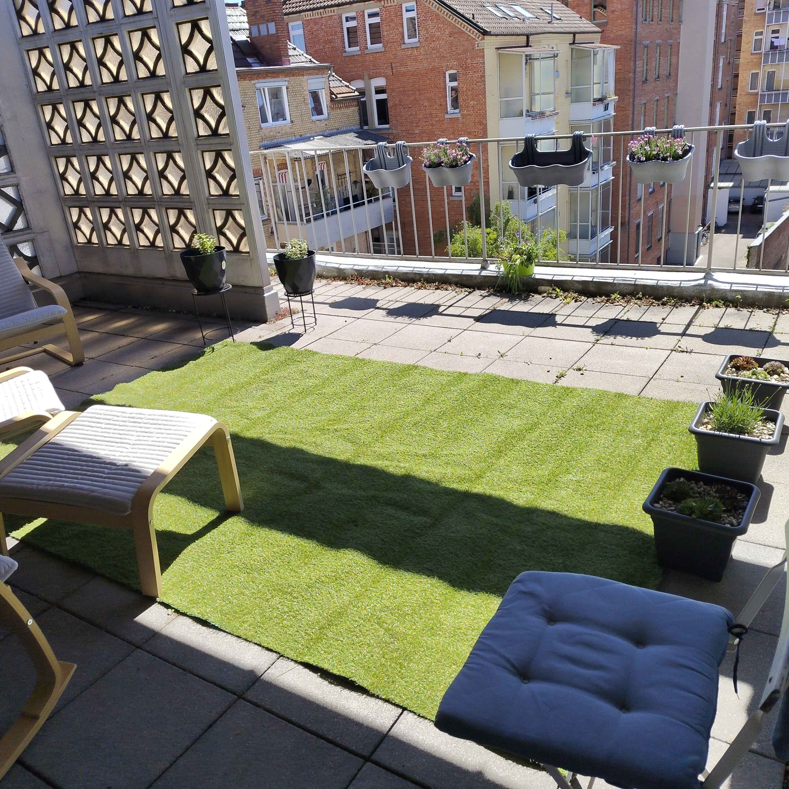

#### 5 — TEDi run — trays and mats

Before the lamps arrived, an unplanned trip to TEDi to solve the airflow concern about pots sitting directly on the wood table. Considered several options:

- Boot trays upside-down (€4 each, would need 3–4)
- Shower mats (uneven texture, pots wobble)
- Plastic flat trays (no airflow)
- **Anti-slip mesh mat (60×120cm, cuttable, €4) — winner**

The anti-slip mat solved the problem elegantly. Open mesh weave allows full airflow, water drains straight through, the size matches the seedling table almost exactly, and it's cheaper than buying multiple boot trays. The wood gets some drips, but the wood was never the real concern — the airflow was.

#### 6 — Aumtrly setup — the long-awaited upgrade

The 5 Aumtrly clip-on lamps (BL-J20B, 2-pack ×2 + 1-pack ×1, **10 heads total**) arrived in the early evening Amazon window. After unboxing and verifying all units powered on, the table was relocated from the balcony window to a quieter, shaded interior corner — what is now officially **"the seedlings room."**

**Tray 1 setup:**

- Sawhorse table with anti-slip mat
- 4 Aumtrly lamps clipped to table edges, double heads each (8 light heads total)
- Lamp height: ~22 cm above pots
- Brightness: 2 clicks down from maximum (conservative recovery setting after the bleach)
- Cycle: 12 hours via built-in timer (6 AM–6 PM)
- Plants grouped: zinnias on left, cosmos on right

**Tray 2 setup:**

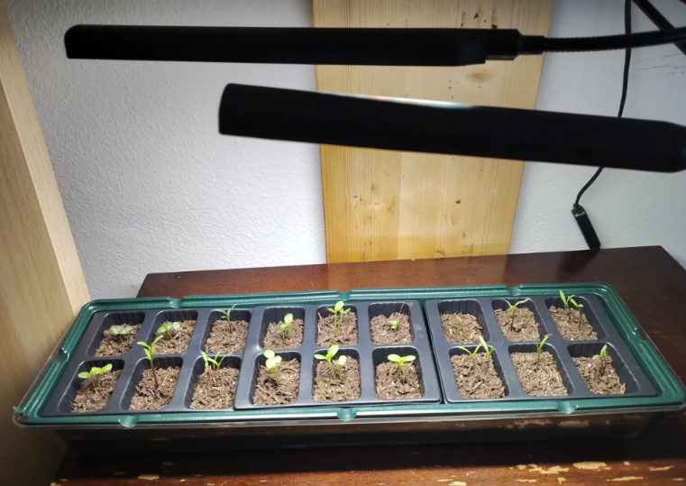

- Separate wood dresser, away from Tray 1
- 1 Aumtrly lamp, double head
- Lamp height: ~22 cm
- Brightness: full
- Cycle: 16 hours via built-in timer (6 AM–10 PM)
- Reasoning: younger seedlings need longer photoperiod to push true leaves and build structure

The built-in soft-switch timers handle the daily cycle automatically — critical for the May 20–25 trip, since no one needs to manually flip switches. **Reassessment point: ~May 8–10, when Tray 2 is ready for pot-up. At that stage both trays unify onto a single schedule.**

#### 7 — Climate control — the window question

With the new indoor location, a question came up about overnight ventilation. Stuttgart's overnight low for tonight is forecast around 4 °C — too cold for cosmos and zinnia seedlings.

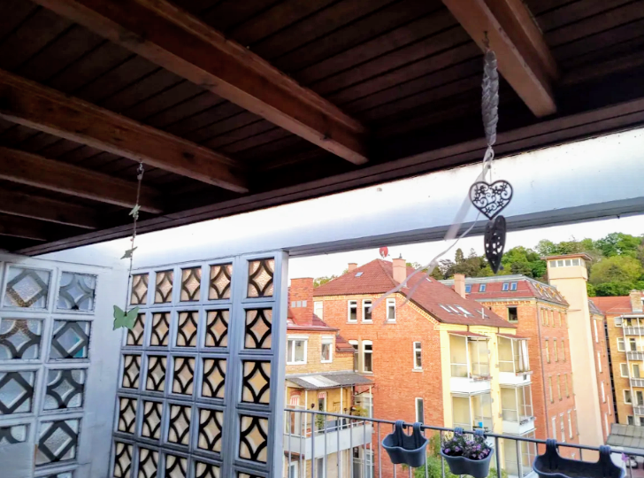

Plan:

- **Tonight:** Window closed, fan on speed 1 for internal air circulation, room door open for ambient airflow from the rest of the apartment.
- **Going forward:**
  - Overnight ≥ 12 °C: Kipp position fine, blinds insulate
  - Overnight 8–12 °C: closed window, fan on low
  - Overnight < 8 °C: closed window, fan on low, door open
- **Day:** Kipp position whenever ambient temps allow, plus the skylight cracked for natural airflow tower effect.

Radiator stays off (it's been off all spring). Ambient room temperature is fine for these seedlings.

#### Active care reminders

**The Nook**

- **Aloe "Safari":** First watering ~May 1–3. Deep but infrequent. Water gently around the base, avoiding the rosette center. Don't disturb the pups.
- **Sansevieria 'Laurentii':** First watering ~May 1–3. Light watering only.
- **Mini pineapple:** First watering ~May 1–3. More generous than the others, plus a small pour into the central rosette cup.
- No fertilizer until June.

**Seedlings — Tray 1**

- Lights: 6 AM–6 PM (12h cycle, brightness −2 from max)
- Water: bottom-water if pots feel light; check every 1–2 days
- Watch: zinnia color over the next 3–4 days. New true leaves should come in healthy green.
- No fertilizer until color stabilizes (likely May 5–7); when resumed, half-strength Compo BIO every 2–3 weeks.

**Seedlings — Tray 2**

- Lights: 6 AM–10 PM (16h cycle, full brightness)
- Watch: true leaves emerging on advanced cells; pot-up window May 8–12
- 2–3 cells still showing no germination — give them through May 4 before writing off

**Climate**

- Window: closed tonight (overnight low ~4 °C). Reassess each evening using forecast.
- Fan: speed 1 for internal circulation when window is closed.
- Skylight: closed at night (insects, debris, weather). Fine to crack during the day.

**Outdoor**

- **Sempervivum:** Check soil every 7–10 days; only water when bone dry 2–3 cm down. Never fertilize.
- **Lavender:** Soak-and-dry rhythm. Currently moist, no water needed. Watch for full bloom over the next 1–2 weeks.
- **Euonymus (both):** Water when top 2–3 cm dry. Soil currently moist.
- **Dianthus (both):** Early morning or late evening watering only. Older pot wants a deadheading session — pull spent flowers back to the first set of healthy leaves or to a junction with new buds.
- **Babiana:** Light moisture; check every 3–4 days. No surface activity expected until ~May 11–18.
- **Brodiaea Pot 2:** Don't disturb the new sprout area; continue light watering. More sprouts likely over the next 1–2 weeks.
- **Brodiaea Pot 1:** Patience. Reassess by May 14.
- **Mint:** Water when top inch dry. Pinch flower stems if they appear. Otherwise, mint will mint.

#### Notes for next time

- **Zinnias do NOT tolerate sun + grow light stacked.** Cosmos can handle it; zinnias bleach. For future spring sowing, choose one light source per stage and stick with it.
- **Grow light from dome-off = significantly sturdier seedlings.** Tray 2 proves this — never went leggy because lights were on from Apr 27 onward.
- **The seedlings room concept is working.** Dedicated space, low traffic, controlled environment. Worth replicating each spring.
- **Anti-slip mesh mat is a more elegant solution than multiple plastic trays.** Cheap, cuttable, full airflow, fits the table exactly. Repurposable for future projects.
- **Skylight + small window = passive airflow tower.** Use this during the day for free ventilation; close at night for insect/debris/weather reasons.
- **"Visitor room → seedlings room"** is a reversible decision. When the seedlings transplant outdoors after May 25, the room can return to its original function. Until then: shhh, the plants are sleeping.

#### Next care notes — looking ahead

- **May 1–3:** First post-repot watering for The Nook trio (Aloe, Sansevieria, pineapple).
- **May 3–4:** Reassess zinnia color under new lighting. Expect noticeable improvement on new true leaves.
- **May 5–7:** Resume half-strength Compo BIO fertilizer for Tray 1 if color recovery is confirmed.
- **May 8–10:** Tray 2 ready for pot-up. Unify lighting schedule for both trays.
- **May 11–18:** Expected Babiana emergence window.
- **May 13–14:** Capillary mat trial run (combined with new boot tray under the seedling pots, prep for trip).
- **May 14:** Reassess Brodiaea Pot 1 if still no sprout.
- **May 19–20:** Pre-trip light reset. All trays on 12h cycle. No fertilizer this week.
- **May 20–25:** Trip. Capillary mat handles indoor watering. Outdoor plants on Blumat-style spikes/bottles for Dianthus, Brodiaea, Babiana.
- **May 26–28:** Cosmos and zinnia transplant to outdoor pots after returning home.

---

### Session 17 — May 1, 2026 — "Both Pots Viable, Tray 1 Diagnosed"

> *"What looks like luck is actually devotion."*

> **Content is user-generated and unverified.**

**A milestone day for the Brodiaea pots and a deep diagnostic session for Tray 1's seedlings. Both Brodiaea pots now confirmed viable, Tray 2 hitting textbook health markers, and Tray 1's pale color identified as persistent post-bleaching pigmentation — a lesson in how mistakes leave metabolic shadows even after recovery.**

#### Brodiaea — Both Pots Now Active

Day 16 since planting. Both pots now confirmed viable.

**Pot 2** — up to 3 shoots total as of today. Two new sprouts since yesterday's check joined the original sprout from April 29.

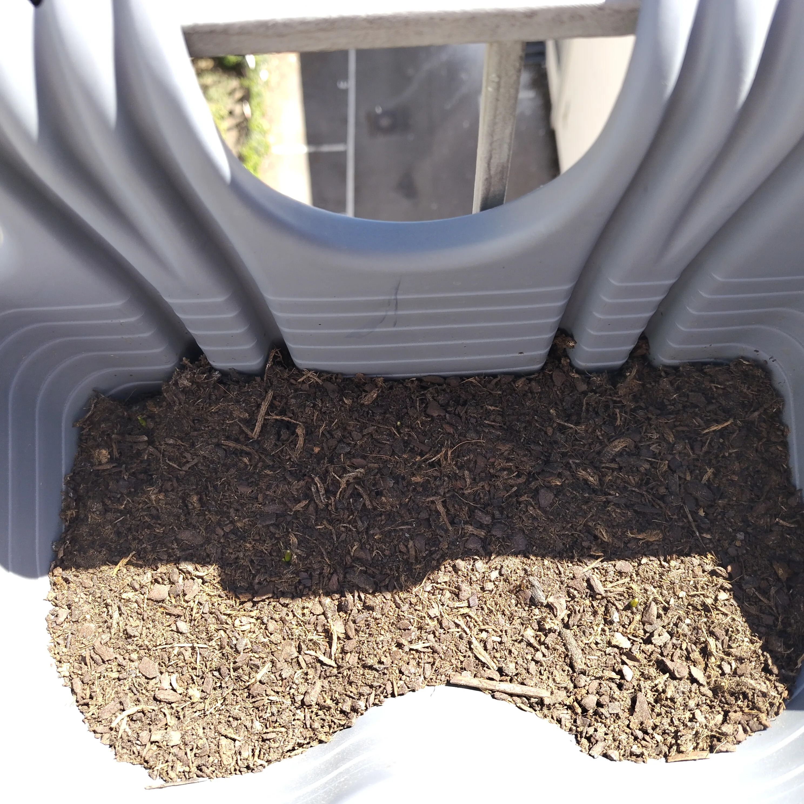

**Pot 1** — first shoot emerged this afternoon, right at the edge of the pot. Just in time before the May 14 reassess deadline. Classic Brodiaea behavior to come up at the pot edge where the corm gets a bit of extra warmth from the sun-heated wall.

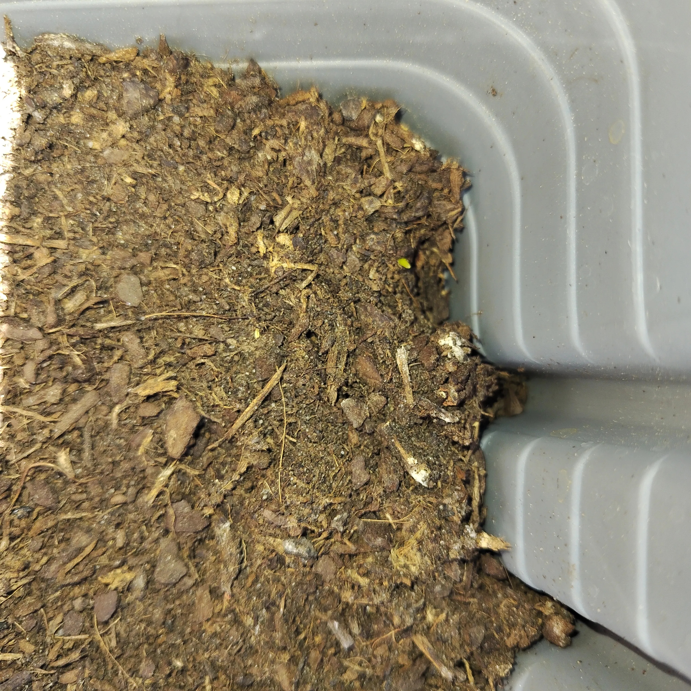

Note on soil appearance: the light/dark contrast in the Pot 2 photo is just sun/shade falling across the pot, not a moisture gradient. No watering today.

**Updated Brodiaea status:**
- Pot 1: Day 16 — 1 shoot (first emergence May 1)
- Pot 2: Day 16 — 3 shoots
- Both pots confirmed viable

#### Babiana — Mineral Salt Crust Identified

Day 12, no growth visible yet — still well within normal germination window (expected May 11–18).

The whitish, ashy crust on the soil surface that's only appearing on this pot got investigated today.

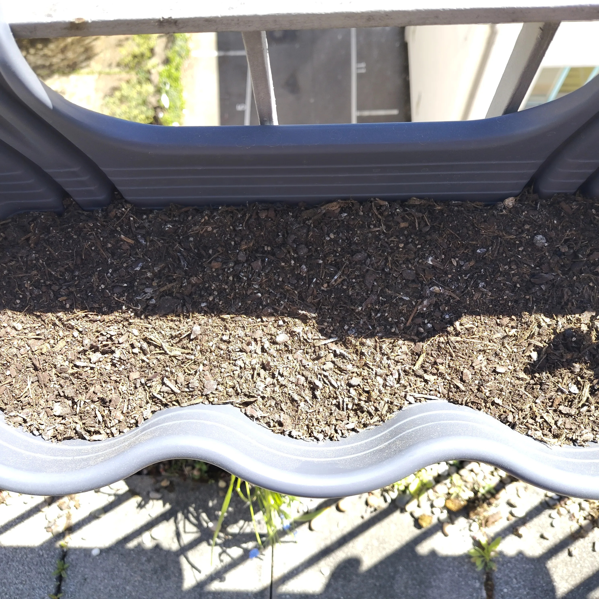

**Diagnosis:** mineral salt deposits (efflorescence) from Stuttgart's hard water. This pot specifically shows it while neighboring Dianthus and Brodiaea pots don't because: bare soil + no shoots yet = no foliage shading the surface, and the shallow wide railing planter = high evaporation per unit volume. Water wicks to the surface, evaporates, leaves dissolved minerals behind as a visible crust. Once Babiana sprouts and develops foliage cover, the crust should diminish significantly.

**Action:** none needed. Cosmetic only, no harm to the corm. Babiana tolerates alkaline conditions just fine. If buildup gets thick over time, scraping the top 0.5cm and topping with fresh mix is the simplest fix. Filtered or rainwater in the spike-watering bottles for the trip would reduce buildup, but it's optional.

#### Tray 2 — Textbook Healthy

Watered today via 10-minute bottom-watering. Soil absorbed water rapidly — exactly what you want post-dome.

**Status:**
- 18 out of 18 cells germinated — including the late-bloomer cell. **100% success rate**
- Deep dark green color — strong chlorophyll production, no light stress
- Compact, sturdy growth — no leggy stretching
- First true leaves emerging cleanly on cosmos cells; cotyledons fully expanded and intact
- Roots developing well — confirmed by rapid water uptake during bottom-watering

Tray 2 is essentially demonstrating what Tray 1 would have looked like without the bleaching incident. Same seeds, same soil, same general system — the difference is that Tray 2 was raised under the corrected setup from day one (no grow-light + direct sun stacking).

**Pot-up readiness check (target ~May 8–12):** Watch for these biological markers, not the calendar:
1. First true leaves emerging clearly above cotyledons — already happening
2. Cotyledons firm and fully expanded — confirmed
3. Slight root showing at cell base when peeking — check around May 8

If all three line up, ready to pot up. If still developing, wait. Readiness over calendar remains the rule.

#### Tray 1 — Diagnosed: Persistent Post-Bleaching Pigmentation

This was the deep dive of the session. Initial concern was about pale lime-green color on the zinnias compared to expected deep green.

Under natural light (away from grow lights):

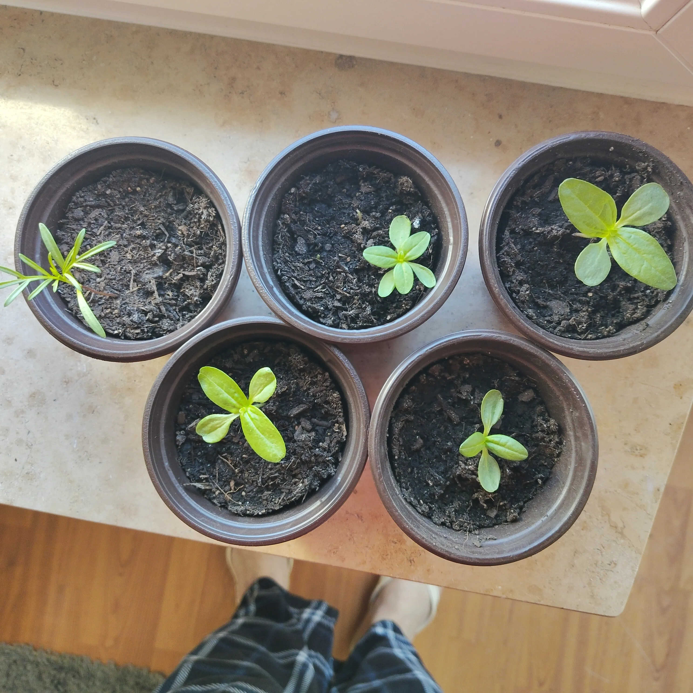

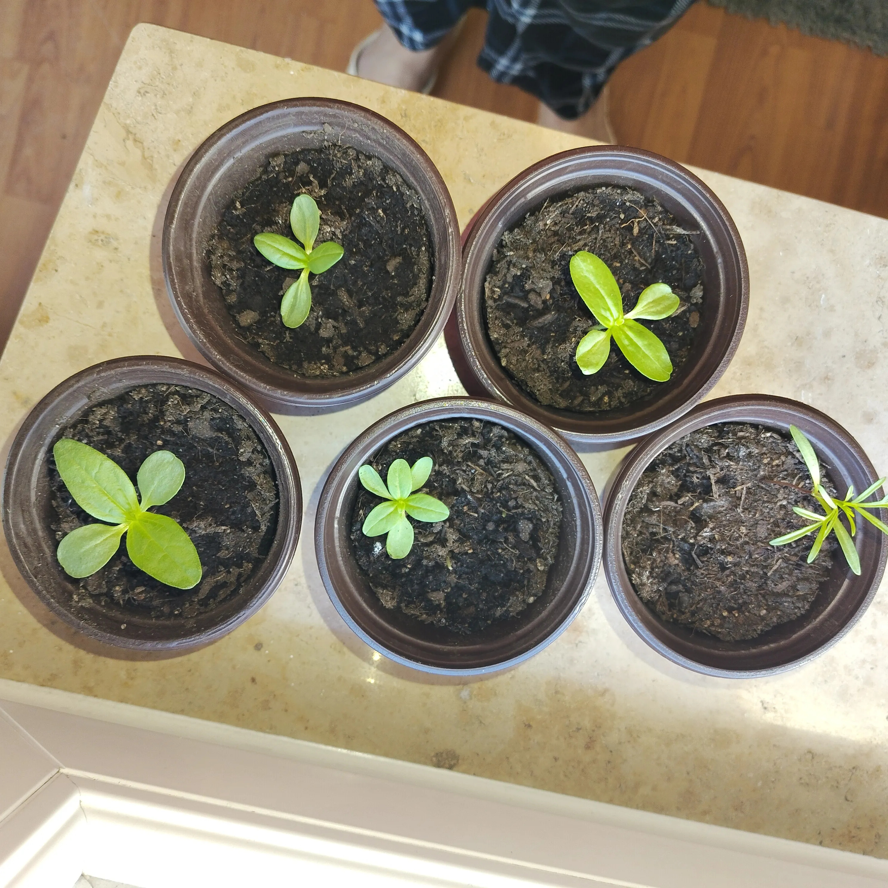

Under grow lights (full stand view):

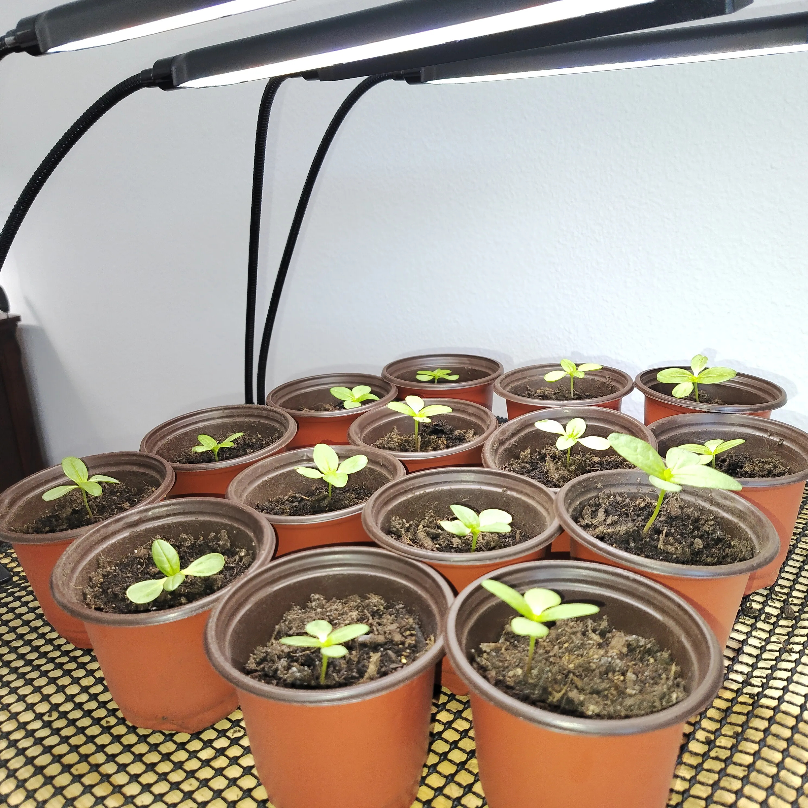

**Diagnostic process:** The initial isolated view suggested possible mild nitrogen deficiency. But the full-stand view changed the picture significantly:
- Uniform pale green across all plants — not the variable expression typical of nutrient deficiency
- Newer growth same shade as older growth — not the older-leaves-yellower pattern of mobile-nutrient deficiency
- No interveinal yellowing, no edge burn, no leaf curling — rules out iron, magnesium, salt stress
- Plants upright and sturdy — light intensity is adequate
- Second true leaves emerging cleanly — active growth, no real metabolic stress

**What confirmed the diagnosis:** The direct side-by-side comparison with Tray 2 (same seeds, same soil, same system, no bleaching) showed Tray 2's deep green vs Tray 1's lime-green — establishing that the only meaningful variable between the two trays is the bleaching event Tray 1 experienced.

**Conclusion:** persistent post-bleaching pigmentation. The damaged cotyledons couldn't fully recover their chlorophyll, and the first true leaves emerged from a plant operating on reduced photosynthetic capacity. The pale color is the metabolic shadow of the bleaching event still lingering.

**Implications:**
- Tray 1 will likely stay paler than Tray 2 throughout its lifecycle — foundational damage doesn't fully erase
- However, newer foliage from healthy growing tips should come in progressively greener as the plant matures
- Plants will still flower and perform — just with somewhat reduced vigor compared to Tray 2

**Decision: hold fertilizer.** Stick to the original schedule: first feed ~1 week post-transplant after the May 25 trip. The pale color is not a deficiency — fertilizing won't fix it, and could stress the recovering plants further.

**Practical implication for Zone B transplant:** When transplanting cosmos/zinnia into the reserved grey pot post-trip (~May 26–28), prioritize Tray 2 plants for the showcase position. Tray 1 plants remain useful as backups or for less prominent placement.

**Lesson reinforced:** Never stack grow lights and direct sun, especially on zinnia cotyledons. The cost of that mistake shows up in the timeline weeks later, not just on the day of damage. Tray 2 — sown into the corrected system — proves the lesson was absorbed immediately.

#### Reflection: On Self-Attribution

Tonight's session ended with a moment worth recording. Looking at Tray 1's pale leaves triggered a feeling of failure — the comparison with YouTube tutorials calling zinnias "the easiest plant to grow" landed hard.

But the data tells a different story:
- 18/18 germination on Tray 2 — commercial nurseries target 80–90%
- Aloe variegata producing flower spike + 2 pups within days of repotting (only happens when thriving)
- Every Tray 1 plant alive with second true leaves emerging — bleached seedlings often die outright
- Every outdoor zone complete and healthy

The pattern of attributing success to "good soil" or "lucky plants" while attributing setbacks to personal failure is a cognitive habit worth noticing. The constant across both trays is the gardener — soil doesn't sow itself at the right depth, and plants don't decide to be 2 seeds per cell.

What looks like luck is actually devotion: checking on every plant first thing in the morning, before bed, and throughout the day. That's not how lucky people garden — that's how attentive gardeners garden.

The plants are responding to attention. Specifically, hers.

#### Possible Third Tray — Deferred

A third tray came up tonight. Recommendation: wait until after the May 20–25 trip, then sow around May 27–30. Reasoning: avoids high-risk dome stage during travel absence, aligns with Tray 2 transplant freeing up seedling room, targets blooms for late July/August to extend the summer color window, and applies all lessons from Trays 1 and 2 to a cleaner third run. Decision deferred — to revisit in a few days with fresh eyes.

#### Next Care Notes

**Tomorrow (May 2) — Nook First Watering:**
- Sansevieria 'Laurentii' — light water only, just moisten the soil. Don't soak
- Aloe variegata "Safari" — deep water around the base, then nothing for a long while. Avoid the rosette and the flower spike
- Ananas nanus — more generous, plus a small pour directly into the rosette cup

**Outdoor:**
- Zone A (Euonymus): No action — built-in nutrients from fresh Sana
- Zone B grey pots: Sempervivum — no fertilizer, ever. Lavender — no fertilizer. Reserved pot for cosmos/zinnia — no action until post-trip transplant
- Railing: Dianthus — next half-strength feed in ~2 weeks (last fed Apr 27). Brodiaea — no feed year 1; both pots active and viable. Babiana — no feed year 1; mineral crust is cosmetic, no action
- Mint: No action

**Seedlings:**
- Tray 1: No fertilizer. Continue current grow light schedule (12h cycle, brightness -2). Watch for newer true leaves coming in greener than older growth — that confirms healthy maturation
- Tray 2: Continue current schedule (16h, full brightness). Monitor pot-up readiness from ~May 8. Don't water again until soil dries noticeably — today's bottom-water was generous
- Seedlings room: Fan continues at 4 hours/afternoon-to-early-evening with breaks. Window cracked daytime, closed nights below 10°C

**Trip Prep (May 20–25) — Upcoming:**
- May 13–14: Capillary mat trial (3m mat cut to tray footprint +2–3cm, draping into ~4–5L reservoir)
- May 19–20: Press timers on all 4 grow lights (12h)
- Outdoor spike watering: Blumat-style terracotta spikes + bottles for Dianthus (1.5L), Brodiaea ×2 (1L), Babiana (1L). No spikes for Sempervivum, Lavender, Euonymus, Mint
- No fertilizer the week before the trip for any plant
- Heat wave contingency: move railing planters to semi-shade if needed

**Photo tracking:**
- Continue weekly photos of Aloe pups to track development
- Capture Tray 1 vs Tray 2 comparison shot at Tray 2 pot-up day for the lesson archive

---

### Session 18 — May 2, 2026 — "Phyllis the Mother of Pineapples, Machali the Queen Mother of Tigers"

> *"What was a nook of low-maintenance plants is turning into a dynasty."*

> **Content is user-generated and unverified.**

**A morning sweep that started ordinary and ended with a pineapple dynasty. Tray 1 is visibly recovering, both Brodiaea pots are gaining momentum (Pot 2 at 5 shoots), the Nook got its first post-repot watering, all three Nook plants got proper names — and Phyllis the pineapple revealed five offshoots hiding under her leaves.**

#### Seedlings — Both Trays in Good Shape

**Tray 1** (potted up Apr 25, thinned Apr 28) is visibly recovering from the bleaching damage of late April. The uniform pale lime-green that triggered last week's deep-dive has shifted noticeably greener, with stronger and more uniform color across both zinnias and cosmos. Several plants are pushing second true leaves, and the cosmos are showing reddish-purple stems — classic anthocyanin under grow lights, totally normal. The back-right zinnia in particular is leading the pack.

Zinnia side close-up — broad cotyledons with developing true leaves, color clearly greener than last week's bleach worst-case:

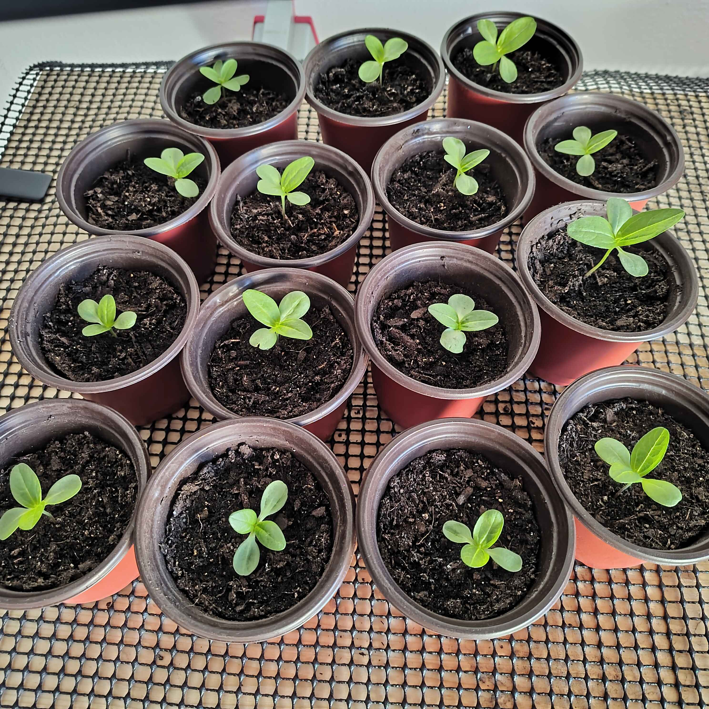

Cosmos side close-up — feathery, dill-like true leaves coming through cleanly, the textbook cosmos signature:

This is a better outcome than the "stays paler all lifecycle but functional" prognosis. Pigmentation recovery looks real — though Tray 2 plants will still take priority for the post-trip Zone B grey pot transplant, just in case.

**Tray 2** (sown Apr 22, dome off Apr 27) is textbook. Even germination, deep green color across all 18 cells, cotyledons firm and thick, second true leaves emerging on the front row. Sitting on the dresser in indirect window light (verified — no direct sun bouncing off the nearby mirror) and tracking right on schedule for the May 8–12 pot-up window. **Biological readiness leads, not the calendar.**

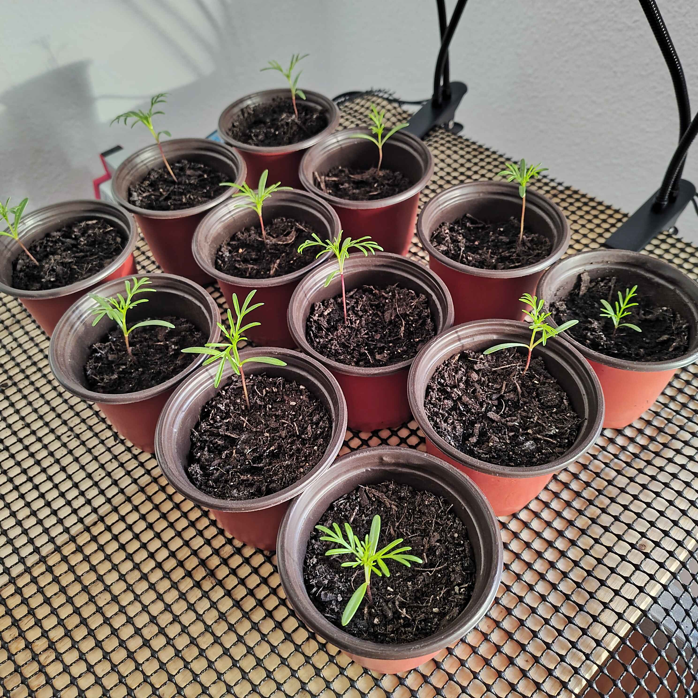

#### Outdoor — Rain Incoming, Plan Adjusts Itself

The forecast pulled this morning: three days of moderate rain Sunday through Tuesday (~11mm total, heaviest Tuesday afternoon), followed by a damp Wednesday. Beneficial soak, not a deluge.

Which means:
- **Railing pots** got their evening watering yesterday — perfect timing. Soil settles tonight, then rain takes over for ~5 days
- **Zone A** (Euonymus duo) still doesn't need water — the 27×24cm pots in fresh Sana hold moisture impressively well. Both plants healthy
- **Zone B** (Sempervivum and Lavender) thriving as usual. The "independent cool guys." Glance at saucers after the rain ends to make sure no pooling — but the gritty Cactea/Kakteenerde mix should drain fine
- **Mint** unbothered as always

**Milestone tracking:**

| Plant | Day | Status |
|-------|-----|--------|
| Brodiaea Pot 2 | 16 | 5 shoots total — added 2 more this morning, real momentum |
| Brodiaea Pot 1 | 16 | First shoot still solo; within stagger window, no concern yet |
| Babiana | 13 | No emergence yet — expected window May 11–18, on track |
| Dianthus | — | Stable, healthy, holding well |

The mineral salt crust noted on the Babiana railing pot last week will likely rinse off naturally with the rain. Bonus.

**Heads up for Wednesday May 6:** Forecast low of 8°C crosses the seedlings room window threshold (10°C). Plan to close the window that night.

#### The Nook — Watering Day, Naming Day, Surprise Day

Day 6 since the April 26 repot — right in the first-water window. All three Nook plants got their first proper drink since the repot, each on their own protocol.

##### Cobra — Sansevieria 'Laurentii' (Left, 12cm)

Light edge-of-pot watering, ~50–80ml. No water on the crown, no drainage produced (expected — fresh mineral soil absorbs that volume fully). She looks beautifully happy: gorgeous yellow margins, strong leaf turgor, no soft spots. Perlite from the OBI cactus mix visible on the soil surface (totally normal — not mineral deposits). **Named today** for her tall, striking, sword-like presence.

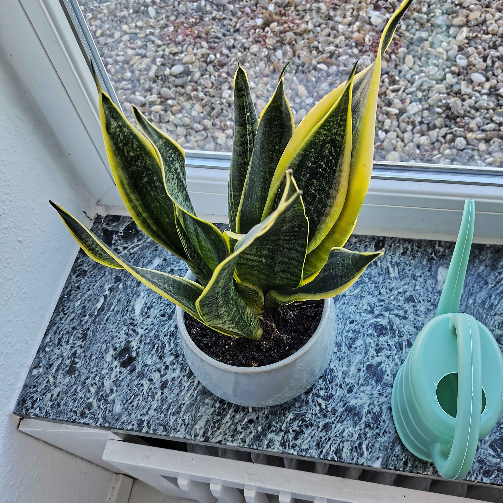

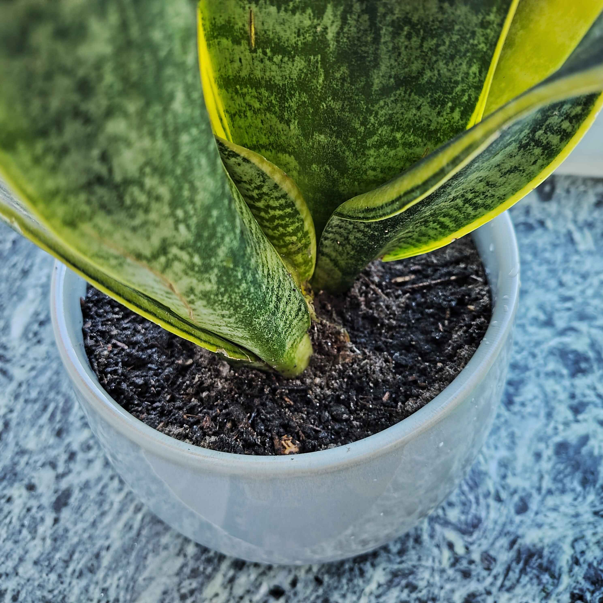

##### Machali — Aloe variegata "Safari" (Right, formerly Haworthia/Tiger Aloe)

Renamed today after the legendary tigress of Ranthambore National Park — a fierce spotted matriarch, fitting for a small succulent producing a flower spike and two pups simultaneously. Deep watering around the edges, no pour into the rosette center while the spike is developing.

The flower spike continues to progress beautifully. No new leaves visible, but that's expected — at her size, leaves come on the scale of weeks-to-months, and right now her energy is going into the spike and root re-establishment. **The spike is the growth signal.**

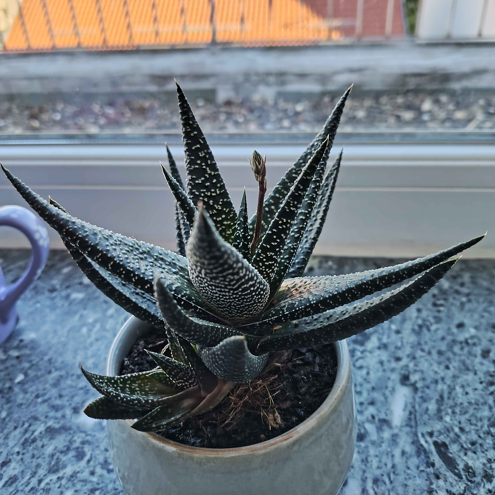

##### Phyllis — Mini Pineapple (Center, Michael's Plant)

Soil watered thoroughly until light drainage, **no rosette cup pour today**. The reason is the next section.

#### About Phyllis — Mother of Five

Lifted her leaves to water her and stopped breathing for a second.

**There are five pups.**

Not one. Not two. Five. After the initial 😯 moment, careful counting confirmed five distinct offshoots emerging around her base — cream-white pointed shoots pushing up through the soil, some already with little leaf rosettes forming.

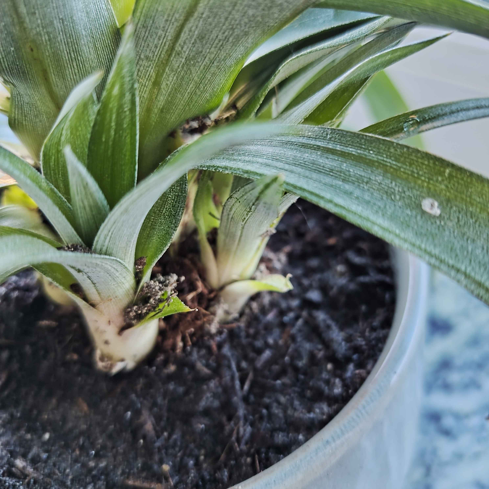

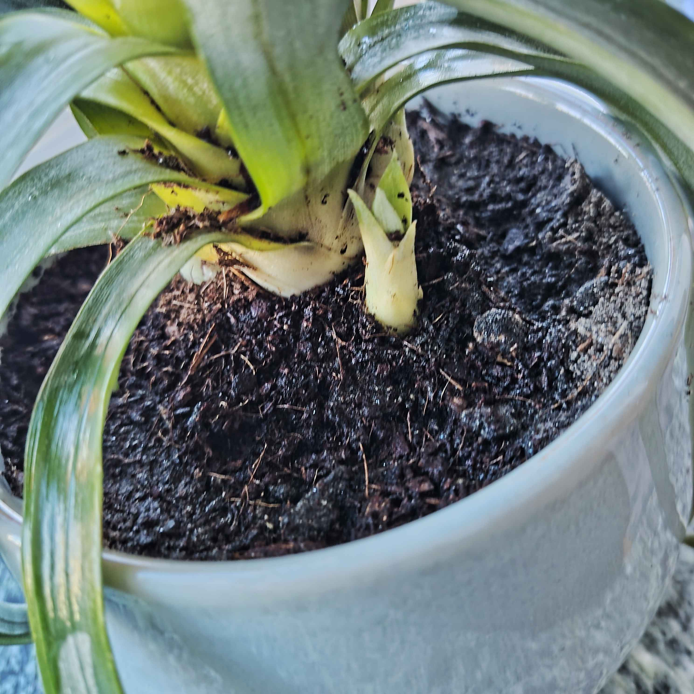

This is genuinely remarkable. Pineapples are **monocarpic** — the main plant fruits once and then dies, but before going she produces offshoots (suckers/ratoons) to carry on. Most home pineapples produce one or two pups in their lifetime. Five is on the high end of what any home pineapple ever produces.

**A few things worked in our favor:**

1. **OBI Kakteen- und Bonsaierde torffrei** — peat-free, mineral-rich, excellent drainage. Mimics the volcanic substrates pineapples evolved on, supplies the micronutrients bromeliads love, and prevents the root rot that quietly kills most home pineapples before they ever get to pup. Earning their shoutout today.
2. **The repot itself probably triggered this burst.** Gentle root disturbance + fresh oxygenated mineral soil sends the "time to reproduce" signal to a mature pineapple, and the fresh nutrient pool gives her the energy budget to actually push pups at scale.
3. **Gentle handling during the repot.** A rough or rushed repot causes leaf snap, root tearing, and shock that suppresses reproduction. The pups visible now were forming before the repot, but they only continued developing because the transition didn't traumatize her.

**Decision tree from here:** let pups grow attached to mother for now (they need to develop their own roots and reach 15–20cm before separation). Once the fruit ripens and she begins her decline, we'll have the option of separating into individual pots — potentially turning Phyllis into a pineapple dynasty of up to five new plants.

**Practical care change:** no rosette cup pour while the fruit is maturing and pups are establishing. Water sitting in the rosette risks rot at exactly the wrong moment. **Soil watering only for the foreseeable future.**

#### Naming Corner — The Nook is a Throne Room

| Name | Plant | Role |
|------|-------|------|
| 🐍 **Cobra** | Sansevieria 'Laurentii' | Elegant striker, left wing, tall sword-like leaves |
| 🍍 **Phyllis** | Mini pineapple | Mother of five, holds nominal residency under Michael's name |
| 🐅 **Machali** | Aloe variegata "Safari" | Queen mother, right wing, named for the legendary tigress |

#### Next Care Notes

**Seedlings room:**
- Tray 1 — keep monitoring color; hold fertilizer per original schedule (start ~1 week post-transplant after May 25 trip)
- Tray 2 — pot-up window May 8–12, readiness-driven; prioritize these plants for Zone B grey pot transplant after the trip
- Wednesday May 6 — close window overnight, forecast low 8°C
- Daytime: Kipp window position; airflow fan on speed 1

**Outdoor:**
- No watering for 4–5 days — rain handles it Sun–Tue plus damp Wed
- After rain ends — quick check of any saucers (Zone B especially) for pooling
- Brodiaea Pot 1 — reassess by ~May 14 if still only one shoot
- Babiana — expect emergence May 11–18
- Dianthus — next half-strength feed due ~May 11–14 (every 2–3 weeks from Apr 27 first feed)

**The Nook:**
- Cobra — next light water in ~3 weeks
- Machali — next deep water in ~2.5–3 weeks; watch the flower spike for cues
- Phyllis — next watering ~1.5–2 weeks; soil only, no rosette pour while fruit + pups develop
- Weekly photos to track Machali's pups + Phyllis's pup development

#### Looking Ahead

- May 6: Close seedlings room window overnight (8°C low)
- May 8–12: Tray 2 pot-up window (readiness-driven)
- May 13–14: Capillary mat trial for trip prep
- May 19–20: Press all 4 grow light timers, prep watering spikes for railing
- May 20–25: Trip
- ~May 26–28: Tray 1 cosmos/zinnia transplant into Zone B grey pot

> A morning that started ordinary and ended with a pineapple dynasty. The garden is always a little ahead of you, and sometimes she just decides today is the day to show off.

---

## What's Done So Far (Summary)

### Completed
- Brodiaea Queen Fabiola bulbs planted in both gray railing planters
- Babiana bulbs planted in 53cm hanging planter
- All seeds and supplies inventoried and catalogued
- Soil types identified — correct usage determined (orchid soil set aside)
- Full season plan created with timeline and to-do lists
- Gift arrangement plants identified and repotting plan made
- Watering schedule established
- 18-cell seed tray purchased and set up (Tray 1)
- Cosmos + zinnia seeds sown indoors — Tray 1 (April 16) and Tray 2 (April 22)
- Tray 1 sprouted ~70% by April 20 (first sprouts Day 3!)
- Tray 2 sown for succession bloom (TEDI tray, Compo Sana, dome on)
- Dome management: off during day, on at night with vent open
- Lavender postponed to next season (needs stratification, timing too tight)
- OBI run (April 17): basil, chocolate mint, 2x pink dianthus, 3x TEDI pots, 17L Compo soil
- Basil potted solo in 27cm TEDI pot
- Chocolate mint potted solo in 27cm TEDI pot (never share — mint is a bully!)
- TEDI run (April 18): €4 gray 37×28cm saddle planter for the dianthus
- 2 pink dianthus planted and mounted on the sunny railing
- Expandable garden hose installed on the balcony wall
- Balcony workstation hosed down and cleaned up
- Basil and mint replanted and improving (April 19)
- Dual-head gooseneck LED grow light set up at 10–15 cm, 16h timer (April 22)
- Dicot weeds identified and removed from Brodiaea + Babiana planters (April 22)
- OBI run (April 23): snake plant 'Laurentii', Haworthia "Safari", mini pineapple, Sempervivum 6-pack, Kakteenerde, Compo
- Pot-up containers ordered (100× 10cm KPYZLBD, drainage holes)
- Amazon order placed: 3× Nook pots (12/11/12 cm) + 2× Sempervivum anchor pots (30–35 cm)
- OBI run (April 24): 2x Euonymus fortunei, 4x NORA anchor pots, 3x Compo Cactea 5L, BIO Blumendünger 1.3L, bypass pruners, measuring jug, bucket, grey hanging planter, 2x Dianthus
- Basil pulled — pots repurposed for Euonymus
- Fertilizer strategy finalized: Compo BIO Blumendünger (with potassium, half strength)
- Second Niello 3-head grow light installed (5 goosenecks total, 16hr cycle)
- Bigger cell trays set up for seedling upsizing before May 15 transplant
- Anchor pot soil blend determined: 40% Cactea / 60% Compo Sana
- Sempervivum care rule established: NEVER fertilize
- OBI run (April 25): ~20L Compo Sana + 1× Lavandula angustifolia (€3.49)
- Tray 1 potted up — 18× 10 cm cups, leggy cosmos buried below cotyledons (April 25)
- Third dianthus pair planted in grey hanging planter — railing trio complete (April 25)
- Euonymus fortunei pair potted in black ex-mint pots — Zone A backbone (April 25)
- Sempervivum 6-pack split across 2 NORA anchor pots, 40/60 Cactea/Sana, full alpine rock top-dress (April 25)
- Final balcony zoning locked in: Zone A black-pot wall + Zone B grey-pot wall + railing dianthus
- Lavandula angustifolia found at OBI (closes the April 23 follow-up)
- Mint propagation confirmed working — new sprouts from deleafed stem cuttings
- Lavandula angustifolia planted in grey pot, Zone B sunny wall (60% Kakteenerde / 40% Sana, gravel top-dress)
- Nook repotted: snake plant (12cm), mini pineapple (12cm), Haworthia "Safari" (10-11cm) in Kakteenerde with drainage mesh discs (April 26)
- Balcony fully cleaned: tile weeds removed with Fugenkratzer, pots organized, chairs positioned
- April 2026 baseline photos taken for July growth comparison
- Travel plan locked: May 20–25 trip, transplant delayed to ~May 26–28
- Fugenkratzer (telescopic, modular heads) added to tool kit
- Tray 2 dome removed entirely on Day 5 — 16/18 germination (April 27)
- Tray 1 true leaves emerging on Day 11 from sow, Day 2 post-pot-up (April 27)
- Fan strategy refined: 3–4 hr/day split sessions, speed 1, indirect breeze (April 27)
- First Compo BIO feed: Dianthus half-strength (10ml in 2L), full feed cycle started (April 27)
- Grow light expansion: 6 additional Niello goosenecks — 11 total across both trays (April 27)
- Tray 1 toddlers thinned to one keeper per cell — cosmos by reddest stem, zinnia by biggest true leaves (April 28)
- Tray 2 final germination confirmed: 17/18 up, light dropped to 10cm (April 28)
- Capillary mat received Apr 27, banked for May 26–28 trip auto-watering (April 28)
- Tile-joint weed cleanup with Fugenkratzer — spring outdoor setup officially wrapped (April 28)
- Haworthia "Safari" flower stalk discovered emerging from rosette center — first bloom event in the Nook (April 29)
- Haworthia base "concern" investigated and cleared — natural outer-leaf dieback, no rot, no mealybugs (April 29)
- Aumtrly clip-on grow light setup reference compiled — pre-arrival spec sheet, day-of and adjustment schedule (April 29)
- Patio corner tree shortlist drafted — olive vs Meyer lemon decision logic + lower-maintenance alternatives (April 29)
- Aloe variegata "Safari" pup #2 confirmed at base of lower leaf — now flower spike + 2 pups simultaneously (April 30)
- Brodiaea Pot 2 first sprout — Day 14 post-planting, bright green shoot through bark mulch (April 30)
- Zinnia light-bleach diagnosed — sun + grow-light stack, cosmos unaffected, fertilizer paused (April 30)
- TEDi run: anti-slip mesh mat (60×120cm, €4) for seedling table airflow (April 30)
- Aumtrly clip-on lamps unboxed and installed — 4 over Tray 1 (12h, −2 brightness), 1 over Tray 2 (16h, full) (April 30)
- Seedling table relocated indoors to dedicated "seedlings room" — out of direct sun, low-traffic (April 30)
- Climate-control protocol set for indoor location — window/fan/door rules tied to overnight low (April 30)
- Brodiaea Pot 2: 3 shoots total at Day 16 — 2 new since Apr 29 (May 1)
- Brodiaea Pot 1: first shoot emerged at pot edge, Day 16 — both pots now confirmed viable (May 1)
- Babiana mineral salt crust diagnosed as cosmetic efflorescence from hard water — no action needed (May 1)
- Tray 2 bottom-watered, 18/18 germination confirmed — 100% success rate (May 1)
- Tray 1 diagnosed: persistent post-bleaching pigmentation, not nutrient deficiency (May 1)
- Decision: hold fertilizer on Tray 1 — pale color is metabolic shadow, not deficiency (May 1)
- Third tray discussed — deferred until post-trip (~May 27–30) (May 1)
- Nook first watering completed — Cobra (light edge), Machali (deep base, no rosette), Phyllis (soil only) (May 2)
- Phyllis the pineapple — **5 pups discovered around her base** (rare on the high end for home pineapples) (May 2)
- Nook plants named: Cobra (Sansevieria), Phyllis (pineapple), Machali (Aloe variegata "Safari") (May 2)
- Brodiaea Pot 2 — 5 shoots (2 new this morning), Pot 1 still solo (within stagger window) (May 2)
- Tray 1 visibly recovering — pale lime-green shifting greener, second true leaves emerging on cosmos (May 2)
- Outdoor watering paused — 3-day rain forecast Sun–Tue (~11mm) plus damp Wed (May 2)
- Phyllis rosette-cup pour discontinued — soil watering only while fruit + pups establish (May 2)

### In Progress
- Tray 1 recovering — pale color shifting greener, watching for further pigmentation rebound
- Tray 2 in open-air nursery phase — 18/18 up, first true leaves emerging, pot-up readiness ~May 8
- Dianthus feeding cycle: next feed ~mid-May, every 2–3 weeks through bloom season
- Brodiaea both pots active — Pot 2 at 5 shoots, Pot 1 holding at 1, monitoring development
- Babiana Day 13, no growth yet — expected germination May 11–18
- Machali (Aloe variegata) flower spike + 2 pups developing — weekly photo tracking
- Phyllis (mini pineapple) — 5 pups developing, soil-only watering until fruit ripens
- Wed May 6 — close seedlings room window overnight (forecast low 8°C)

### Not Yet Started
- Pre-trip shopping: Blumat carrots, timer plug (before May 20)
- Capillary mat trial run (May 13–14)
- May 20 morning checklist: deep soak, shade positions, Blumats installed, timer confirmed
- Transplanting cosmos/zinnias outdoors into anchor pot centers (~May 26–28 post-return)
- Fertilizer first dose: ~1 week after transplant (half strength BIO Blumendünger)
- Possible third tray sowing (~May 27–30, post-trip)
- Patio corner tree purchase — pull up at next OBI itch (olive vs Meyer lemon decision)
- Repotting gift arrangement into individual pots
- Fall/winter sowing plan (July–August)
- Find Ilex crenata, Heuchera on next OBI trip (Lavandula angustifolia ✅ April 25)

---

## Photo Log

| Date | Description | Photo |
|------|-------------|-------|
| April 15, 2026 | The supply haul — soils on the table |  |
| April 15, 2026 | Seeds and bulbs lineup |  |
| April 15, 2026 | Railing planters unboxed |  |
| April 15, 2026 | Planters filled with soil on the balcony |  |
| April 15, 2026 | Brodiaea bulbs placed in planter |  |
| April 15, 2026 | Planting holes dug and ready |  |
| April 16, 2026 | Seed tray sowing station in action |  |
| April 16, 2026 | Tray and spray bottle before filling |  |
| April 16, 2026 | Seed tray on the windowsill — the waiting begins |  |
| April 17, 2026 | Gift arrangement & dianthus on the balcony |  |
| April 17, 2026 | Chocolate mint potted solo |  |
| April 17, 2026 | Babiana bulbs going into the hanging planter |  |
| April 17, 2026 | Basil potted and soaking up the sun |  |
| April 18, 2026 | Pink dianthus planted and mounted on the sunny railing |  |
| April 18, 2026 | New expandable hose installed on the balcony wall |  |
| April 18, 2026 | Workstation hosed down and cleaned up |  |
| April 19, 2026 | First sprouts! Cosmos/zinnia seedlings on Day 3 |  |
| April 19, 2026 | Basil looking lush after replanting |  |
| April 19, 2026 | Mint pushing fresh shoots after replanting |  |
| April 20, 2026 | Sproutlings progress — ~70% sprouted, dome off! |  |
| April 22, 2026 | Tray 2 sown + grow light set up over Tray 1 |  |
| April 23, 2026 | Dianthus thriving in their saddle planter |  |
| April 23, 2026 | Michael's Nook — snake plant, tiger aloe, mini pineapple |  |
| April 24, 2026 | Euonymus pair — golden + white variegated on the balcony |  |
| April 24, 2026 | New Dianthus pair + grey hanging planter |  |
| April 24, 2026 | Full OBI haul — Cactea, fertilizer, pots, pruners |  |
| April 24, 2026 | Dual grow lights — 5 goosenecks over the seedlings |  |
| April 25, 2026 | The OBI haul — ~20L Compo Sana + supply crate |  |
| April 25, 2026 | 10cm pot-up cells laid out and ready |  |
| April 25, 2026 | Tray 1 transplanted on the patio table (hardening off too) |  |
| April 25, 2026 | Tray 1 transplants back under the grow lights |  |
| April 25, 2026 | Third dianthus pair on the railing — trio complete |  |
| April 25, 2026 | Euonymus fortunei pair in black ex-mint pots — Zone A |  |
| April 25, 2026 | Sempervivum anchor pots, alpine rock top-dress |  |
| April 25, 2026 | The patio battlefield — workstation aftermath |  |
| April 26, 2026 | Lavender + Sempervivum pots on the Zone B sunny wall |  |
| April 26, 2026 | Nook repotted — final arrangement on granite sill |  |
| April 26, 2026 | Balcony cleaned and ready — April baseline |  |
| April 26, 2026 | Balcony panorama — April 2026 baseline |  |
| April 26, 2026 | Tray 2 dome day 4 — sprouts breaking through |  |
| April 27, 2026 | Tray 2 dome off — 16 of 18 cells germinated by Day 5 |  |
| April 27, 2026 | Tray 1 true leaves emerging on the zinnias |  |
| April 27, 2026 | Dianthus first feed — Compo BIO on the railing |  |
| April 28, 2026 | Tray 1 toddlers under lights, pre-thin |  |
| April 28, 2026 | Thinned seedlings laid out on the bench |  |
| April 28, 2026 | Tray 1 post-thinning — one keeper per cell |  |
| April 28, 2026 | Tray 2 babies — cotyledons open, even green |  |
| April 29, 2026 | Haworthia "Safari" in its white Nook pot — three days post-repot |  |
| April 29, 2026 | The base concern — red-circle annotation (verdict: not a problem) |  |
| April 29, 2026 | Close-up of the base — flower stalk + dried outer leaf tip |  |
| April 29, 2026 | Top-down — flower stalk emerging from the rosette center |  |
| April 30, 2026 | Terrace spring baseline — Poäng chairs, grass mat, planters along the railing |  |
| April 30, 2026 | Zone A Euonymus pair with decorative birds tucked in |  |
| April 30, 2026 | Skylight + window — passive airflow tower over the seedlings room |  |
| April 30, 2026 | Tray 1 cup close-up — pale zinnia foliage flagged for light-bleach |  |
| April 30, 2026 | Brodiaea Pot 2 — first green shoot through the bark mulch |  |
| April 30, 2026 | Lavandula angustifolia — flower buds forming on the spike tips |  |
| April 30, 2026 | The new seedlings room — both trays under their Aumtrly clip-on lamps |  |
| April 30, 2026 | Tray 2 babies under a single Aumtrly lamp — 16h photoperiod |  |
| May 1, 2026 | Babiana mineral salt crust — efflorescence from hard water |  |
| May 1, 2026 | Brodiaea Pot 1 — first shoot at pot edge, Day 16 |  |
| May 1, 2026 | Brodiaea Pot 2 — 3 shoots at Day 16 |  |
| May 1, 2026 | Tray 1 under natural light — pale lime-green diagnostic view 1 |  |
| May 1, 2026 | Tray 1 under natural light — close-up diagnostic view 2 |  |
| May 1, 2026 | Tray 1 full stand under grow lights — uniform pale green |  |
| May 1, 2026 | Tray 2 healthy stand — deep green, compact, 18/18 |  |
| May 2, 2026 | Tray 1 recovering — color shifting greener, second true leaves on cosmos |  |
| May 2, 2026 | Tray 2 second true leaves emerging under the Aumtrly lamp |  |
| May 2, 2026 | Cobra the Sansevieria 'Laurentii' on the granite sill — watering day |  |
| May 2, 2026 | Cobra base detail — fresh mineral soil, perlite specks, healthy turgor |  |
| May 2, 2026 | Machali — Aloe variegata flower spike continuing to develop |  |
| May 2, 2026 | Phyllis the pineapple — **5 pups** discovered around her base |  |
| May 2, 2026 | Phyllis pup detail — single offshoot pushing up with leaf rosette forming |  |
| May 2, 2026 | Tray 1 zinnia side recovering — broad cotyledons, color clearly greener |  |
| May 2, 2026 | Tray 1 cosmos side — feathery true leaves emerging cleanly |  |
| May 2, 2026 | Cobra leaf-base detail — perlite specks, healthy turgor at the soil junction |  |
| May 2, 2026 | Phyllis pup at mother's base — cream-white shoot pushing through soil at the stem |  |
| May 2, 2026 | Cobra full portrait — granite sill, watering can, gravel courtyard view |  |
| May 2, 2026 | Machali in warm morning light — tiger spots, flower spike with bud cluster |  |
| May 2, 2026 | Phyllis pups overview — several cream-white pup bases at the mother's stem |  |
| | First bloom! | *(coming soon!)* |

> See the full story with descriptions in the [Photo Gallery](GALLERY)!

---

*Last updated: May 2, 2026*
