# Progress Report — Emma's Balcony Flower Garden

**Stuttgart, Germany | Started April 2026**

---

## Milestones

| Date | Milestone | Status |
|------|-----------|--------|
| April 14, 2026 | First-ever gardening session — learned the basics | Done |
| April 15, 2026 | Full project planned — all supplies inventoried | Done |
| April 15, 2026 | Brodiaea bulbs planted in both railing planters | Done |
| April 16, 2026 | Seed tray purchased, cosmos & zinnias sown indoors | Done |
| April 16, 2026 | Lavender postponed to next season | Done (decision) |
| April 17, 2026 | Babiana bulbs planted in hanging planter | Done |
| April 17, 2026 | OBI run — basil, mint, dianthus, pots, 17L soil | Done |
| April 17, 2026 | Basil and chocolate mint potted in TEDI pots | Done |
| April 18, 2026 | TEDI run — €4 gray saddle planter for dianthus | Done |
| April 18, 2026 | 2 pink dianthus planted in 37×28cm saddle planter | Done |
| April 18, 2026 | Expandable hose installed on balcony wall | Done |
| April 18, 2026 | Balcony workstation cleaned and hosed down | Done |
| April 19, 2026 | First sprouts! Cosmos/zinnia seedlings up on Day 3 | Done |
| April 19, 2026 | Basil & mint improving after replanting | Done |
| April 20, 2026 | ~70% sprouted, dome management shifted | Done |
| April 22, 2026 | Tray 2 sown (cosmos + zinnia succession) | Done |
| April 22, 2026 | Grow light arrived and set up at 10–15 cm | Done |
| April 22, 2026 | Dicot weeds removed from bulb planters | Done |
| April 23, 2026 | Michael's Nook — OBI trip, 3 plants acquired | Done |
| April 23, 2026 | Sempervivum 6-pack bought — evergreen backbone starts | Done |
| April 23, 2026 | Pot-up containers ordered (100× 10cm KPYZLBD) | Done |
| April 24, 2026 | OBI run — Euonymus, anchor pots, Cactea soil, BIO fertilizer, pruners, new Dianthus pair | Done |
| April 24, 2026 | Basil pulled — pots repurposed for Euonymus | Done |
| April 24, 2026 | Second grow light installed (5 goosenecks total) | Done |
| April 24, 2026 | Fertilizer strategy set — BIO Blumendünger with potassium | Done |
| April 25, 2026 | Tray 1 potted up — 18 cells into 10cm cups | Done |
| April 25, 2026 | Third dianthus pair planted in grey hanging planter | Done |
| April 25, 2026 | Euonymus fortunei pair potted (Zone A backbone) | Done |
| April 25, 2026 | Sempervivum split across 2 NORA anchor pots, alpine rock top-dress | Done |
| April 25, 2026 | OBI run — ~20L Compo Sana + Lavandula angustifolia (€3.49) | Done |
| April 25, 2026 | Final balcony zoning plan locked in (Zone A black / Zone B grey) | Done |
| April 26, 2026 | Lavandula angustifolia planted in grey pot (Zone B sunny wall) | Done |
| April 26, 2026 | Nook repotted — snake plant, pineapple, tiger aloe in proper pots | Done |
| April 26, 2026 | Balcony fully cleaned and organized — April baseline established | Done |
| April 26, 2026 | Travel plan locked: May 20–25, transplant delayed to ~May 26–28 | Done (decision) |
| April 2026 | Repot gift arrangement into individual pots | Pending |
| May 26–28, 2026 | Transplant seedlings outdoors (delayed from May 15 for travel) | Upcoming |
| June 2026 | First brodiaea blooms expected | Upcoming |
| June–July 2026 | First cosmos and zinnia blooms | Upcoming |
| July–August 2026 | Plan fall/winter sowing | Upcoming |

---

## Session Log

### Session 1 — April 14, 2026 — "First Time Planting"

**Emma's very first gardening experience!**

Emma introduced herself as a first-time gardener with a pot, some seeds, and starter soil. She asked for help knowing what to do. The basics were covered:

1. Fill the pot with starter soil to about 1 inch below the rim (don't pack too hard)
2. Make small holes for seeds — about 1/4 to 1/2 inch deep, following the seed packet
3. Drop seeds in and cover with soil
4. Water gently — soil should be moist like a wrung-out sponge, not soaking
5. Place in a sunny spot — windowsill with good light is perfect

Session ended with Emma ready to get started. The adventure begins!

---

### Session 2 — April 15, 2026 — "Full Project Planning"

**The big session — everything came together.**

Emma shared photos of all her supplies. The following were identified and catalogued:

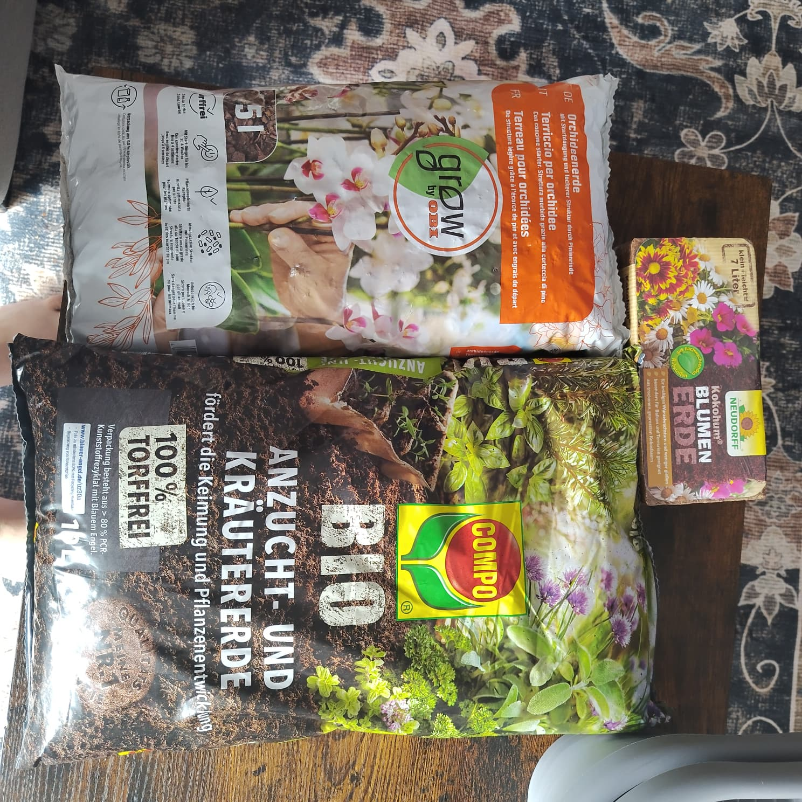

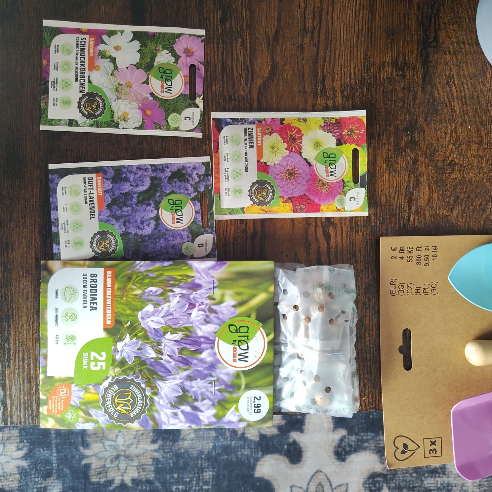

**Seeds:**
- Cosmos (Schmuckkörbchen) — full sun, start indoors, transplant after May 15
- Zinnia Field Mix — full sun, start indoors, transplant after May 15
- Lavender (Duft-Lavendel, Munstead) — slow grower, start indoors, be patient

**Bulbs:**
- Brodiaea Queen Fabiola — 25-pack, plant 8–10 cm deep, blooms June–August

**Supplies identified:**

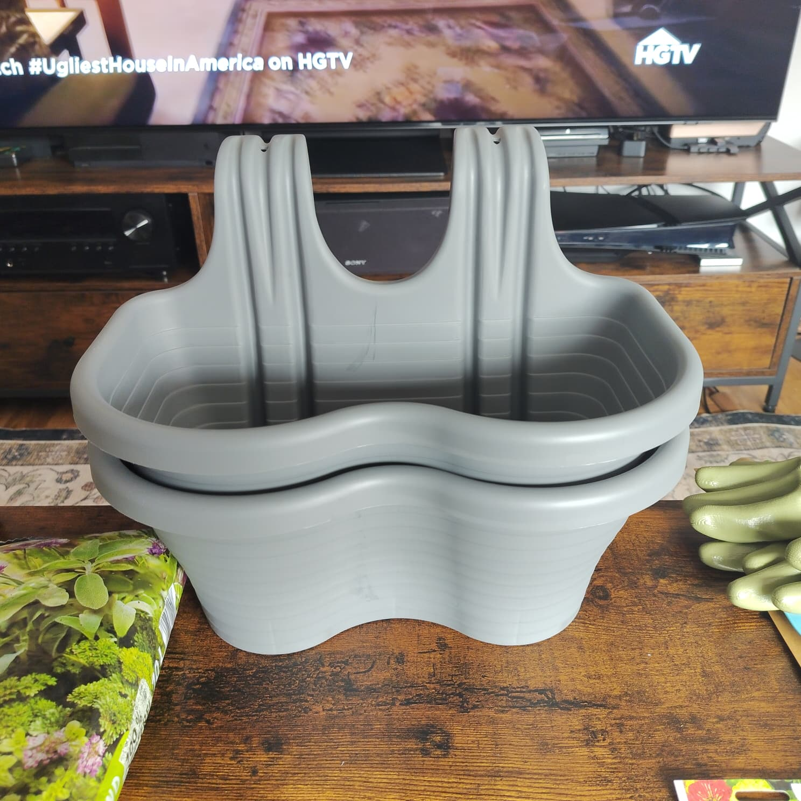

- 2 gray railing planters (double hook style)
- Compo Bio Anzucht- und Krautererde (brown bag) — main seed starting soil
- Neudorff Kokohumus (coco coir brick) — mix in for better drainage
- Orchid soil (white/OBI bag) — flagged as NOT suitable for flowers (bark-based, orchids only)

**Key decisions made:**
- Balcony confirmed as full sun — ideal for all chosen plants
- Cosmos, zinnias, and lavender will be started indoors first
- May 15 is the transplant-outside date (last frost, Stuttgart)
- Emma wants to expand the whole balcony with more pots and flowers over time

**Achievement unlocked: Brodiaea Bulbs Planted!**

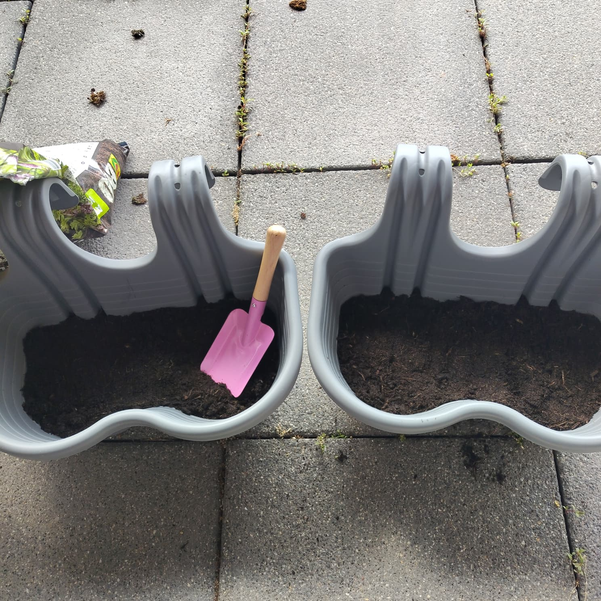

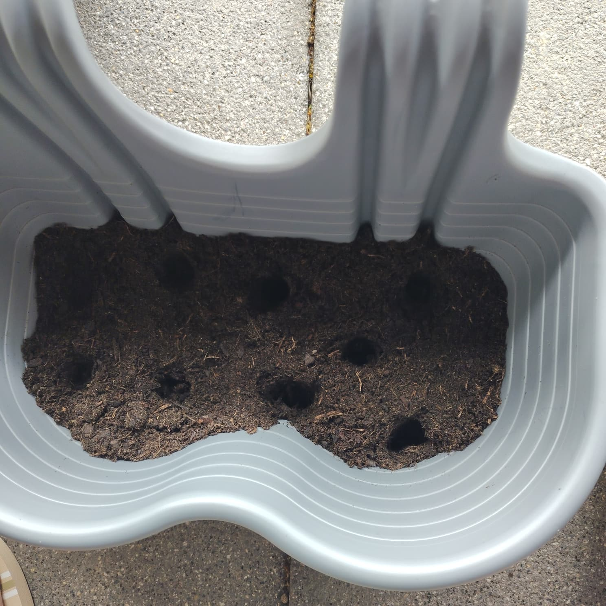

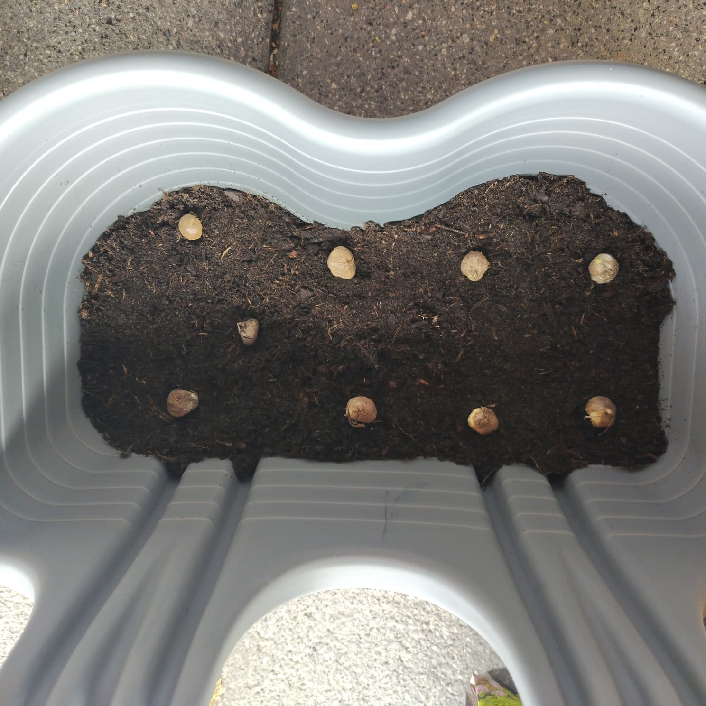

Both gray railing planters were filled with brodiaea bulbs during this session — approximately 8–10 bulbs per planter, placed 8–10 cm deep. These will bloom June through August.

**Gift flower arrangement documented:**

A mixed gift arrangement needs to be separated and repotted:
- Daffodils
- Ranunculus
- Pansies
- Primrose
- Forget-me-nots
- Pussy willow

Each plant to be separated into its own pot with Compo Bio soil.

---

### Session 3 — April 16, 2026 — "Seeds In the Ground!"

**The first seeds are officially planted — this garden is really happening!**

Michael helped Emma set up the seed starting station today. A brand new **18-cell seed tray** was unboxed — it comes in three sections of six cells each, with a clear plastic humidity lid to keep things warm and moist while the seeds germinate.

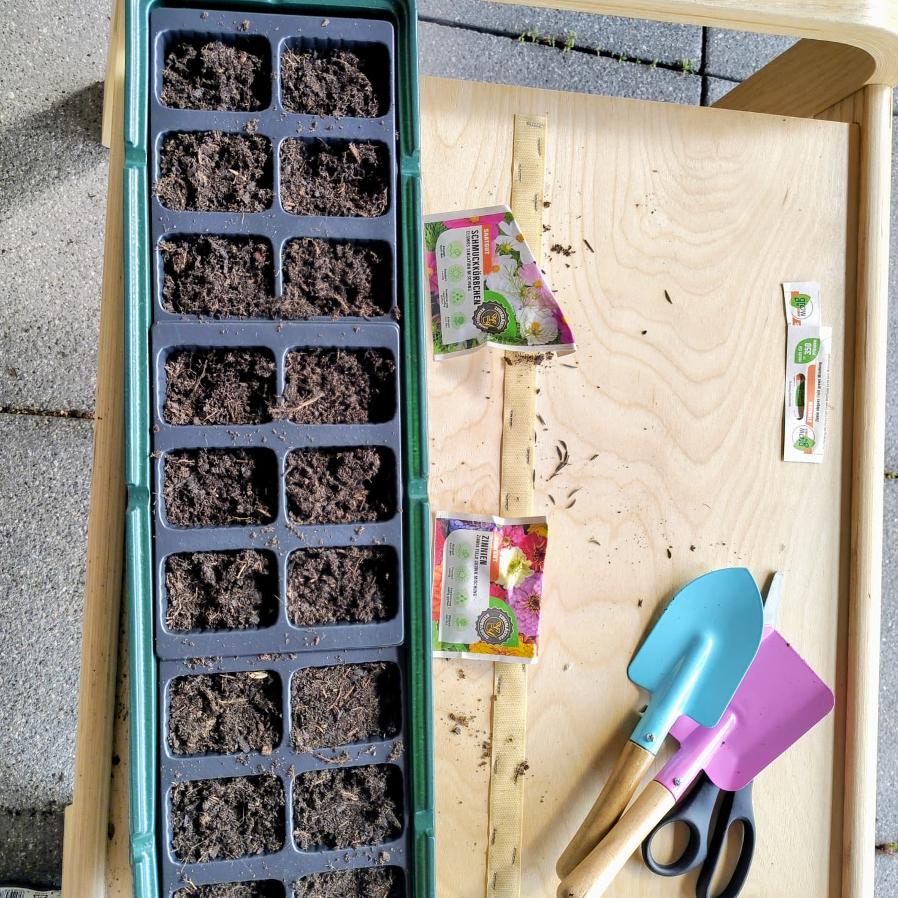

**The plan:** 9 cells for cosmos, 9 cells for zinnias. A clean 50/50 split.

**Sowing process:**
1. Filled all 18 cells with brown Compo Bio soil — first fill was too shallow, so they topped up to about 1 cm from the rim
2. Light press to settle the soil (not packed hard — roots need room to breathe!)
3. Made a small ~1 cm indent in each cell
4. Dropped 1–2 seeds per cell
5. Covered lightly with soil — no hard pressing on top
6. Sprayed everything down with the spray bottle until evenly moist

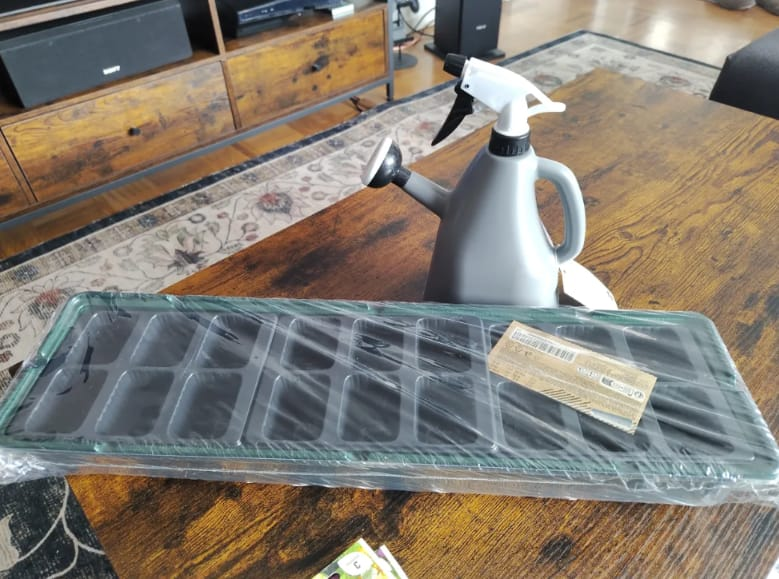

**Placement:** The tray went straight to a bright indoor windowsill with the humidity lid on top. The lid stays on until the first sprouts peek through, then it comes off to let air circulate. Expected germination: **5–10 days** — could see the first tiny green shoots by April 21–26!

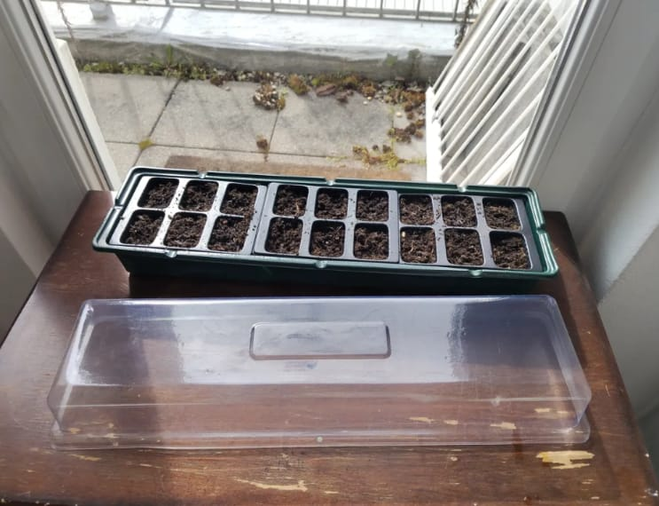

**The lavender decision:** After some consideration, the lavender seeds were set aside for a future season. The reasons make sense — lavender needs cold stratification (2–4 weeks in the fridge before sowing), has slow germination (another 2–4 weeks), and the timing was just too tight to get viable seedlings before the May 15 transplant date. The seeds will keep! If Emma wants lavender on the balcony this summer, a starter plant from the garden center is the way to go.

**Soil status:** About 2–2.5 liters of the brown Compo soil remain — not enough for repotting the gifted flower arrangement. More brown Compo has been ordered and is on the way!

---

### Session 4 — April 17, 2026 — "OBI Run & The Garden Expands!"

**The balcony garden just leveled up — new plants, new bulbs, new pots, and a big bag of soil!**

Today was a big day. Michael and Emma hit OBI with a plan to grab some long pots for greenery, and came home with way more than expected — in the best possible way.

**The OBI haul:**
- 3x **27cm TEDI pots** (black, practical, perfect for herbs)
- **Basil** (Basilikum) — a kitchen garden classic
- **Chocolate mint** — sounds delicious, looks gorgeous, and smells amazing
- 2x **Pink dianthus** — cheerful, low-maintenance summer bloomers
- **17L bag of brown Compo** (Qualitats-Blumenerde) — the good stuff, and plenty of it this time!

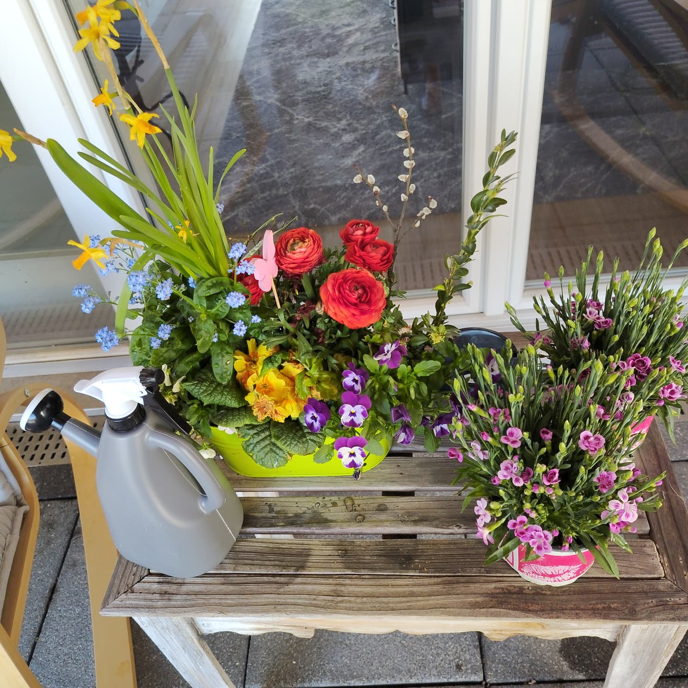

**What got planted:**

The **Babiana bulbs** (15-pack!) went into the **53cm hanging planter** — one of the gray railing-style planters. Holes were dug, bulbs were dropped in, and everything got a good watering. These will bloom in late spring to summer with stunning purple-blue and white flowers.

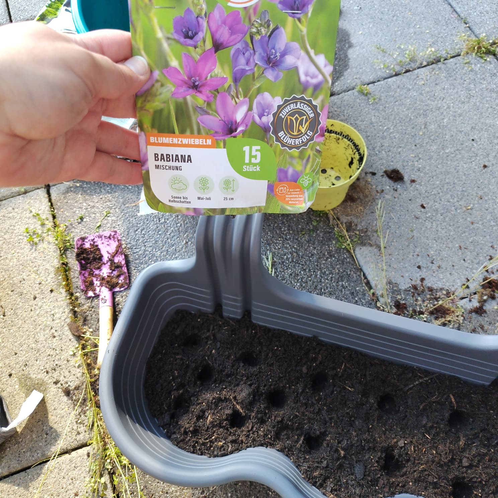

**Basil** got its own 27cm TEDI pot and is already looking lush and bushy on the balcony. Key care tip: pinch the top leaves regularly to keep it bushy and delay flowering — once basil flowers, the leaves turn bitter.

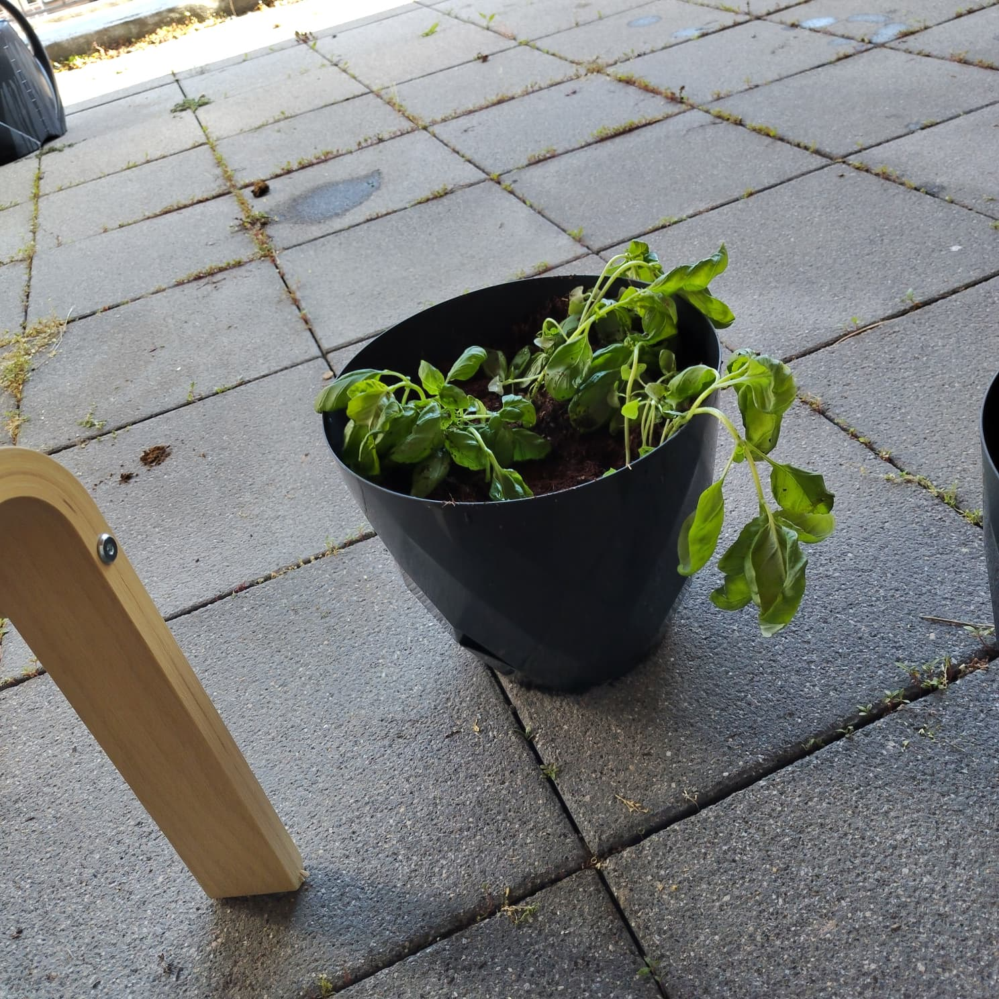

**Chocolate mint** also got its own solo pot — and this is important, because mint is the plant world's most aggressive roommate. It sends out runners and will absolutely strangle anything sharing its pot within a month. Solo living only!

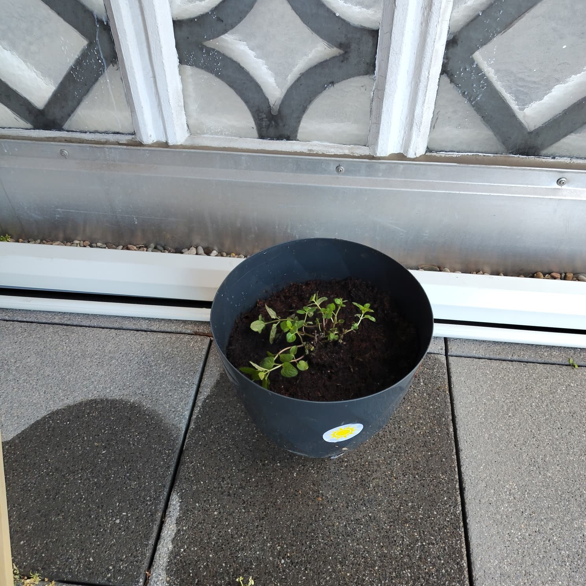

**The dianthus** are waiting for a smaller hanging planter — shopping trip planned for tomorrow (April 18). They'll want full sun, well-draining soil, and regular deadheading to keep the pink blooms coming all summer.

**What they almost bought (and wisely didn't):**
- Indoor houseplants from the *Zimmerpflanzen* section — would die on a Stuttgart balcony with near-freezing nights
- Petunias — frost-tender, need to wait until after May 15 (Eisheiligen)

**German garden shopping tip learned today:** Look for labels saying *winterhart* (winter-hardy), *Kubelpflanzen* (container plants), *Stauden* (perennials), *Krauter* (herbs), or *Balkonpflanzen* (balcony plants) — NOT *Zimmerpflanzen* (houseplants)!

**Soil status:** With the new 17L bag of brown Compo, there's now plenty on hand for potting up the dianthus, repotting the gift arrangement, and having soil left over. The orchid bag remains banished to the corner.

---

### Session 5 — April 18, 2026 — "Dianthus Day (and a Hose!)"

**Three mini-sessions in one day — morning plan, afternoon shopping, evening planting.**

#### Morning — Watering Check-In

Quick check before heading out for a hike. Nothing planted yesterday needed a real drink yet — everything was still holding moisture from the initial watering. The two pink dianthus were parked in a shady spot on the balcony, which meant the hot sunny day ahead wouldn't stress them. Evening repotting confirmed as the better play (cooler, less transplant shock).

#### Afternoon — TEDI Shopping Run

The hunt was on for a hanging planter for the two pink dianthus. First candidate: a 40 × 15 × 12.5cm railing box — wrong shape and way too shallow (12.5cm of root room isn't enough for dianthus, which want 20cm+).

Second candidate was the winner: a **€4 gray TEDI saddle planter, 37 × 28cm** — same gray finish as the brodiaea planters already on the railing, proper depth, wide enough for both dianthus side-by-side, and a drainage hole already cut. Green-lit on the spot.

#### Evening — Planting the Dianthus

Step-by-step walkthrough:

1. **Prep the planter** — flat surface, checked drainage hole was clear
2. **Add soil** — filled about ⅔ with brown Compo, loose (not packed)
3. **Unpot the dianthus** — gentle squeeze, teased out any circling roots
4. **Position** — 15–20cm apart, crowns level with the final soil line (critical: crowns buried = rot)
5. **Backfill** — firm gently around each plant, leaving ~2cm gap below the rim
6. **Water in** — slow thorough soak until water drained out the bottom
7. **Mount & place** — hooked onto the sunny railing alongside the brodiaea planters

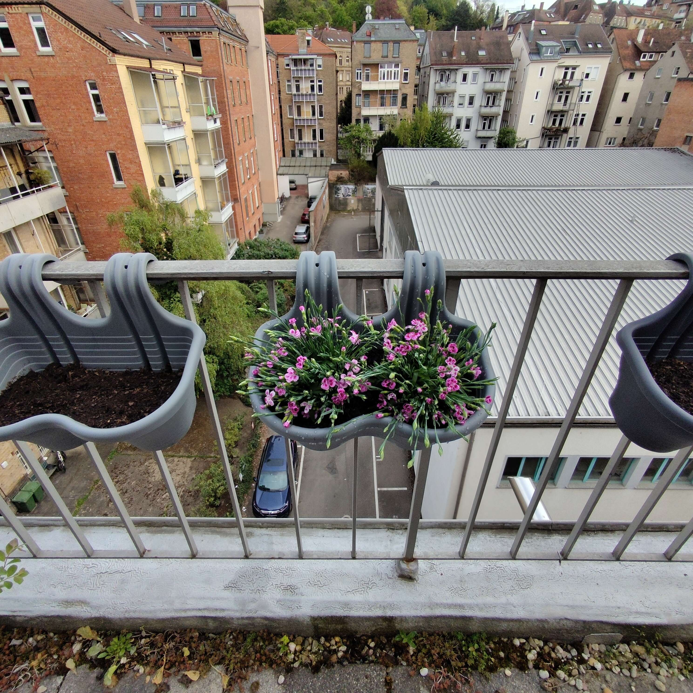

Spacing on point, crowns at the right height, freshly watered, and now catching full afternoon sun — exactly what dianthus want for continuous summer blooms.

#### Bonus — The Hose Arrived!

Emma's ordered expandable garden hose arrived and got installed on the balcony wall. Green hose with a black protective sleeve, multi-pattern spray nozzle, brass fittings, mounted to the wall hanger for clean storage between waterings. No more hauling watering cans back and forth from the kitchen sink.

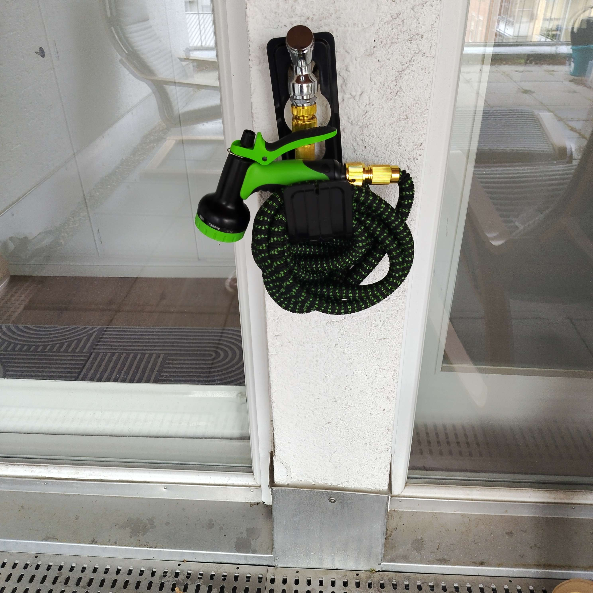

First job for the new hose: cleaning down the balcony workstation. The tiled floor got a proper hose-down — no more soil dust, potting debris, or stray leaves around the staging area.

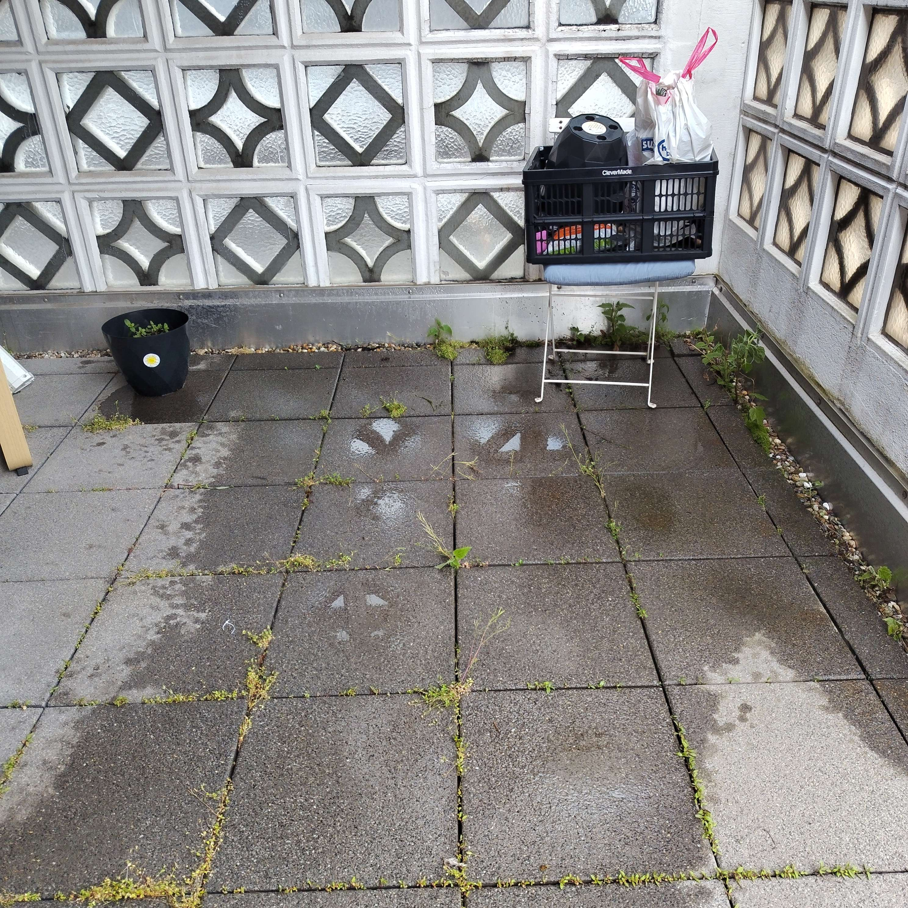

**Current balcony state after today:**
- Brodiaea — 2 gray railing planters
- Cosmos + zinnia — 18-cell tray on windowsill (still waiting on sprouts)
- Babiana — 53cm hanging planter
- Basil — solo in 27cm TEDI pot
- Chocolate mint — solo in 27cm TEDI pot
- **2 pink dianthus — 37×28cm gray TEDI saddle planter** ✨ NEW
- **Expandable hose installed on the wall** ✨ NEW

**Still on hand:** 1 spare 27cm TEDI pot, some brown Compo left. The gift arrangement is the next repotting job.

---

### Session 6 — April 19, 2026 — "WE HAVE SPROUTS!"

**Day 3 after sowing and the first green is already up!**

Emma peeked at the windowsill tray this morning and there they were — **tiny yellow-green seedlings** pushing through the soil in several cells, curled cotyledons breaking free. Sown on April 16, so today is **Day 3 post-sow** — ahead of the 5–10 day window and a sign that the humidity dome + bright windowsill combo is working exactly as intended.

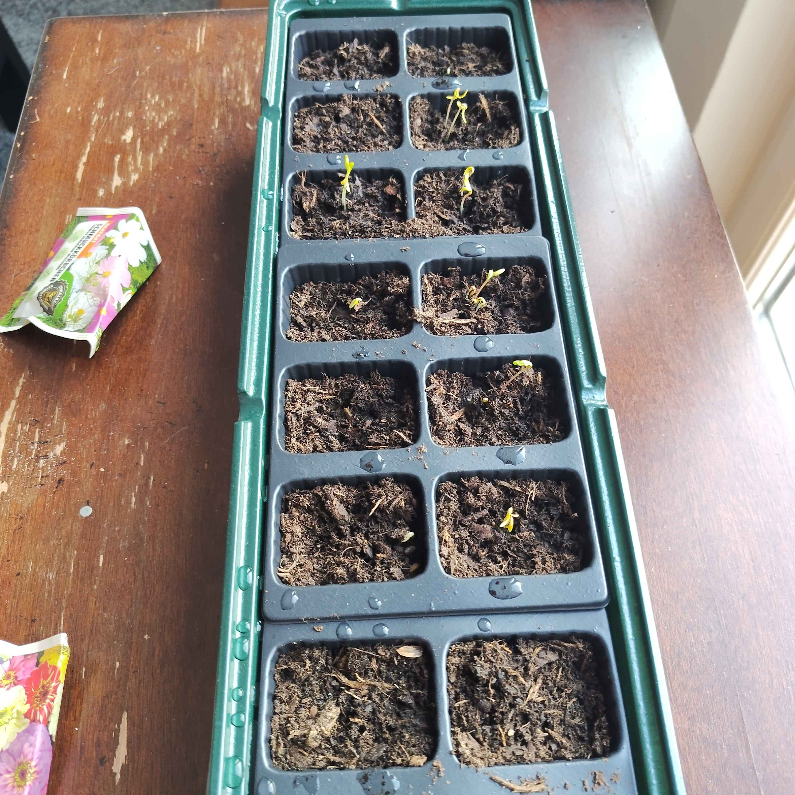

**Basil & mint update — replanted and improving!**

Emma also checked in on the basil and mint today. Both were replanted and are looking noticeably healthier — the basil is pushing out lush, full leaves and the mint is sending up fresh bright green shoots. The replanting clearly agreed with them.

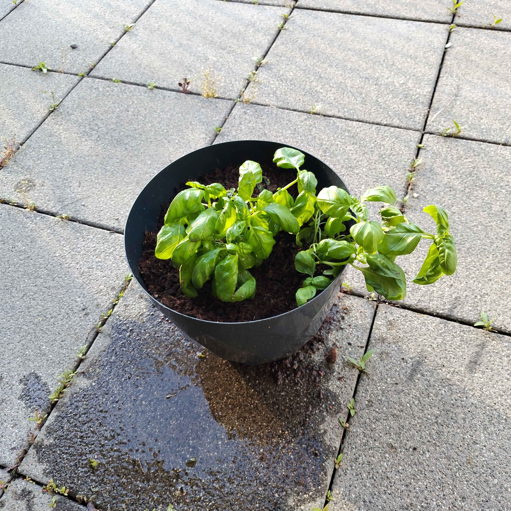

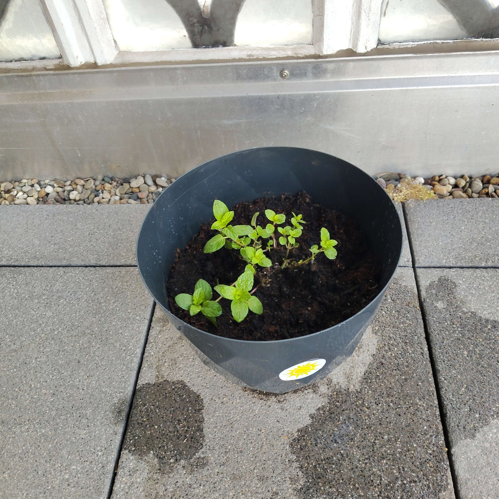

**What we're looking at:** the first cotyledons (seed leaves) — not the "true" leaves yet, but the sign that germination is complete. Zinnias are known for quick germination (3–7 days) so these early risers are almost certainly zinnias. Cosmos usually take a few more days.

**Immediate care changes now that things are sprouting:**

1. **Lid off (or propped open).** Once sprouts are visible, the humidity dome starts working against you — too much moisture = damping off, the fungal disease that collapses seedlings overnight. Better to let air circulate.
2. **Light, light, light.** Sprouts stretch toward the brightest source. Keep the tray on the brightest spot available and **rotate the tray 180° each day** to prevent leaning.
3. **Water from below if possible.** Seedlings are fragile — misting from above can flatten them. Pour water into the outer green tray and let the cells wick it up.
4. **No fertilizer yet.** The cotyledons carry the seed's own food reserves. First feeding comes when the first pair of true leaves appears.
5. **Watch for the rest.** More cells will wake up over the next 5–7 days. Empty cells aren't failures — patience first.

**Next milestone:** First true leaves — typically 1–2 weeks after germination. That's the green light to start thinking about transplanting up to bigger pots (if they outgrow the cells) before the **May 15 outdoor transplant date**.

---

### Session 7 — April 20, 2026 — "The Babies Are Here!"

**Day 2 of sprout life — and Emma is officially a plant parent!**

The cosmos and zinnia seeds sown on April 16 defied expectations. First sprouts appeared on April 19 — just 3 days after sowing, well ahead of the 5–10 day estimate. By this morning (April 20), approximately **70% of cells have visible sprouts**. They're green, standing upright, and showing no signs of legginess. Ahead of schedule!

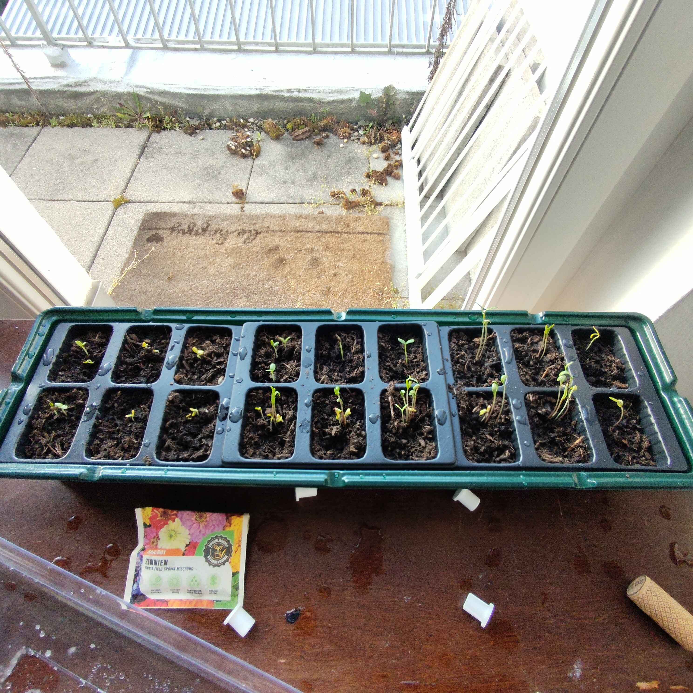

Emma headed straight to the sprouts first thing in the morning — full plant-parent mode activated. The soil was quite wet with heavy condensation on the dome, so the session focused on managing airflow and moisture.

**Key decisions made:**

- **Dome off during the day:** The humidity dome comes off during sunny daytime hours to let air circulate and prevent damping off. Dome goes back on at night when Stuttgart temperatures drop, with the built-in vent slider left open.
- **Skip watering today:** Soil is saturated — dark and wet with heavy condensation. Next watering will be **bottom-watering** (add water to the tray underneath, not from above) once the soil dries back.
- **Daily rotation:** Turn the tray 180° every day so sprouts grow straight instead of leaning toward the window light.
- **Grow light not needed:** The sunny windowsill + late-April Stuttgart daylight (14+ hours) is more than enough. Only reconsider if sprouts become leggy (tall, thin, pale, flopping).
- **Vent tool sorted:** The dome has a built-in slider vent — no need for pencils or chopsticks. A wine cork laid on its side works as a stable prop if more airflow is needed.

**Watch list for the coming week:**

- **Legginess** in stems → would signal need for more light
- **True leaves** (second set, different shape from the round first pair) → readiness milestone for full sun and transplant prep
- **Damping off** (fungal collapse at stem base) → risk from soggy soil + warm dome; prevented by venting and letting soil dry back
- **Soil moisture** → water only when drying back; always bottom-water from now on

**Emma's emotional state:** Nervous, anxious, utterly devoted. Had to be told three times to go make coffee and stop hovering over the sprouts. Classic first-time plant parent energy!

### Session 8 — April 22, 2026 — "Tray 2 & The Grow Light Arrives!"

**Succession sowing day — plus the grow light finally showed up to rescue the leggy seedlings.**

Day 7 of the garden, and the windowsill real estate is officially at capacity. Tray 2 got sown with a fresh batch of cosmos and zinnia for a staggered bloom window, an investigation of mystery sprouts in the bulb planters turned up some weeds, and the dual-head gooseneck LED grow light landed just in time.

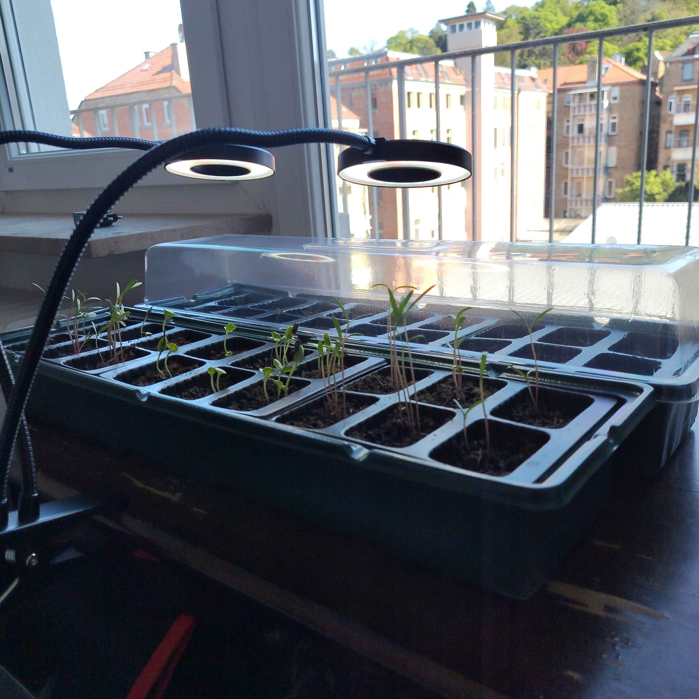

**Tray 2 — cosmos + zinnia succession sowing:**

Same process that worked for Tray 1, with a few tweaks:

- TEDI lidded cell tray (matching Tray 1)
- Compo Sana Qualitäts-Blumenerde (new bag)
- Cells filled to ~2 cm from the rim
- Small hole poked in the center of each cell, 1–2 seeds dropped in, covered with ~0.5 cm of soil
- Gentle mist watering with the new spray bottle
- Dome on, placed indoors by the window on the wooden dresser

Expected sprouts in ~3 days based on Tray 1's timing.

**Bulb planters — the mystery sprout investigation:**

Tiny green sprouts showed up in both the Brodiaea (2 gray railing planters) and the Babiana (53 cm hanging planter). Close inspection revealed **dicot cotyledons** — paired round leaves. Brodiaea and Babiana are monocots and would emerge as thin grass-like blades, so these weren't the bulbs.

Verdict: **weeds**, almost certainly from weed seeds in the Compo potting mix. Pulled to avoid nutrient and water competition with the bulbs below.

**Grow light — arrived, set up, adjusted:**

Dual-head gooseneck LED ring grow light. First attempt placed it too high (~25–30 cm above the seedlings). Lowered to **10–15 cm above seedling tops**. Set on a **16-hour timer** (8 hours of consecutive darkness). A regular LED strip was considered as a supplement but rejected — decorative strips aren't the right spectrum.

**Tray 1 — status check:**

Sprouts looking leggy (tall thin stems, cotyledons stretched toward the light). Cause: insufficient light before the grow light arrived. Plan: at transplant (after May 15), **bury the stretched stem deep**, up to just below the cotyledons — cosmos and zinnia will root along the buried portion.

**Notes for the next few days:**

- Check Tray 2 dome daily for condensation — vent if heavy droplets form
- Remove dome as soon as sprouts appear (prevents damping-off)
- Expect Tray 1 growth to come in tighter and sturdier under the grow light within 2–4 days
- Rotate trays 180° daily once sprouts emerge
- Skip watering Tray 2 until sprouts are visible
- Gentle stem ruffling or a low fan helps strengthen stems
- Sunny days ahead — natural light will supplement nicely

---

### Session 9 — April 23, 2026 — "Dianthus In, Nook Born, Backbone Begins"

**A big day — the dianthus are thriving, Michael's Nook came together at OBI, the evergreen backbone concept kicked off, and pot-up containers were ordered. Lots of plans locked in.**

**Morning check-in on the nursery:**

- **Tray 1 (cosmos + zinnia, sown April 16):** Soil surface a little dry on top — not a concern (mild surface dryness helps keep damping-off at bay). No wilting, so no water today. Next watering will be **bottom-watered** to avoid flattening the leggy stems further.
- **Tray 2 (cosmos + zinnia, sown April 22):** Barely any condensation on the dome. Day 1 after sowing is when the humid microclimate matters most. Plan: lift the dome, knuckle-deep moisture check, mist or bottom-water briefly if drying, then reseat firmly for a proper seal.
- **Grow light schedule correction:** Was left on overnight by accident — switched off in the morning, back on for the day, and off at 22:00 to give plants a proper dark period. Timer to be verified.

**Outdoor — herbs (separate pots):**

Mint and basil are kept in separate pots. Mint lives in a shaded spot, deliberately away from everything else — it's famously aggressive and will bully anything sharing a container.

- **Mint:** doing well. Once it has 3–4 sets of leaves, pinch the top pair just above a leaf node to force branching. Repeat every few weeks.
- **Basil:** leggy, weak stems, probably not going to recover. This was a crowded supermarket/commercial pot (many seedlings competing from day one) — not a reflection on the care. Next attempt: sow from seed or split a commercial root ball into 3–4 separate clumps at transplant.

**Dianthus — thriving in their saddle planter!**

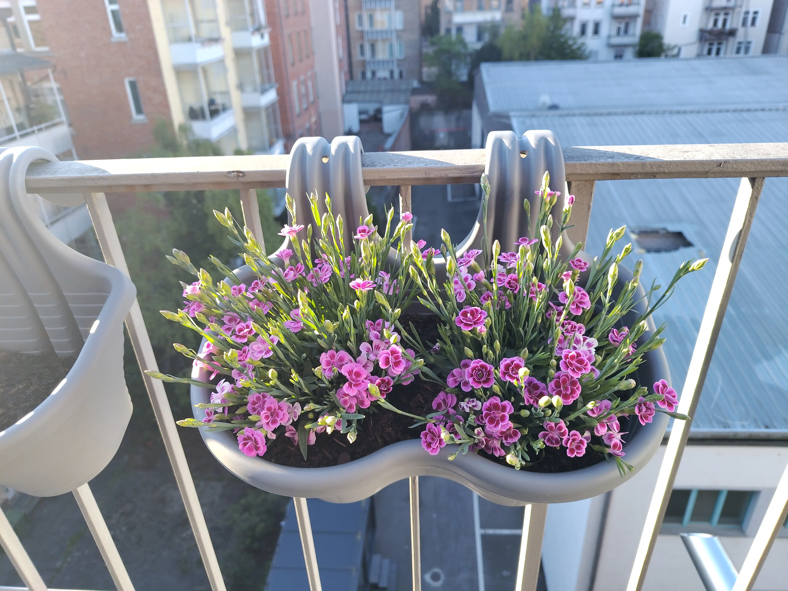

The two pink dianthus are looking great on the railing — full foliage, lots of unopened buds, vivid pink blooms. No watering today; it rained two days ago and dianthus prefer to dry out between waterings (soggy roots = trouble).

Watering rule of thumb: stick a finger ~2 cm into the soil — water only if dry at that depth. **Deadhead** spent blooms (pinch off flowers once they fade and brown) to keep new ones coming all season.

**Outdoor — Babiana & Brodiaea bulb pots:**

Finger-tested the soil on the bulb pots — still moist a knuckle deep. No watering today. Same principle as dianthus: let the top dry slightly before the next water.

**Pot-up containers ordered (Option 1 chosen):**

Ordered the **KPYZLBD pack of 100× 10 cm plastic propagation pots** with drainage holes (~$15.20, ~$0.15/pot). Right size for the first pot-up from the cell trays (fits the 7–9 cm guidance) and reusable across seasons. 100 count is intentional — this balcony garden is becoming a year-round project.

Rejected: Option 2 (biodegradable paper-fiber) — dries out too fast, mold risk indoors under the grow light, and "plant the whole pot" doesn't apply to balcony containers. Option 3 (13.6 cm) — too big as a first step-up; excess soil around a small root ball stays wet too long and risks root rot.

**Year-round garden planning — a new direction:**

The project is shifting from "spring sowing" to a full year-round rotation:

- **July–August:** Plan fall/winter sowing (candidates for Stuttgart: pansies, violas, ornamental kale, parsley, chives, maybe spinach or mâche)
- **Late winter (Jan–Feb 2027):** Plan next spring's sowing
- **Ongoing:** Note what thrived vs. struggled to inform next year

**Design concept — the evergreen backbone:**

New direction: build each large pot around an **evergreen backbone** (hardy foliage that stays green year-round) and rotate seasonal flowers around it. Keeps the balcony looking alive in winter — no empty, sad pots — and gives continuity across seasons.

Concept: 1–2 evergreen structural plants per large pot + rotating seasonal flowers (cosmos/zinnia in summer → pansies/violas in fall → hellebores/primroses in late winter).

Candidate evergreens (Stuttgart zone 7, container-suitable):

- **Heuchera** ("coral bells") — compact, evergreen in mild winters, purple/lime/caramel/silver foliage
- **Carex** (ornamental grasses) — graceful, with evergreen varieties
- **Dwarf conifers** — tiny spruces, junipers, or thuja for real structure
- **Euonymus fortunei** — variegated green/gold or green/white, very hardy
- **Ivy (Hedera)** — classic trailing evergreen
- **Lavender** (angustifolia) — semi-evergreen, silvery-green year-round, bonus summer blooms

**Michael's Nook — the OBI trip:**

An afternoon at OBI to finalize plants and soil for the Nook (the granite-sill reading spot overlooking Stuttgart's rooftops). The original plan was snake plant + small aloe vera + mini pineapple. The snake plant and mini pineapple stayed on the list; the Aloe vera got swapped after seeing what was in stock.

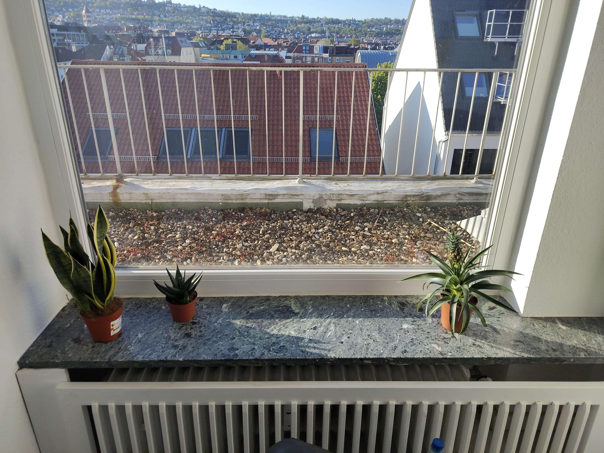

**Final plant selection:**

- **Snake plant (Sansevieria trifasciata 'Laurentii')** — bold yellow-edged green leaves, compact upright rosette. Picked over the silvery 'Moonshine' because the yellow margins complement the granite sill.
- **Haworthia / small aloe "Safari"** — compact upright rosette with white-speckled pattern. Replaced the true Aloe vera (the Aloe veras at OBI looked overwatered and floppy). The speckled pattern pairs beautifully with the snake plant's banding.
- **Mini pineapple (Ananas nanus)** — picked the specimen with the freshest, greenest fruit crown (longer-lasting decoration).

**Soil:**

- **Kakteen- und Bonsaierde torffrei** (OBI "grow" brand, 5 L, peat-free) — for the three Nook plants. Lechuza-Pon was rejected (wrong substrate — that's for self-watering Lechuza planters only).
- Additional Compo compost picked up for general balcony use (top-ups, repotting outdoor plants).

**Pots — ordering from Amazon:**

The terracotta pots at OBI either lacked drainage or weren't the right size. Ordering 3× pots with drainage + saucers (Untersetzer) from Amazon:

| Plant | Diameter | Height | Rationale |
|-------|----------|--------|-----------|
| Snake plant | 12 cm | 12–13 cm | Slightly more width than depth suits spreading rhizomes |
| Tiger aloe "Safari" | 10–11 cm | 9–10 cm | Smallest plant, shallow roots |
| Mini pineapple | 12 cm | 11–12 cm | Small root system — resist oversizing |

Sill is ~40 cm deep — plenty of room. Saucers essential to protect the granite from water stains. **Estimated arrival: Saturday April 25.**

**Care until pot-up:**

Plants are acclimating. Minimize stress — no fertilizing, no major interventions, stable conditions.

- **Light:** sunny window is ideal. Quarter-turn each pot every couple of days to grow evenly. Watch the aloe for leaf scorch in midday sun.
- **Watering:** don't water for now. Nursery pots arrive moist; enough residual moisture for several days. **Overwatering after transition is the #1 killer of succulents.** Wait until the soil is fully dry (a week or more).
- **Temperature:** 18–25°C, no cold drafts.

Once potted up:

- Snake plant: deep soak, then let soil dry completely. Winter: every 4–6 weeks.
- Tiger aloe: deep soak, dry fully between. Wrinkled leaves = thirsty.
- Mini pineapple: pour a little water into the central "cup" of the rosette; refresh every 1–2 weeks. Keep soil barely moist, not wet.

Watch for: yellow/mushy leaf bases → overwatering. Wrinkled leaves → underwatering. White cottony spots in crevices → mealybugs.

Mini pineapple fruit: will slowly dry and eventually fall off (weeks to months). Normal. The plant keeps living and may produce "pups" (baby plants) at the base for later propagation.

**OBI trip — evergreen backbone scouting:**

Browsed the full garden section. Only one buy today, but a clear shortlist for the next trip:

- **Sempervivum 6-pack (€7.99) ✅ bought** — mixed red/green/burgundy rosettes. Truly evergreen, hardy in Stuttgart winters, self-multiplies. Will go in a wide shallow pot with Kakteenerde.
- Hosta ❌ deciduous and shade-loving — wrong plant for the year-round sunny balcony goal
- Sedum "Spot On" / Mauerpfeffer ❌ semi-evergreen at best, and too similar in habit to Sempervivum
- Heuchera / Purpurglöckchen ❌ not stocked today — keep looking
- Carex / Segge ❌ not the right look
- Euonymus fortunei / Kriechspindel ❌ specimens looked leggy — revisit when stock improves
- Buchsbaum (boxwood) ❌ looked healthy but skipped — widespread boxwood moth (Buchsbaumzünsler) problem in Stuttgart. **Ilex crenata (Japanische Stechpalme)** is the recommended moth-free alternative
- Lavendel ❌ only Lavandula stoechas 'Anouk' (Schopf-Lavendel / French lavender) in stock — hardy only to -5 to -10°C, won't survive Stuttgart winters. Want **Lavandula angustifolia (Echter Lavendel / English lavender)**, hardy to -20°C

**Sempervivum — placement and pot plan:**

Planned location: the sunny wall where the reading chair sits. White stucco reflects light and warmth — perfect for Sempervivum, and ideal for cosmos/zinnia transplants later.

Design: two matching anchor pots flanking the chair, each combining the evergreen Sempervivum backbone with seasonal flowers on rotation (cosmos/zinnia in summer → pansies/violas in autumn → etc.).

Pot specs to add to the Amazon order:

- Quantity: **2 pots** (symmetrical — one per side of the chair)
- Size: **~30–35 cm diameter, ~25–30 cm deep** — fits Sempervivum around the perimeter + cosmos/zinnia in the center, deep enough that cosmos won't topple at full height (60–90 cm)
- Material: terracotta (classic, breathable, pairs with stucco), or frost-proof plastic (frostfest) as alternative
- Must-have: drainage holes + saucers or pot feet

**Planting plan per anchor pot (once pots arrive and Tray 1 is ready):**

- Backbone: 3 Sempervivum rosettes around the front/perimeter (splits the 6-pack: 3 per pot)
- Seasonal center: 2–3 cosmos or zinnia seedlings transplanted from Tray 1 after May 15
- Optional later: low trailing filler (alyssum, lobelia) to soften the edges

**Care until pot-up (Sempervivum):** leave in a sunny spot on the balcony, don't water unless bone dry, tuck somewhere covered if heavy rain is forecast (so water doesn't pool in nursery cells). Bulletproof in Stuttgart spring temperatures.

**Follow-ups (rolling list):**

- Check Tray 2 soil moisture under the dome; mist or bottom-water if drying
- Watch Tray 1 for first true leaves → pot up into 10 cm pots, burying leggy stems deep
- Pinch mint once it has 3–4 sets of leaves
- Plan replacement basil (seed-sown or split commercial pot)
- Deadhead dianthus as blooms fade
- Monitor bulb pots and dianthus — water only when top 2 cm feels dry
- Babiana planter: finish removing dicot weeds (carried over from April 22)
- Pots arriving Sat 25 Apr — ready for first pot-up when Tray 1 shows true leaves
- July–August: revisit fall/winter sowing plan
- Next OBI trip: Lavandula angustifolia, Ilex crenata, healthier Euonymus fortunei, Heuchera
- Pot up Nook plants (snake plant, tiger aloe, mini pineapple) in Kakteenerde once pots arrive
- Pot up Sempervivum split across 2 anchor pots with Kakteenerde once those arrive
- After May 15: plant 2–3 cosmos/zinnia per anchor pot alongside the Sempervivum

---

### Session 10 — April 24, 2026 — "The Evergreen Project"

**OBI run day — new plants, new soil, new tools, and the second grow light goes up!**

Emma and Michael refined the Evergreen Project design and hit OBI with a serious shopping list. The haul was big: two variegated Euonymus shrubs, metallic grey NORA anchor pots, Compo Cactea soil, BIO flower fertilizer, bypass pruners, a measuring jug, and a mixing bucket. Most planting is deferred to tomorrow (Apr 25) when Michael brings additional soil — but the plan is locked in.

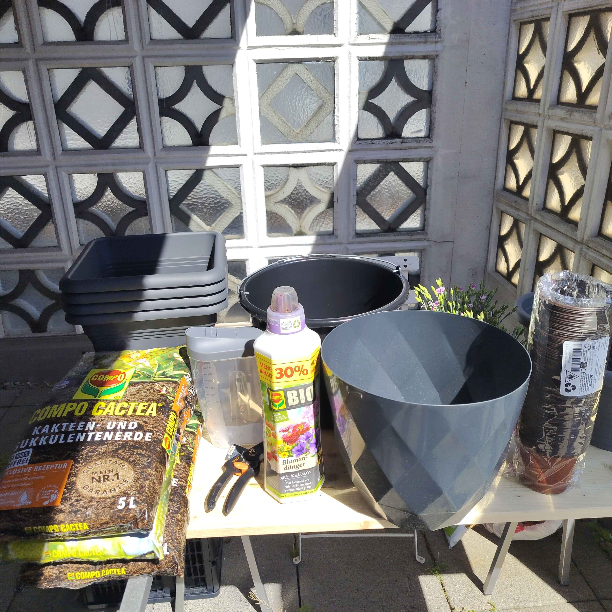

**Key decisions made:**

- **Sempervivum = alpine succulents.** Created a soil tension with the cosmos/zinnia anchor pot plan. Resolved with a 40% Cactea / 60% Compo Sana blend — lean enough for Sempervivum, rich enough for annuals. Cosmos and zinnias actually prefer leaner soil anyway (less nitrogen = more flowers, fewer leaves).
- **Anchor pot dimensions loosened.** Revised from strict 30-35cm wide / 25-30cm deep to 28cm+ wide, 20cm+ deep. Sempervivum are rock-crevice plants — diameter and drainage matter more than depth.
- **Euonymus gets its own pots.** Initially considered joining the anchor pots, but Euonymus is a woody shrub (30-60cm spread) that would crowd out everything else and wants richer, more moisture-retentive soil. Separate pots it is.
- **Basil pulled.** Not Emma's interest — was Michael's influence. Freed up two black pots (27x24cm) from the mint area, now repurposed as Euonymus pots. Matched pair = visual balance.

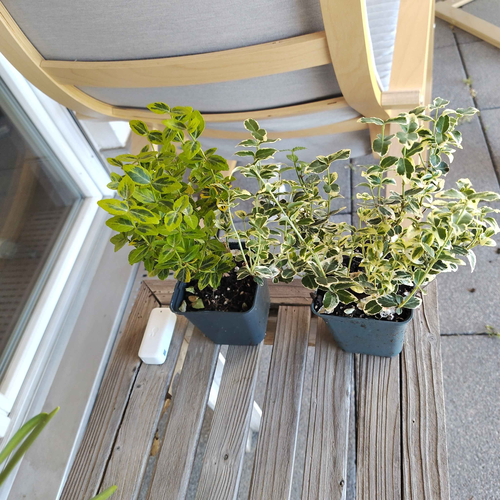

**Fertilizer strategy — switched to BIO Blumendünger:**

Originally planned Compo Universal-Flüssigdünger. Switched to **Compo BIO Blumendünger 1.3L** at the shelf — flower-specific ("Mit Kalium" / with potassium) for more blooms, BIO/organic for gentler feeding with less burn risk at half strength, and better value at €8.46/L. Skipped Düngestäbchen (sticks) — can't dial back once inserted, risky near Sempervivum.

**Critical rule: Sempervivum — NEVER fertilize.** Feeding causes soft weak growth, washed-out colors (reds/purples/bronzes fade to bland green), leggy open rosettes, rot risk, and reduced winter hardiness. The Cactea soil's 8-week built-in nutrients are already more than they need.

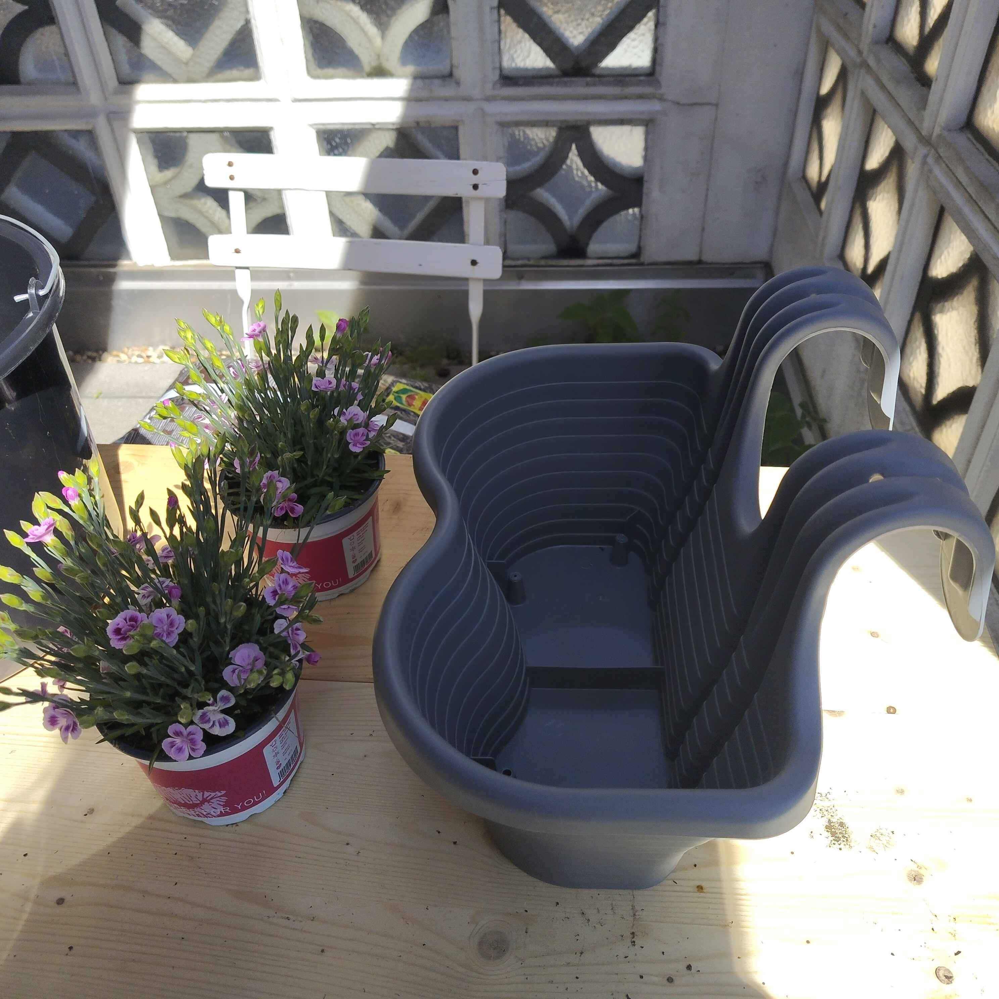

**Second grow light — intentional, not duplicate:**

Second Niello 3-head unit arrived as planned. Bigger cell trays also arrived today, so 5 goosenecks total give much better coverage than 2. Setup: 10-15cm above tallest seedlings, 16hr cycle, heads spaced evenly across the expanded tray footprint.

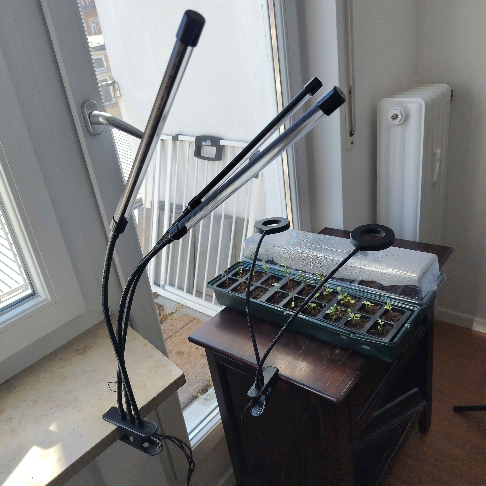

**New tools:** OBI bypass pruners with orange safety-lock slider. Care: wipe blades after each use, engage safety lock when storing, occasional pivot oil, alcohol-disinfect between plants if one is diseased. Upcoming uses: deadheading Dianthus, trimming ratty Euonymus leaves, thinning seedlings at transplant.

**Tomorrow's plan (Apr 25):**
- Michael brings +20L Compo Sana from OBI
- Pot up new Dianthus pair into hanging planter
- Pot up 2 Euonymus into freed-up black pots
- Plant Sempervivum in 2 anchor pots (3 per pot around rim)
- Leave center of anchor pots empty until May 15 cosmos/zinnia transplant
- Top-dress Sempervivum with balcony rocks (check size first)

**Overnight plant placement:** Dianthus and Sempervivum in sun (already adapted). Euonymus in partial shade (variegated leaves scorch-prone, need 1-2 day acclimation). No watering — stressed plants + transplant pending = rot risk.

---

### Session 11 — April 25, 2026 — "The Big Planting Day"

> *"No rest for the wicked."* — Emma, mid-transplant

**Massive planting day. Four projects completed, two deferred to tomorrow. ~9 hours start to finish, patio looked like a battlefield by the end. Worth it.**

**Morning OBI run:**

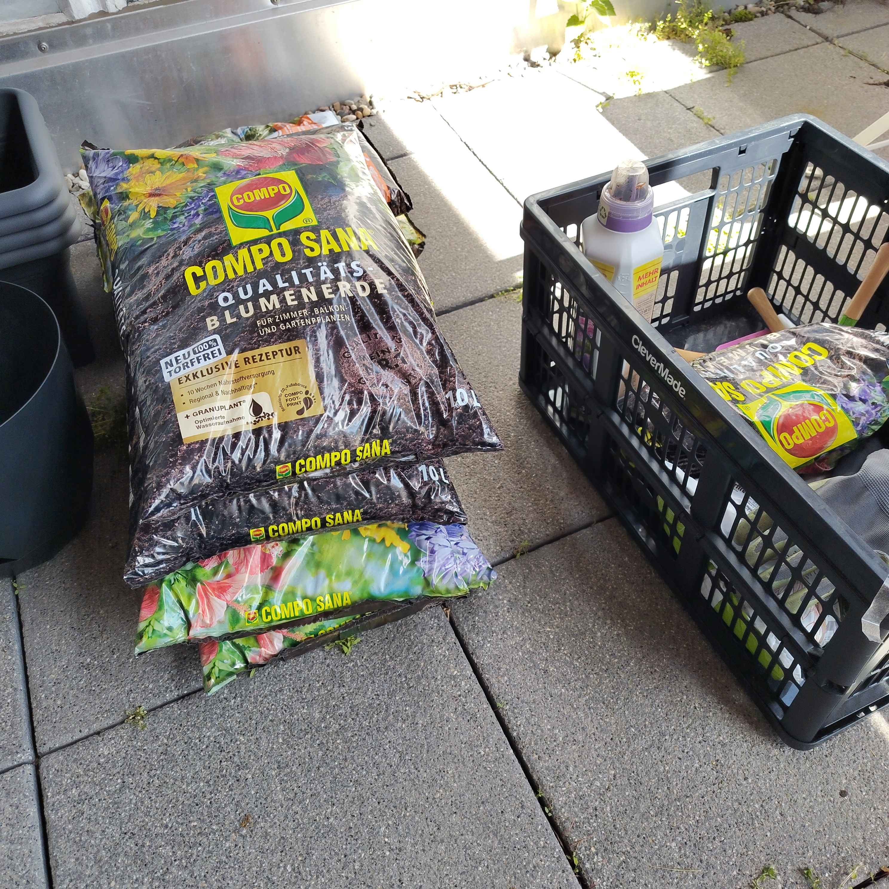

- ~20 L **Compo Sana Qualitäts-Blumenerde** — for the Euonymus and the Sempervivum anchor blend
- 1× **Lavandula angustifolia** (OBI Grow line, €3.49) — healthy roots, already budding. One for now; scale later if it thrives.
- Tile-joint weed solution **deferred** — chemical herbicides are illegal in Germany on paved surfaces (§12 PflSchG). Legal options: Fugenkratzer (joint scraper), boiling water, or a Heißluftgerät (heat gun).

#### 1 — Tray 1 potted up (cosmos + zinnia → 10 cm cells)

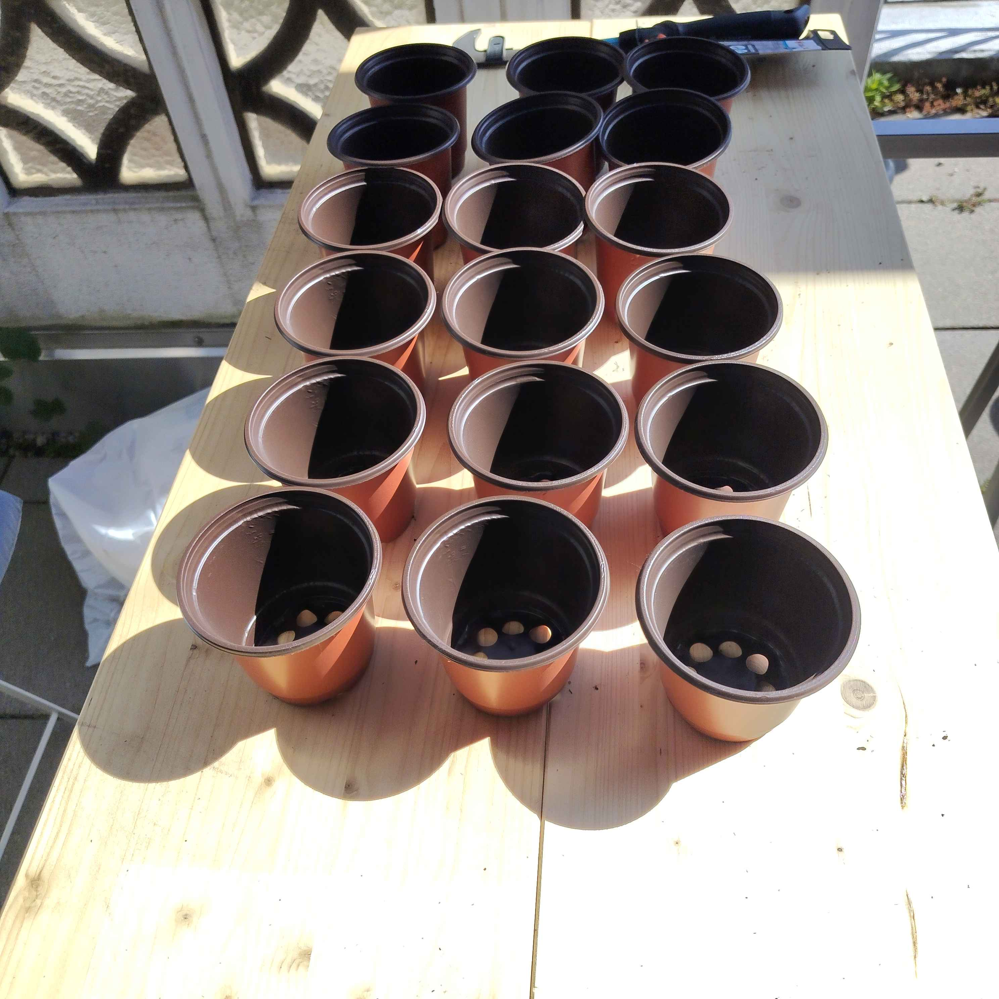

The Amazon pot order showed up right on cue, and Tray 1 (sown April 16, leggy by Day 9) finally graduated. **24 cells worth** of cosmos and zinnia got transplanted into 10 cm cups — worked outside on the shaded patio table, which doubled as a soft hardening-off step.

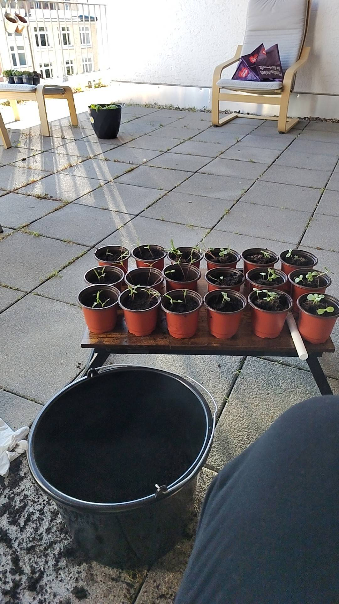

Identification on the table:

- **Cosmos** (left/center) — leggy, narrow cotyledons → buried below the cotyledons to fix the legginess (cosmos roots along the buried stem)
- **Zinnia** (right) — broader cotyledons → handled by the leaves, not the stem (zinnia stems don't re-root the same way)

After potting, everything went back inside under the dual grow light setup (now 5 goosenecks total since April 24):

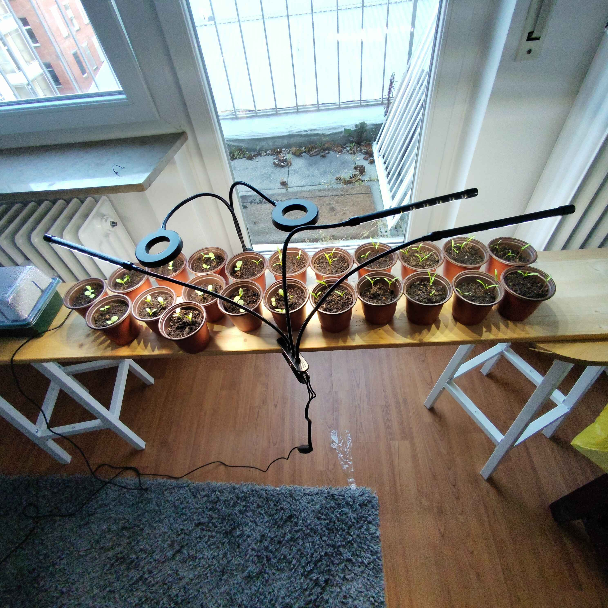

**Recovery plan:** lights raised / cut to 12 hr for the next 24–48 hr to let them recover from the transplant shock. **No water tomorrow** unless the surface is dry to the touch.

#### 2 — Third dianthus pair → grey hanging planter

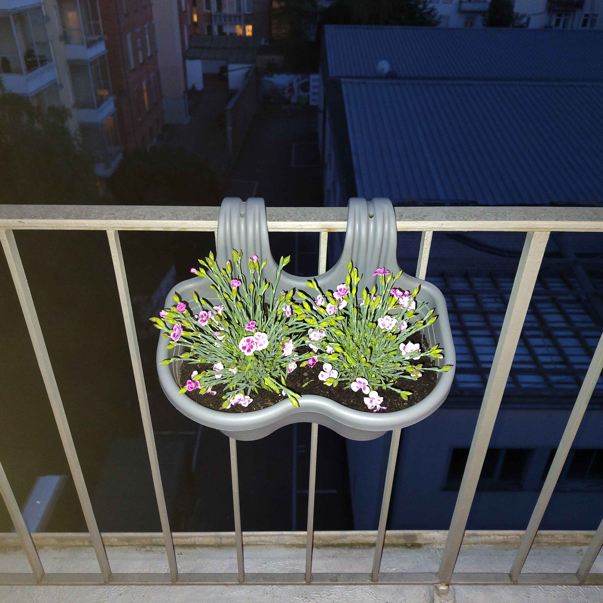

The pair purchased April 24 went into their new grey hanging planter. Used leftover soil opportunistically (no point letting it go to waste). Watered in. **Three pink dianthus planters now run along the railing** — a beautiful repeating rhythm that ties the whole gray-pot lineup together.

#### 3 — Euonymus fortunei → Zone A (short wall, black pots)

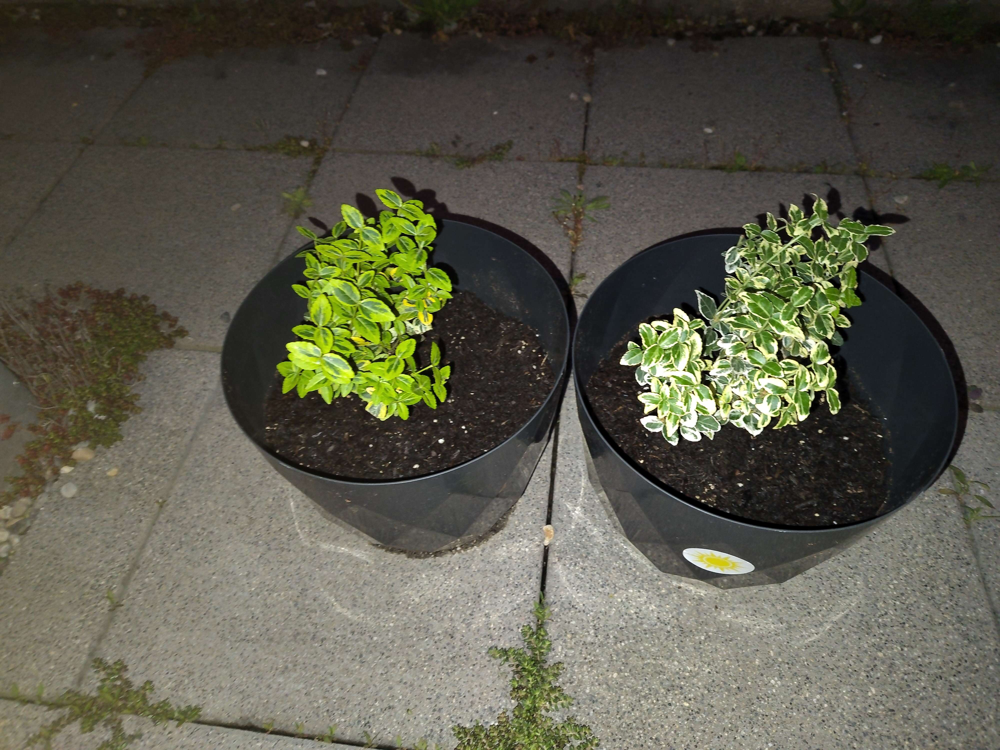

Both Euonymus into the **freed-up black 27×24 cm ex-mint pots** (the ones repurposed when the basil was pulled on April 24). Straight Compo Sana — no Cactea blend, since Euonymus prefers regular potting mix. Same depth as the nursery pot, stems NOT buried, watered to runoff.

**Multi-stemmed plants kept intact** — single plant per pot, do *not* separate the stems (would destabilize the root ball). When they go to Zone A, they'll face their bushiest side outward.

The matching pair: **golden-variegated + white-variegated** — the contrast will read well against the black pots and the short wall.

#### 4 — Sempervivum (Hens & Chicks) → Zone B anchor pots

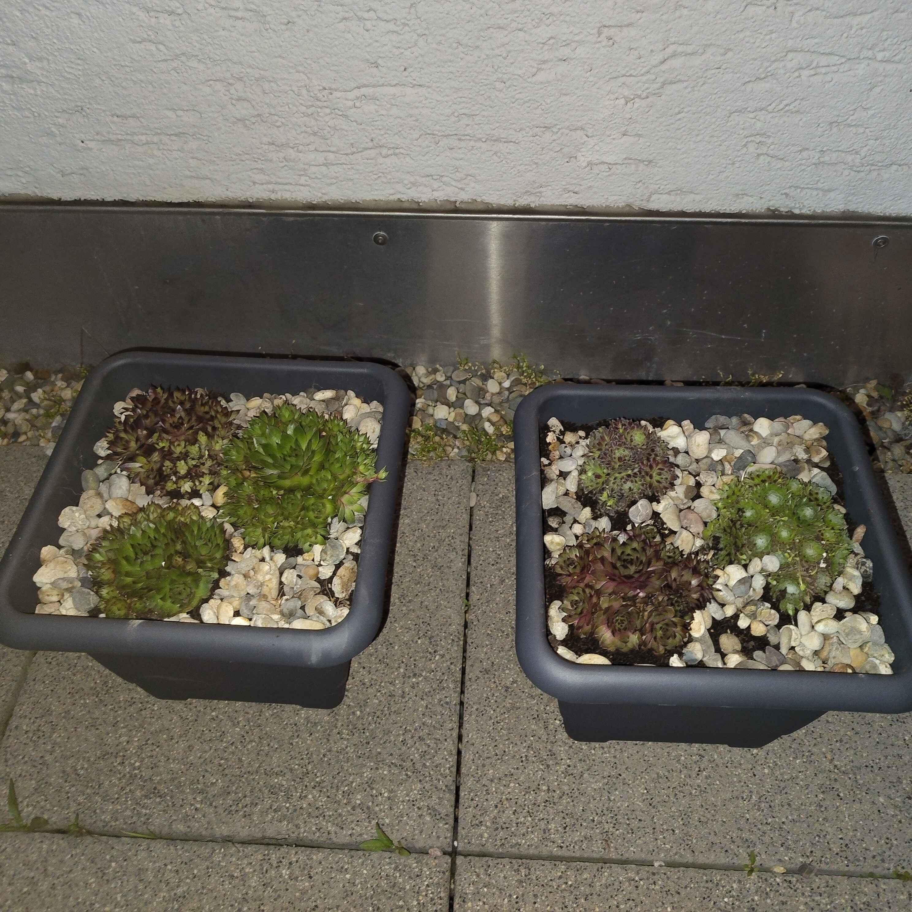

The 6-pack split across **2 grey NORA anchor pots**, **40/60 Cactea/Sana blend** (per the soil tension resolved on April 24). Crowns kept at soil level — *never buried*. Full rock top-dress for the alpine garden look.

The mix included green rosettes, burgundy/purple, and **S. arachnoideum** (the cobweb-haired one).

**Care non-negotiables (already established April 24):**
- **NO water for 3–5 days** — the roots need to heal first
- **NEVER fertilize** — Sempervivum want lean soil; feeding kills them

The remaining 2 NORA anchor pots stay reserved for the lavender (tomorrow) and the cosmos/zinnia post-May 15 overflow.

**Bonus — mint propagation worked:** the mint pot now has tiny new plants sprouting from the deleafed stems Emma replanted earlier. Confirms stem-cutting propagation as a working method to redirect/replace mint. Stays isolated from everything else (mint is invasive).

**The patio at the end of the day:**

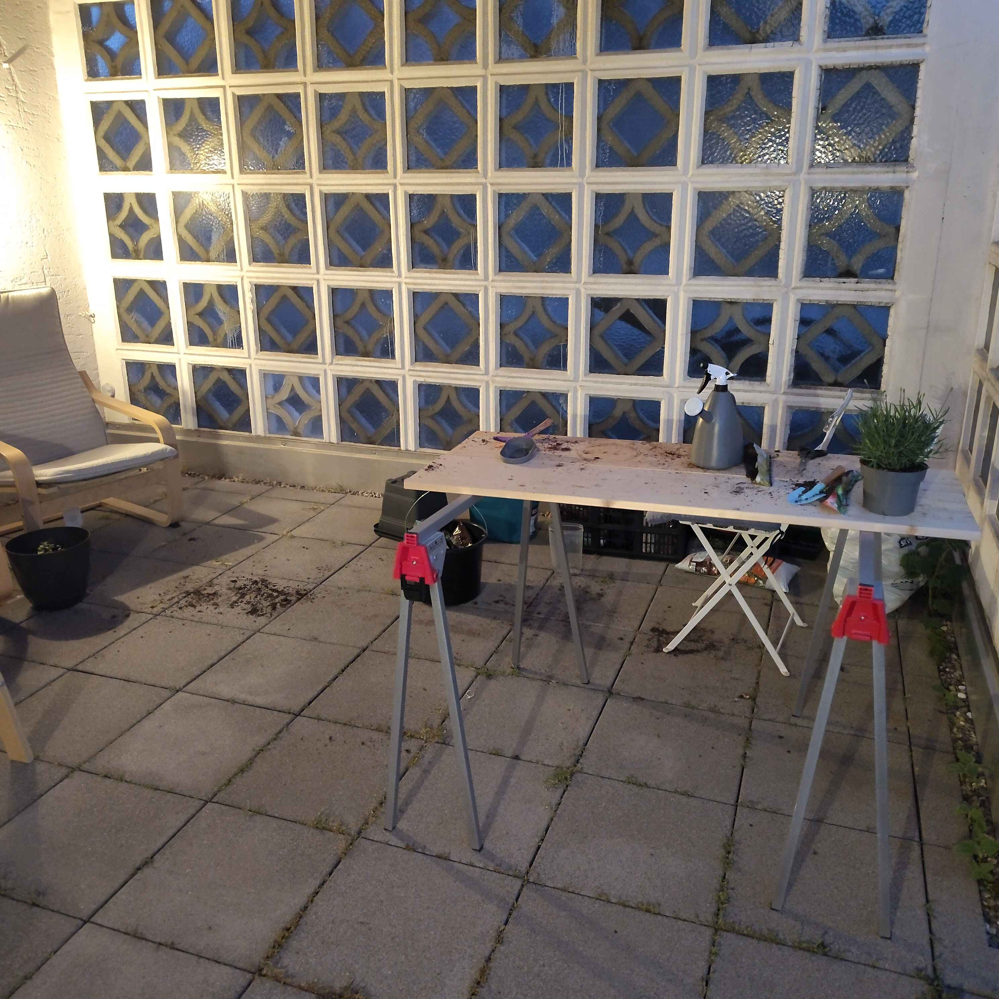

#### Final balcony zoning plan (locked in)

**Zone A — short wall (BLACK pot zone):**
- 2× Euonymus in black ex-mint pots ✅
- Matches the existing black pot at the far end
- Sunny morning exposure

**Zone B — long sunny wall (ALL GREY zone):**
- 2× NORA anchor pots: Sempervivum ✅
- 1× NORA anchor pot: Lavandula angustifolia (tomorrow)
- 1× NORA anchor pot: reserved for cosmos/zinnia overflow post-May 15
- Reading chair to be relocated
- Scope to scale: more lavender or more Sempervivum varieties

**Railing between zones:** dianthus trio in grey hangers ✅

#### Deferred to tomorrow

- [ ] Lavender repot — 1 NORA pot, 60/40 Cactea/Sana, drainage non-negotiable
- [ ] Michael's Nook repot — pots arrived; Sansevieria + Aloe Safari + Ananas nanus into drainage pots
- [ ] Final placement of Euonymus + Sempervivum in their zones, rotate Euonymus bushy-side outward
- [ ] Patio cleanup — soil sweep, store Compo bags
- [ ] Tile-joint weeds — Fugenkratzer or boiling water pass

#### Active care reminders

- **Sempervivum:** NO water 3–5 days, NEVER fertilize
- **Tray 1 seedlings:** lights eased 24–48 hr, no water unless surface dry
- **Tray 2:** dome on, day 3, germination expected Tue–Wed
- **Cosmos/zinnia outdoor transplant:** after May 15
- **Compo BIO Blumendünger:** half-strength every 2–3 wks, start ~1 wk post-May 15 transplant
- **Dianthus:** optional light feed every 2–3 wks
- **Brodiaea/Babiana:** no feed year 1
- **Pruners:** wipe + lock + oil pivot; alcohol disinfect only if disease present

#### Notes for next time

- ~9 hours start (morning check) to finish (final rocks). Mid-day was rough — the leggy seedling work is nerve-racking.
- Working in shade on the patio table = good for plants, fine for back/wrists.
- **Always pre-moisten new soil** before transplanting.
- Decorative rock placement around individual rosettes ate time without adding much value — next time, dump and spread.
- **Order dinner BEFORE the work, not after.**

---

### Session 12 — April 26, 2026 — "End-of-April Closeout"

**Three big items off the list: lavender planted, Nook repotted, balcony fully cleaned. Travel plan locked. April baseline established.**

End-of-April closeout day. The kind of session where the garden stops looking like a construction site and starts looking like somewhere you'd actually sit with a coffee. Three major tasks knocked out, a travel contingency plan locked in, and the balcony photographed as the official April 2026 baseline.

**Morning check — the nursery:**

Tray 1 (sown April 16, potted up into 10cm cells April 25) is looking healthy on Day 1 in cells. Cosmos cotyledons paired up nicely, and the zinnias on the right are already pushing true leaves — the feathery second pair. Color is good, no yellowing. A few sparse or empty cells to investigate next session. Grow lights eased 24–48hr post pot-up; back to normal 10–15cm distance tomorrow.

Tray 2 (sown April 22, dome day 4) has ~6 sprouts breaking through the soil. Dome condensation is healthy at this stage. The crack-the-dome sequence starts in 2–3 days: prop corner, half-off, off entirely over ~3 days.

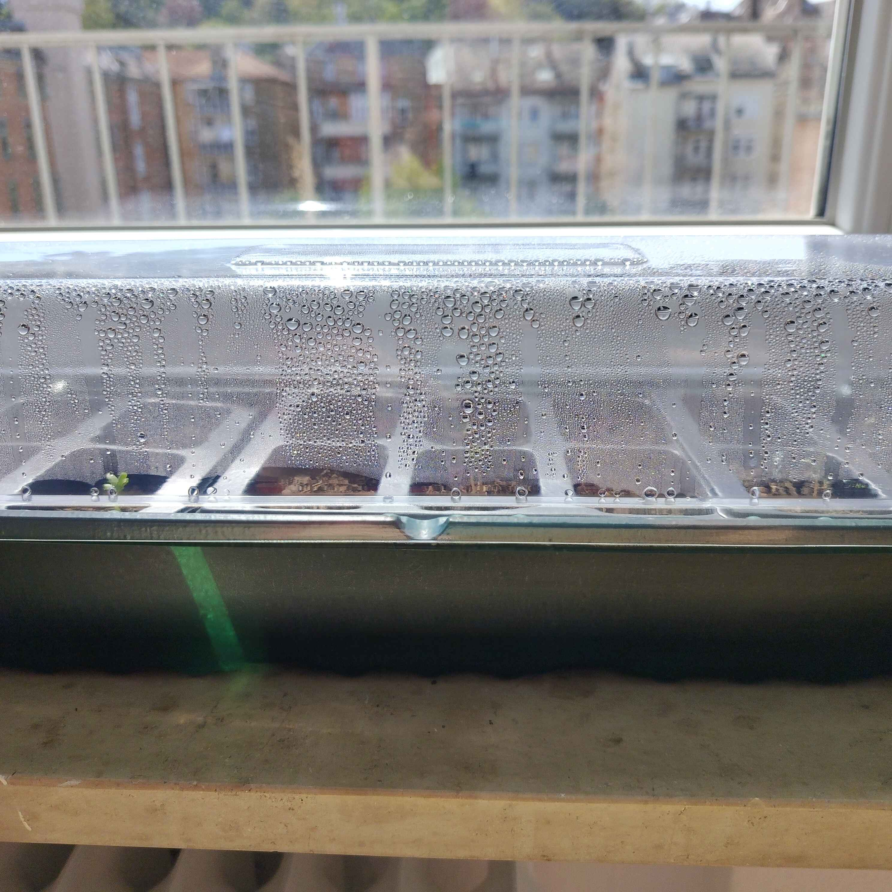

**Lavender planted!**

Finally — **Lavandula angustifolia** goes in! The winter-hardy variety (skipped L. stoechas, which can't handle Stuttgart winters). Planted in a reserved grey pot on the Zone B sunny long wall. Soil mix: 60% OBI Kakteenerde / 40% Sana — slightly grittier than the Sempervivum blend because lavender wants even more drainage. Crown placed at/above the soil line (buried crown = rot, the #1 lavender killer). Top-dressed with the same 5–10mm gravel as the Sempervivum pots. Watered in once deeply. No fertilizer — lavender prefers lean soil.

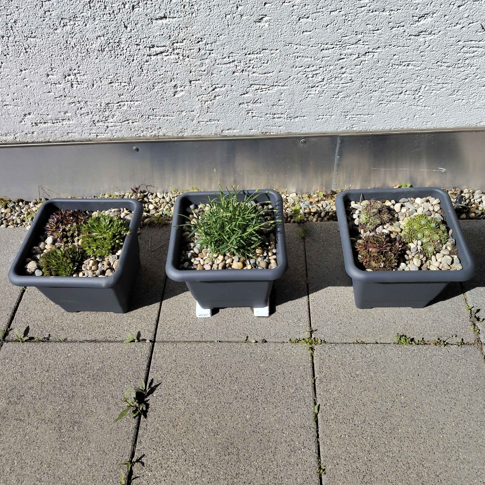

Initially placed in semi-shade out of transplant-stress habit, but Mediterranean plants don't actually need this. Moving to full Zone B sun in 1–2 days.

**Nook repotted!**

The three Nook plants finally got out of their OBI nursery pots and into proper homes. Full repot session into the Amazon pots that arrived yesterday. Final arrangement (L → R): Sansevieria 'Laurentii' (12cm pot), Ananas nanus mini pineapple (12cm pot, center), Aloe variegata "Safari" tiger aloe (10–11cm pot). All pots have drainage mesh discs — they prevent soil washout and pest entry without impeding drainage. Soil: straight OBI Kakteen-und Bonsaierde torffrei.

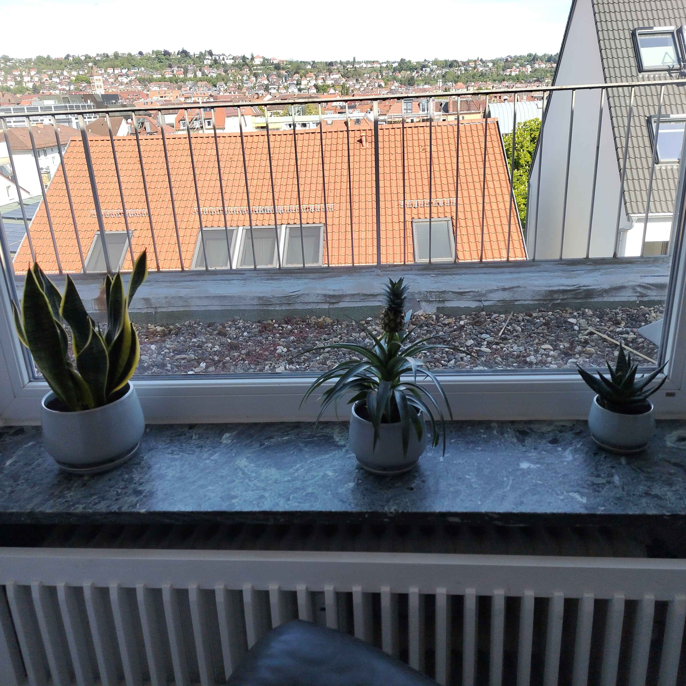

Care plan: no water for 5–7 days post-repot (root wounds need to callus). Direct sun is fine. Watch for leaf yellowing/mushiness. First watering ~May 1–3.

**Balcony cleanup and April baseline:**

Tile weeds tackled with the new Fugenkratzer (telescopic, modular heads, bought Apr 25). Combo strategy: pull toward you on dry joints, boiling water for stubborn deep roots, then scrape after 24–48 hours. Empty pots, soil bags, and tools organized. Chairs returned to position. The balcony is clean and ready for sitting season.

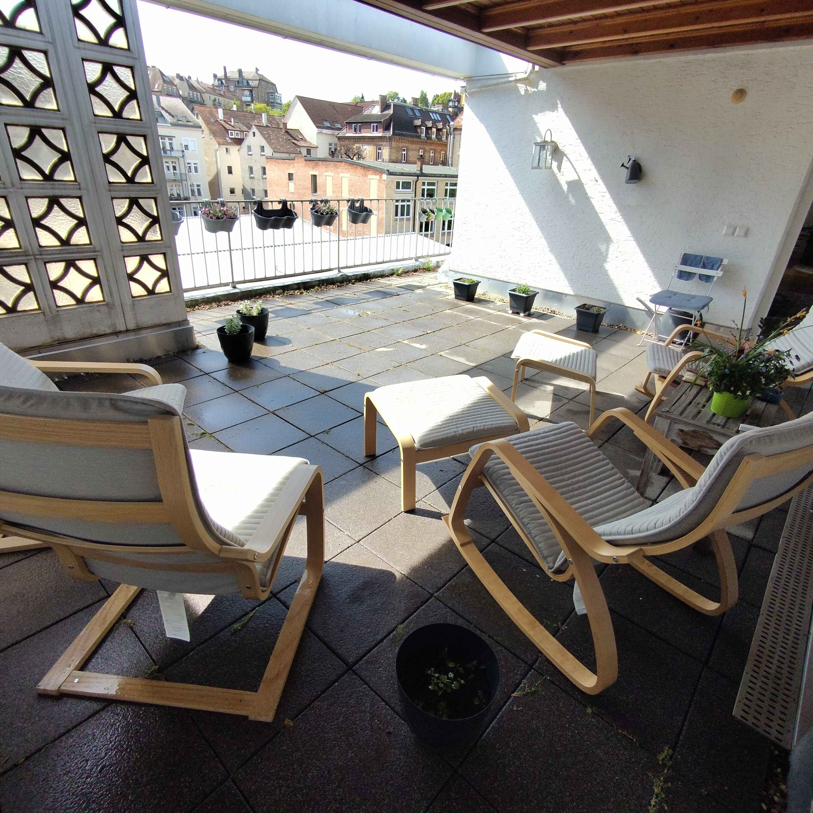

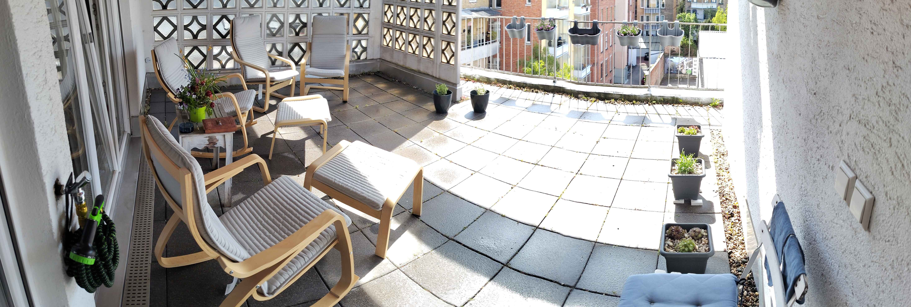

**Travel plan — May 20–25 (5 days):**

Decision: delay cosmos/zinnia outdoor transplant from May 15 → ~May 26–28 (post-return). Reasoning: slightly rootbound seedlings beat transplant-shocked-then-abandoned. Risk assessment: cosmos/zinnia are highest risk (delay transplant), tray seedlings medium (capillary mats), dianthus and mint medium (Blumat carrots + 1.5L PET bottles), everything else drought-tolerant (no action needed). Pre-trip shopping: 1–2 capillary mats, 3–4 Blumat carrots + PET bottles, 1× timer plug. Grow lights stay on 16hr timer, raised to 20–25cm, dimmed to 70–80% if possible.

---

## What's Done So Far (Summary)

### Completed
- Brodiaea Queen Fabiola bulbs planted in both gray railing planters
- Babiana bulbs planted in 53cm hanging planter
- All seeds and supplies inventoried and catalogued
- Soil types identified — correct usage determined (orchid soil set aside)
- Full season plan created with timeline and to-do lists
- Gift arrangement plants identified and repotting plan made
- Watering schedule established
- 18-cell seed tray purchased and set up (Tray 1)
- Cosmos + zinnia seeds sown indoors — Tray 1 (April 16) and Tray 2 (April 22)
- Tray 1 sprouted ~70% by April 20 (first sprouts Day 3!)
- Tray 2 sown for succession bloom (TEDI tray, Compo Sana, dome on)
- Dome management: off during day, on at night with vent open
- Lavender postponed to next season (needs stratification, timing too tight)
- OBI run (April 17): basil, chocolate mint, 2x pink dianthus, 3x TEDI pots, 17L Compo soil
- Basil potted solo in 27cm TEDI pot
- Chocolate mint potted solo in 27cm TEDI pot (never share — mint is a bully!)
- TEDI run (April 18): €4 gray 37×28cm saddle planter for the dianthus
- 2 pink dianthus planted and mounted on the sunny railing
- Expandable garden hose installed on the balcony wall
- Balcony workstation hosed down and cleaned up
- Basil and mint replanted and improving (April 19)
- Dual-head gooseneck LED grow light set up at 10–15 cm, 16h timer (April 22)
- Dicot weeds identified and removed from Brodiaea + Babiana planters (April 22)
- OBI run (April 23): snake plant 'Laurentii', Haworthia "Safari", mini pineapple, Sempervivum 6-pack, Kakteenerde, Compo
- Pot-up containers ordered (100× 10cm KPYZLBD, drainage holes)
- Amazon order placed: 3× Nook pots (12/11/12 cm) + 2× Sempervivum anchor pots (30–35 cm)
- OBI run (April 24): 2x Euonymus fortunei, 4x NORA anchor pots, 3x Compo Cactea 5L, BIO Blumendünger 1.3L, bypass pruners, measuring jug, bucket, grey hanging planter, 2x Dianthus
- Basil pulled — pots repurposed for Euonymus
- Fertilizer strategy finalized: Compo BIO Blumendünger (with potassium, half strength)
- Second Niello 3-head grow light installed (5 goosenecks total, 16hr cycle)
- Bigger cell trays set up for seedling upsizing before May 15 transplant
- Anchor pot soil blend determined: 40% Cactea / 60% Compo Sana
- Sempervivum care rule established: NEVER fertilize
- OBI run (April 25): ~20L Compo Sana + 1× Lavandula angustifolia (€3.49)
- Tray 1 potted up — 18× 10 cm cups, leggy cosmos buried below cotyledons (April 25)
- Third dianthus pair planted in grey hanging planter — railing trio complete (April 25)
- Euonymus fortunei pair potted in black ex-mint pots — Zone A backbone (April 25)
- Sempervivum 6-pack split across 2 NORA anchor pots, 40/60 Cactea/Sana, full alpine rock top-dress (April 25)
- Final balcony zoning locked in: Zone A black-pot wall + Zone B grey-pot wall + railing dianthus trio
- Lavandula angustifolia found at OBI (closes the April 23 follow-up)
- Mint propagation confirmed working — new sprouts from deleafed stem cuttings
- Lavandula angustifolia planted in grey pot, Zone B sunny wall (60% Kakteenerde / 40% Sana, gravel top-dress)
- Nook repotted: snake plant (12cm), mini pineapple (12cm), tiger aloe (10-11cm) in Kakteenerde with drainage mesh discs
- Balcony fully cleaned: tile weeds removed with Fugenkratzer, pots organized, chairs positioned
- April 2026 baseline photos taken for July growth comparison
- Travel plan locked: May 20–25 trip, transplant delayed to ~May 26–28
- Fugenkratzer (telescopic, modular heads) added to tool kit

### In Progress
- Tray 1 recovery in 10cm cells — Day 1, lights eased, resume normal distance tomorrow
- Tray 2 germination: ~6 sprouts on day 4, dome cracking starts ~Apr 29–30
- Nook plants post-repot: no water for 5–7 days, first watering ~May 1–3
- Lavender acclimation: move from semi-shade → full Zone B sun ~Apr 28
- Gift arrangement still in original container — needs repotting

### Not Yet Started
- Pre-trip shopping: capillary mats, Blumat carrots, timer plug (before May 20)
- May 20 morning checklist: deep soak, shade positions, Blumats installed, timer confirmed
- Transplanting cosmos/zinnias outdoors into anchor pot centers (~May 26–28 post-return)
- Fertilizer first dose: ~1 week after transplant (half strength BIO Blumendünger)
- Repotting gift arrangement into individual pots
- Fall/winter sowing plan (July–August)
- Find Ilex crenata, Heuchera on next OBI trip (Lavandula angustifolia ✅ April 25)

---

## Photo Log

| Date | Description | Photo |
|------|-------------|-------|
| April 15, 2026 | The supply haul — soils on the table |  |
| April 15, 2026 | Seeds and bulbs lineup |  |
| April 15, 2026 | Railing planters unboxed |  |
| April 15, 2026 | Planters filled with soil on the balcony |  |
| April 15, 2026 | Brodiaea bulbs placed in planter |  |
| April 15, 2026 | Planting holes dug and ready |  |
| April 16, 2026 | Seed tray sowing station in action |  |
| April 16, 2026 | Tray and spray bottle before filling |  |
| April 16, 2026 | Seed tray on the windowsill — the waiting begins |  |
| April 17, 2026 | Gift arrangement & dianthus on the balcony |  |
| April 17, 2026 | Chocolate mint potted solo |  |
| April 17, 2026 | Babiana bulbs going into the hanging planter |  |
| April 17, 2026 | Basil potted and soaking up the sun |  |
| April 18, 2026 | Pink dianthus planted and mounted on the sunny railing |  |
| April 18, 2026 | New expandable hose installed on the balcony wall |  |
| April 18, 2026 | Workstation hosed down and cleaned up |  |
| April 19, 2026 | First sprouts! Cosmos/zinnia seedlings on Day 3 |  |
| April 19, 2026 | Basil looking lush after replanting |  |
| April 19, 2026 | Mint pushing fresh shoots after replanting |  |
| April 20, 2026 | Sproutlings progress — ~70% sprouted, dome off! |  |
| April 22, 2026 | Tray 2 sown + grow light set up over Tray 1 |  |
| April 23, 2026 | Dianthus thriving in their saddle planter |  |
| April 23, 2026 | Michael's Nook — snake plant, tiger aloe, mini pineapple |  |
| April 24, 2026 | Euonymus pair — golden + white variegated on the balcony |  |
| April 24, 2026 | New Dianthus pair + grey hanging planter |  |
| April 24, 2026 | Full OBI haul — Cactea, fertilizer, pots, pruners |  |
| April 24, 2026 | Dual grow lights — 5 goosenecks over the seedlings |  |
| April 25, 2026 | The OBI haul — ~20L Compo Sana + supply crate |  |
| April 25, 2026 | 10cm pot-up cells laid out and ready |  |
| April 25, 2026 | Tray 1 transplanted on the patio table (hardening off too) |  |
| April 25, 2026 | Tray 1 transplants back under the grow lights |  |
| April 25, 2026 | Third dianthus pair on the railing — trio complete |  |
| April 25, 2026 | Euonymus fortunei pair in black ex-mint pots — Zone A |  |
| April 25, 2026 | Sempervivum anchor pots, alpine rock top-dress |  |
| April 25, 2026 | The patio battlefield — workstation aftermath |  |
| April 26, 2026 | Lavender + Sempervivum pots on the Zone B sunny wall |  |
| April 26, 2026 | Nook repotted — final arrangement on granite sill |  |
| April 26, 2026 | Balcony cleaned and ready — April baseline |  |
| April 26, 2026 | Balcony panorama — April 2026 baseline |  |
| April 26, 2026 | Tray 2 dome day 4 — sprouts breaking through |  |
| | First bloom! | *(coming soon!)* |

> See the full story with descriptions in the [Photo Gallery](GALLERY)!

---

*Last updated: April 26, 2026*
