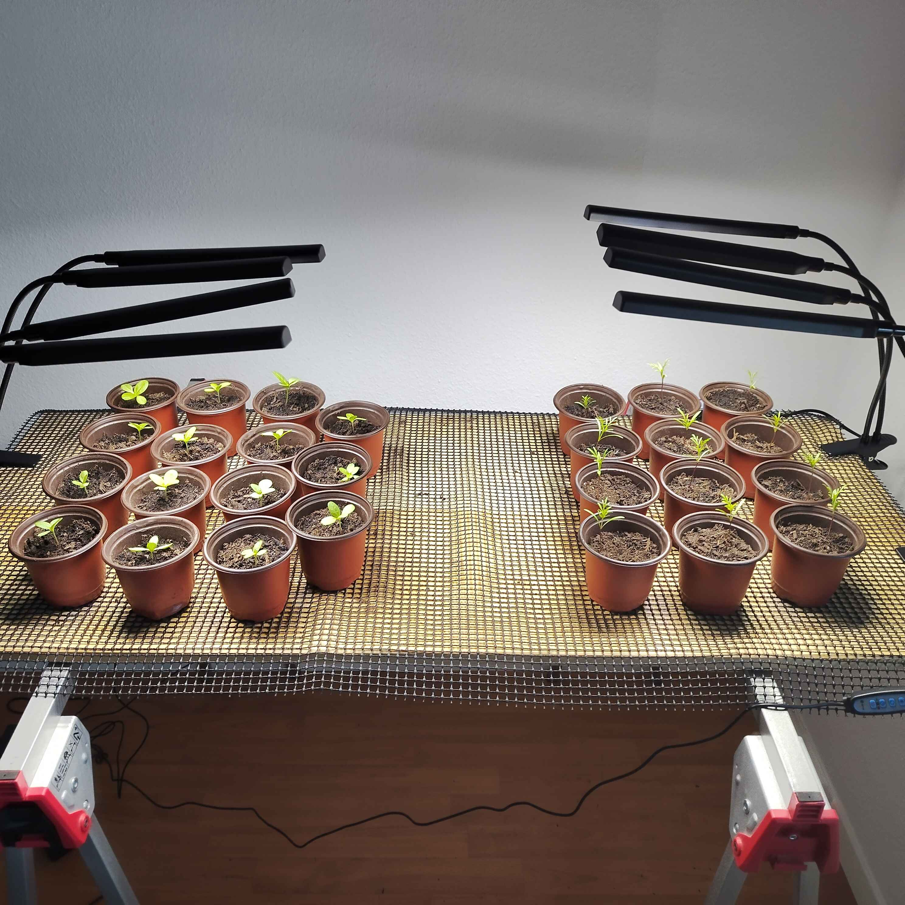

# Emma's Balcony Flower Garden

**Location:** Stuttgart, Germany — Sunny Balcony | **Started:** April 2026 | **Gardener:** Emma (first-time gardener!)

---

Emma is transforming a sunny Stuttgart balcony into a vibrant personal flower garden. What started with a handful of seeds, some bulbs, and a couple of railing planters is growing into a full balcony oasis — more pots, more flowers, more color all summer long.

## What's Growing

| Plant | Type | Bloom Period | Status |
|-------|------|-------------|--------|
| Brodiaea Queen Fabiola | Bulbs (25-pack) | June - August | Planted in railing planters |
| Babiana | Bulbs (15-pack) | Late spring - Summer | Planted in hanging planter |
| Cosmos (Schmuckkörbchen) | Seeds (Tray 1 + Tray 2) | Summer - Fall | Relocated indoors to the new "seedlings room" under Aumtrly lamps (Apr 30) |
| Zinnia (Field Mix) | Seeds (Tray 1 + Tray 2) | Summer - Fall | Light-bleach diagnosed Apr 30 — moved indoors, brightness dialed back, recovering |
| Lavandula angustifolia | Potted plant (Zone B) | June - August | Planted Apr 26 — Zone B sunny wall |
| Sempervivum (mixed 6-pack) | Evergreen succulent (Zone B) | Year-round foliage | Planted in anchor pots, gravel top-dressed |
| Euonymus fortunei | 2x variegated shrubs (Zone A) | Evergreen | Potted in black ex-mint pots (Apr 25) |
| Dianthus (Pink) | 4 plants in 2 grey hanging pots | Spring - Summer | 2 per pot on the railing, first feed Apr 27 |
| Chocolate Mint | Herb - potted | Summer | Thriving + propagating from cuttings |
| Snake plant 'Laurentii' | Houseplant (Michael's Nook) | — | Repotted Apr 26 — 12cm pot |
| Haworthia "Safari" | Succulent (Michael's Nook) | Spring (flower stalk!) | Flower spike + **2 pups** as of Apr 30 — pup #2 spotted at base of lower leaf |
| Mini Pineapple (Ananas nanus) | Bromeliad (Michael's Nook) | — | Repotted Apr 26 — 12cm pot |
| Lavender (Duft-Lavendel, Munstead) | Seeds | Summer | Saved for next season |

## Latest Update — April 30, 2026 — The Seedlings Get Their Own Room

> *"It's their room for real — we even whisper whenever we talk around them."*
>
> A long, busy session that started with the simple observation of a **second aloe pup** on Haworthia "Safari" (now flower spike + 2 pups simultaneously) and ended with a complete relocation of the seedling operation from the balcony window into a dedicated indoor space. The zinnias were diagnosed with **light-bleach** from sun + grow light stacked together (cosmos unaffected, fertilizer paused). **Brodiaea Pot 2** broke ground — first sprout, Day 14 right on schedule. A TEDi run produced an anti-slip mesh mat for table airflow. The 5 **Aumtrly clip-on lamps** (BL-J20B, 10 heads total) arrived and got installed: 4 over Tray 1 on a 12 h cycle at −2 brightness, 1 over Tray 2 on a 16 h full-brightness cycle. Outdoor walk-through was clean — euonymus got decorative birds, lavender is forming flower buds on the spike tips, and the dianthus trio is thriving.

## Project Pages

- [Garden Plan](GARDEN-PLAN) — Full planting schedule, dates, to-do lists, and shopping needs
- [Progress Report](PROGRESS-REPORT) — What's been done so far — session logs and milestones
- [Future Ideas](FUTURE-IDEAS) — Fun future expansions and things to try
- [Gardening Research](GARDENING-RESEARCH) — In-depth growing guides, tips, videos, and tool recommendations
- [Photo Gallery](GALLERY) — The visual journey from supplies to soil to planted bulbs

## Quick Facts

- **Balcony:** Full sun — perfect for all chosen plants
- **Key date:** May 15, 2026 — safe to move seedlings outdoors
- **Philosophy:** More pots = more flowers!

---

*Emma's Balcony — Stuttgart 2026 — First-time Gardener*
*Last updated: April 30, 2026*
