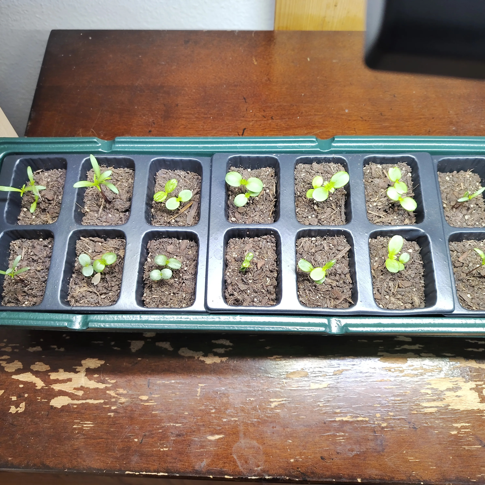
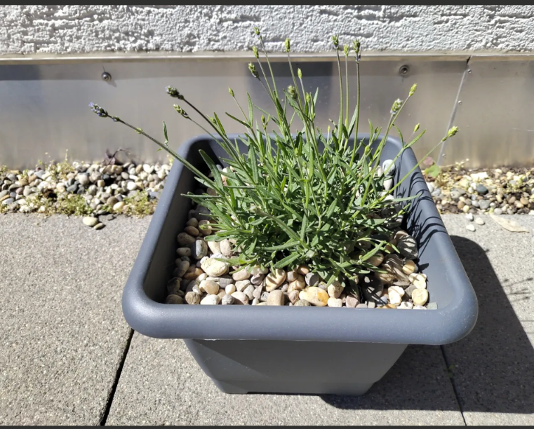

# Emma's Balcony Flower Garden

**Location:** Stuttgart, Germany — Sunny Balcony | **Started:** April 2026 | **Gardener:** Emma (first-time gardener!)

---

Emma is transforming a sunny Stuttgart balcony into a vibrant personal flower garden. What started with a handful of seeds, some bulbs, and a couple of railing planters is growing into a full balcony oasis — more pots, more flowers, more color all summer long.

## What's Growing

| Plant | Type | Bloom Period | Status |
|-------|------|-------------|--------|
| Brodiaea Queen Fabiola | Bulbs (25-pack) | June - August | Both pots viable! Pot 1: 1 shoot, Pot 2: **5 shoots (Day 16)** — momentum building |
| Babiana | Bulbs (15-pack) | Late spring - Summer | Day 13, no growth yet (expected May 11–18). Salt crust will rinse off in the rain |
| Cosmos (Schmuckkörbchen) | Seeds (Tray 1 + Tray 2) | Summer - Fall | Tray 1 visibly **recovering** — color shifting greener, second true leaves on cosmos. Tray 2 textbook, second true leaves emerging |
| Zinnia (Field Mix) | Seeds (Tray 1 + Tray 2) | Summer - Fall | Tray 1 visibly **recovering** — back-right zinnia leading. Tray 2 deep green, on track for May 8–12 pot-up |
| Lavandula angustifolia (Lovely) | Potted plant (Zone B) | June - August | Planted Apr 26 — Zone B sunny wall, flower buds forming |
| Lavandula angustifolia 'Essence Purple' (Itchy + Scratchy) | 4-pack → 2 square grey pots (Zone B) | June - August | Acquired May 4, resting 24 hr — 2+2 repot scheduled May 5 |
| Sempervivum (mixed 6-pack) | Evergreen succulent (Zone B) | Year-round foliage | Planted in anchor pots, gravel top-dressed |
| Euonymus fortunei | 2x variegated shrubs (Zone A) | Evergreen | Potted in black ex-mint pots (Apr 25) |
| Dianthus (Pink) | 4 plants in 2 grey hanging pots | Spring - Summer | 2 per pot on the railing, next feed ~May 11–14 |
| 🐍 Cobra — Sansevieria 'Laurentii' | Houseplant (The Nook) | — | **First watering complete (May 2)** — light edge pour ~50–80ml, healthy turgor |
| 🐅 Machali — Aloe variegata "Safari" | Succulent (The Nook) | Spring (flower spike!) | **Flower spike + 2 pups developing** — deep base water (May 2), no rosette pour |
| 🍍 Phyllis — Mini Pineapple (Ananas nanus) | Bromeliad (The Nook) | Fruiting | **Mother of 5 pups!** — discovered May 2, soil-only watering while fruit + pups establish |
| Lavender (Duft-Lavendel, Munstead) | Seeds | Summer | Saved for next season |

## Latest Update — May 4, 2026 — Solo Recon & the Naming Day

> *"Solo plant shopping is the move when it matters."* A focused **solo OBI run** for Emma — Michael was locked into Monday WFH, so the lavender-expansion mission ran without backup. Came back with a **Lavandula angustifolia 'Essence Purple' 4-pack** (hardy to −20 °C, same species as Lovely) and one spare square grey pot, dodged the wrong-lavender trap (L. stoechas 'Anouk') and three impulse buys (Lima rossa, carnivorous terrarium, TEDi basket pots), and used the quiet evening to lock in a **full plant naming roster** — every plant in the garden now has a name and a zone. Goldy + Frosty in Zone A; Lovely + new pair Itchy + Scratchy in Zone B; Pinky, Gilly, Big Sissy, Lil Sissy, and Baboon on the railing; 🐍 COBRA, 🍍 PHYLLIS, and 🐅 MACHALI in the Nook. Itchy + Scratchy resting 24 hr before tomorrow's 2+2 repot.

> **Content is user-generated and unverified.**

## Project Pages

- [Garden Plan](GARDEN-PLAN) — Full planting schedule, dates, to-do lists, and shopping needs
- [Progress Report](PROGRESS-REPORT) — What's been done so far — session logs and milestones
- [Future Ideas](FUTURE-IDEAS) — Fun future expansions and things to try
- [Gardening Research](GARDENING-RESEARCH) — In-depth growing guides, tips, videos, and tool recommendations
- [Photo Gallery](GALLERY) — The visual journey from supplies to soil to planted bulbs

## Quick Facts

- **Balcony:** Full sun — perfect for all chosen plants
- **Key date:** May 15, 2026 — safe to move seedlings outdoors
- **Philosophy:** More pots = more flowers!

---

*Emma's Balcony — Stuttgart 2026 — First-time Gardener*
*Last updated: May 4, 2026*
