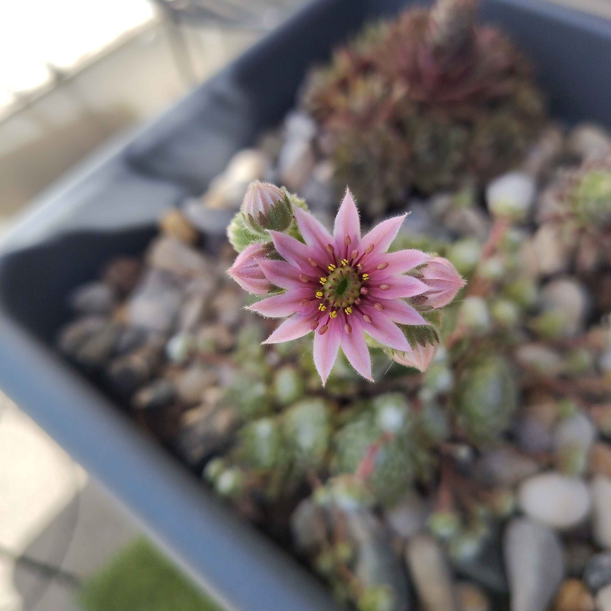
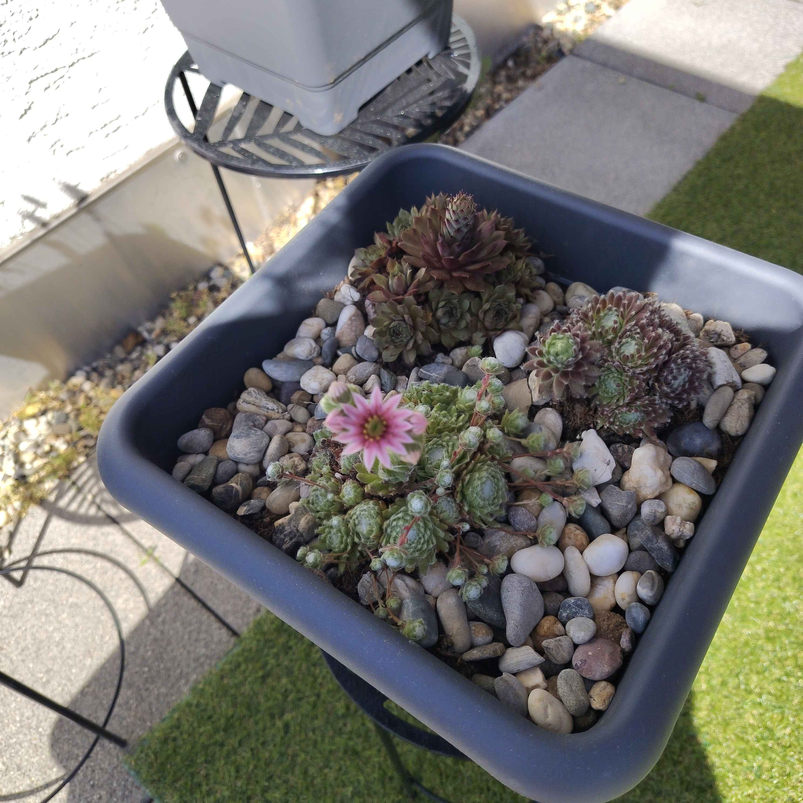

# Emma's Balcony Flower Garden

**Location:** Stuttgart, Germany — Sunny Balcony | **Started:** April 2026 | **Gardener:** Emma (first-time gardener!)

---

Emma is transforming a sunny Stuttgart balcony into a vibrant personal flower garden. What started with a handful of seeds, some bulbs, and a couple of railing planters is growing into a full balcony oasis — more pots, more flowers, more color all summer long.

## What's Growing

| Plant | Type | Bloom Period | Status |
|-------|------|-------------|--------|
| Brodiaea Queen Fabiola | Bulbs (25-pack) | June - August | Both pots active — continue monitoring growth |
| Babiana | Bulbs (15-pack) | Late spring - Summer | Post-emergence — continue monitoring growth |
| Cosmos (Schmuckkörbchen) | Seeds (Tray 1 + Tray 2) | Summer - Fall | **Hardening off Day 3** — catching direct sun, stems visibly thickening. Transplant to 52L bins ~May 29 |
| Zinnia (Field Mix) | Seeds (Tray 1 + Tray 2) | Summer - Fall | **Hardening off Day 3** — standing upright in shade, sturdy. First direct-sun exposure late afternoon today |
| Lavandula angustifolia (Lovely) | Potted plant (Zone B) | June - August | Water only when soil reads dry; lean and infrequent |
| Lavandula angustifolia 'Essence Purple' (Itchy + Scratchy) | 2 square grey pots (Zone B) | June - August | Water only when soil reads dry; lean and infrequent |
| Sempervivum — Chicks (Pot 1) | Evergreen succulent (Zone B) | Year-round foliage | **3 mothers × 15–20 chicks** — colony multiplying as designed |
| Sempervivum — Side Chicks (Pot 2, cobweb / S. arachnoideum) | Evergreen succulent (Zone B) | Monocarpic bloom event | **FIRST BLOOM May 28** — pink star-shaped flower opened on the scape, more buds queued. Monocarpic death bloom; mother rosette will die, chicks replace |
| Euonymus fortunei (Goldy + Frosty) | 2x variegated shrubs (Zone A) | Evergreen | Spring flush active. Frosty has a solid-green reversion shoot — optional snip to preserve variegation |
| Dianthus (Pinky + Gilly) | 4 plants in 2 grey hanging pots | Spring - Summer | Fertilizer tonight May 28 — half strength (6ml/1.5L), 750ml per pot. On every-2-week feed cycle |
| 🐍 Cobra — Sansevieria 'Laurentii' | Houseplant (The Nook) | — | Next water ~June 9. Light edge-pour ~50–80ml |
| 🐅 Machali — Aloe variegata "Safari" | Succulent (The Nook) | Spring (flower spike!) | **Flower spike + 2 pups developing** — next water ~June 9. Deep edge watering, no rosette pour |
| 🍍 Phyllis — Mini Pineapple (Ananas nanus) | Bromeliad (The Nook) | Fruiting | **Mother of 5 pups** — next water ~June 1. Soil-only, no rosette cup pour |
| Lavender (Duft-Lavendel, Munstead) | Seeds | Summer | Saved for next season |

## Latest Update — May 28, 2026 — Side Chick Blooms

> *"The hidden chapter most people never see."* Side Chick (Sempervivum) opened her first flower this morning — a star-shaped pink bloom caught on opening day, with pointed petals fading from deeper rose at the center to pale blush at the tips. Sempervivum flowers are genuinely rare to witness: a rosette may take years to flower, and many growers snip the stalk before it opens. The bittersweet side — Sempervivum are **monocarpic**, so the flowering rosette will die after blooming. But she's already raised a ring of chicks to carry on. Meanwhile, **hardening off is on Day 3** — zinnias standing upright in shade, cosmos catching direct sun with stems visibly thickening. **Supplies are staging for tomorrow's transplant** — soil arrived early, four 52L bins ready, bamboo stakes expected today. Tonight: Dianthus fertilizer (Pinky + Gilly only, half strength). The garden is shifting from indoor nursery to outdoor production mode.

> **Content is user-generated and unverified.**

## Project Pages

- [Garden Plan](GARDEN-PLAN) — Full planting schedule, dates, to-do lists, and shopping needs
- [Progress Report](PROGRESS-REPORT) — What's been done so far — session logs and milestones
- [Future Ideas](FUTURE-IDEAS) — Fun future expansions and things to try
- [Gardening Research](GARDENING-RESEARCH) — In-depth growing guides, tips, videos, and tool recommendations
- [Photo Gallery](GALLERY) — The visual journey from supplies to soil to planted bulbs

## Quick Facts

- **Balcony:** Full sun — perfect for all chosen plants
- **Key date:** Transplant Tray 1 into 52L bins ~May 29 (evening cool)
- **Philosophy:** More pots = more flowers!

---

*Emma's Balcony — Stuttgart 2026 — First-time Gardener*
*Last updated: May 28, 2026*
