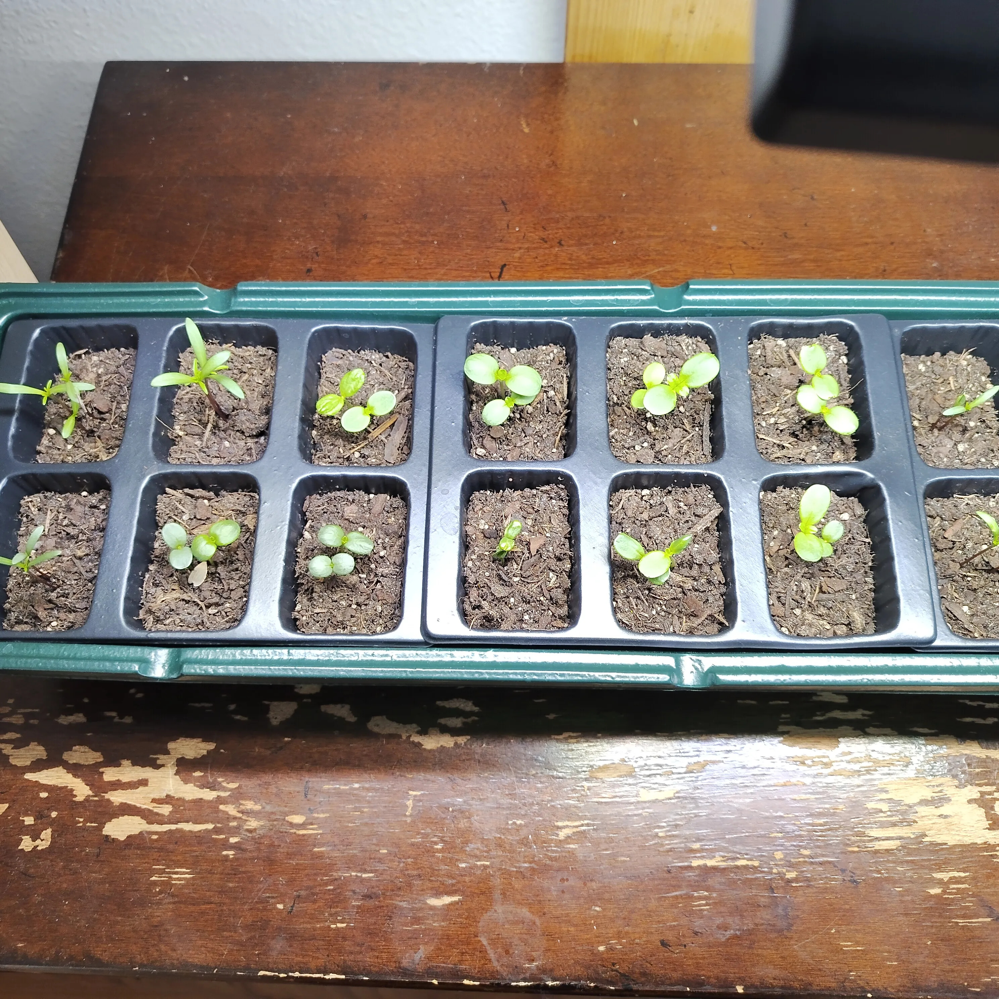
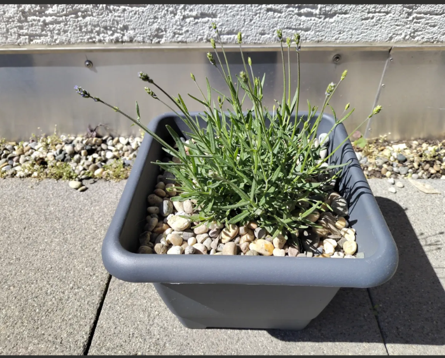

# Emma's Balcony Flower Garden

**Location:** Stuttgart, Germany — Sunny Balcony | **Started:** April 2026 | **Gardener:** Emma (first-time gardener!)

---

Emma is transforming a sunny Stuttgart balcony into a vibrant personal flower garden. What started with a handful of seeds, some bulbs, and a couple of railing planters is growing into a full balcony oasis — more pots, more flowers, more color all summer long.

## What's Growing

| Plant | Type | Bloom Period | Status |
|-------|------|-------------|--------|
| Brodiaea Queen Fabiola | Bulbs (25-pack) | June - August | Both pots active — Big Sissy (Pot 2) multi-shoot cluster, **Lil Sissy (Pot 1) +2 new sprouts (May 11)** — staggered emergence continuing |
| Babiana | Bulbs (15-pack) | Late spring - Summer | **FIRST EMERGENCE May 12** — 2 pale yellow-white fuzzy tips revealed after dry crust scrape (Day 2 of May 11–18 window) |
| Cosmos (Schmuckkörbchen) | Seeds (Tray 1 + Tray 2) | Summer - Fall | T1 cosmos toddlers at multi-leaf stage; T2 cotyledon + first true leaves. Lights 15–20 cm clearance, no legginess |
| Zinnia (Field Mix) | Seeds (Tray 1 + Tray 2) | Summer - Fall | T1 zinnias filling in nicely; T2 cotyledon + first true leaves. Healthy under multi-arm Aumtrly array |
| Lavandula angustifolia (Lovely) | Potted plant (Zone B) | June - August | **~15–20 spikes** — peak bloom developing, vertical vase-shaped habit. Bloom free, deadhead post-bloom |
| Lavandula angustifolia 'Essence Purple' (Itchy + Scratchy) | 2 square grey pots (Zone B) | June - August | **Day 6 post-repot** — Itchy ~12–15 spikes bushy/spreading; Scratchy ~8–10 spikes with 3 leaders, upright. PINCH ALL spikes this week |
| Sempervivum — Chicks (Pot 1) | Evergreen succulent (Zone B) | Year-round foliage | **3 mothers × 15–20 chicks** — colony multiplying as designed |
| Sempervivum — Side Chicks (Pot 2, cobweb / S. arachnoideum) | Evergreen succulent (Zone B) | Monocarpic bloom event | **5–6 flower stalks pushing** — monocarpic event underway, rosettes bloom-and-die over 4–8 wk, chicks replace |
| Euonymus fortunei (Goldy + Frosty) | 2x variegated shrubs (Zone A) | Evergreen | **Spring flush active** — new leaf clusters, latent buds, aerial rootlet initials documented (May 12) |
| Dianthus (Pinky + Gilly) | 4 plants in 2 grey hanging pots | Spring - Summer | **Peak bloom density 24hr post-feed (May 12)** — refined 75ml syringe technique validated. Next feed Thursday May 28 |
| 🐍 Cobra — Sansevieria 'Laurentii' | Houseplant (The Nook) | — | Next watering window May 20–23 (during trip — pre-trip top-up planning) |
| 🐅 Machali — Aloe variegata "Safari" | Succulent (The Nook) | Spring (flower spike!) | **Flower spike + 2 pups developing** — next watering window May 17–20 (during trip) |
| 🍍 Phyllis — Mini Pineapple (Ananas nanus) | Bromeliad (The Nook) | Fruiting | **Mother of 5 pups** — next watering window May 11–14 (Day 11 today, soon), soil-only |
| Lavender (Duft-Lavendel, Munstead) | Seeds | Summer | Saved for next season |

## Latest Update — May 12, 2026 — Baboon Wakes Up, Three Lavenders, and the Hard-Water Lesson

> *"Bare-minimum care is still care — and sometimes the garden quietly stacks five firsts in one morning."* A full wellness-check sweep turned into one of the most milestone-dense sessions of the season. **Baboon (Babiana) finally emerged** — two pale yellow-white fuzzy tips revealed after a dry surface scrape cleared a hard-water calcium crust (Day 2 of the May 11–18 window). **Lil Sissy pushed two new Brodiaea sprouts**, the staggered emergence continuing. **Pinky + Gilly hit peak bloom density** 24 hr after a refined 75 ml syringe feed — the new technique landed every drop, zero runoff. **Goldy + Frosty showed spring flush** plus aerial rootlet initials along the stems — Euonymus fortunei's climber genetics still expressing in a tidy pot. **Itchy and Scratchy at Day 6 post-repot** revealed two distinct growth personalities — Itchy bushy and spreading with ~12–15 spikes, Scratchy upright with 3 leaders and ~8–10 spikes — both queued for full spike-pinch this week (Year 1 root + woody-base priority). **Side Chicks pushed 5–6 monocarpic flower stalks** — cobweb Sempervivum bloom-and-die cycle now running, chicks already in place to replace. And the **outdoor transplant plan finally took shape** — mixed configuration, Compo Sana from Amazon pre-trip, execution ~May 27.

> **Content is user-generated and unverified.**

## Project Pages

- [Garden Plan](GARDEN-PLAN) — Full planting schedule, dates, to-do lists, and shopping needs
- [Progress Report](PROGRESS-REPORT) — What's been done so far — session logs and milestones
- [Future Ideas](FUTURE-IDEAS) — Fun future expansions and things to try
- [Gardening Research](GARDENING-RESEARCH) — In-depth growing guides, tips, videos, and tool recommendations
- [Photo Gallery](GALLERY) — The visual journey from supplies to soil to planted bulbs

## Quick Facts

- **Balcony:** Full sun — perfect for all chosen plants
- **Key date:** May 20–25 trip → outdoor transplant ~May 27 (post-trip)
- **Philosophy:** More pots = more flowers!

---

*Emma's Balcony — Stuttgart 2026 — First-time Gardener*
*Last updated: May 12, 2026*
