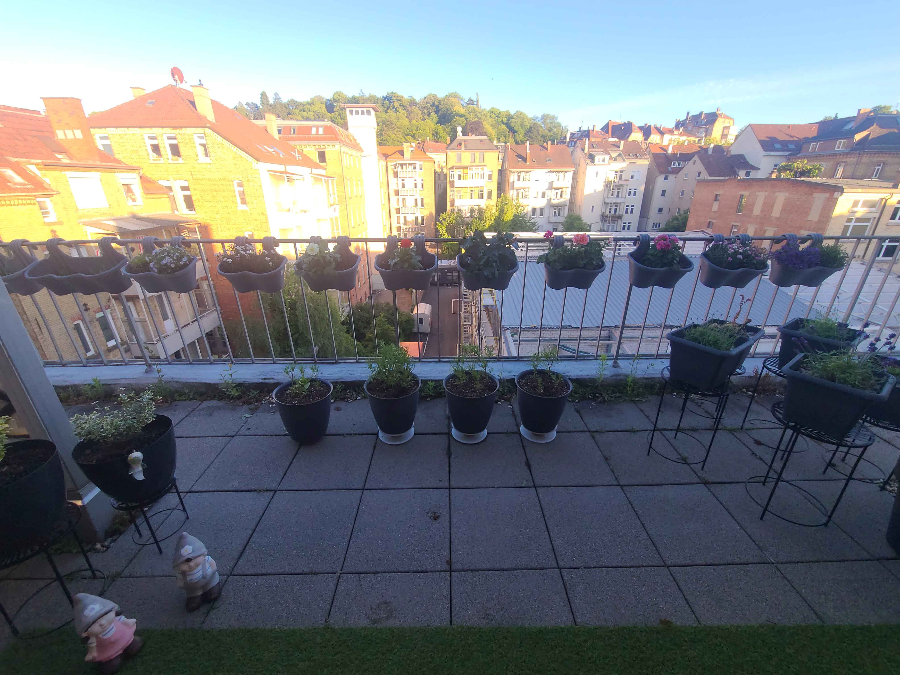
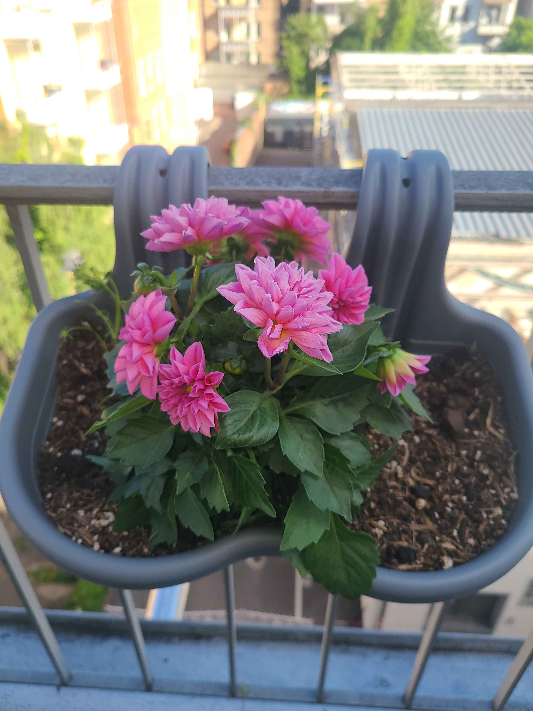
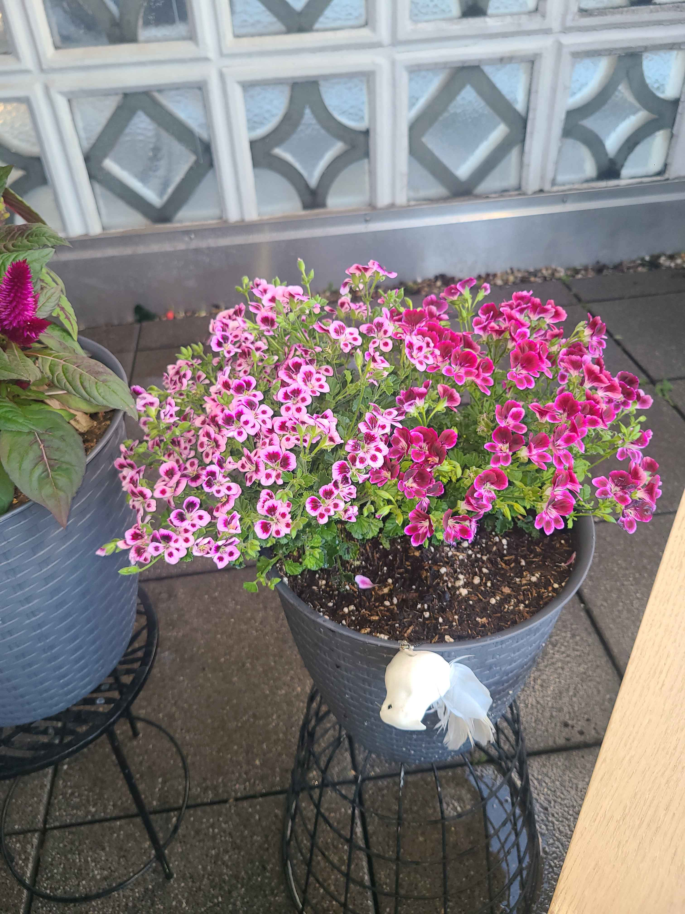
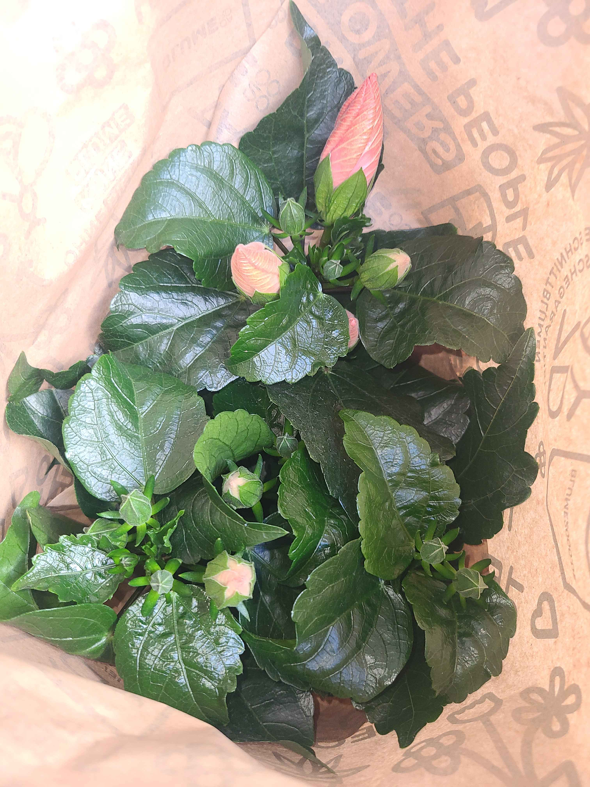
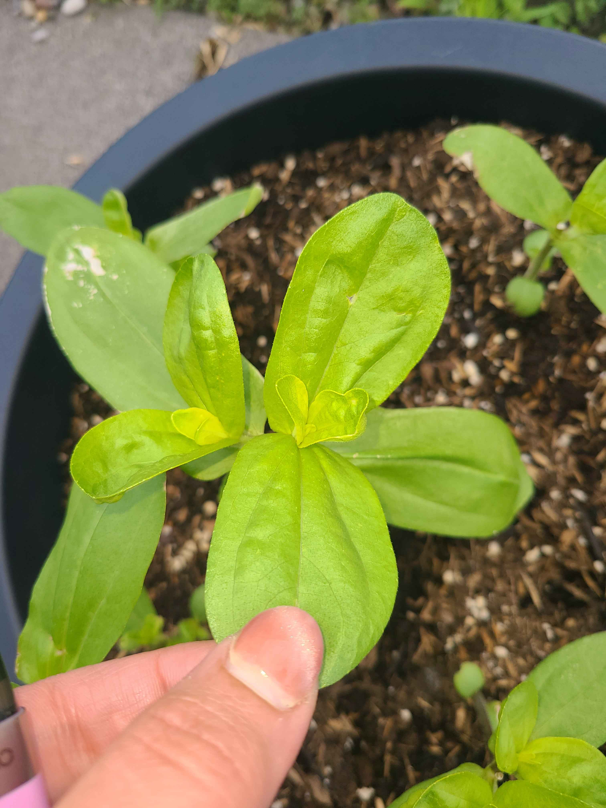

# Emma's Balcony Flower Garden

**Location:** Stuttgart, Germany — Sunny Balcony | **Started:** April 2026 | **Gardener:** Emma (first-time gardener!)

---

Emma is transforming a sunny Stuttgart balcony into a vibrant personal flower garden. What started with a handful of seeds, some bulbs, and a couple of railing planters is growing into a full balcony oasis — more pots, more flowers, more color all summer long.

## What's Growing

| Plant | Type | Bloom Period | Status |
|-------|------|-------------|--------|
| Brodiaea Queen Fabiola | Bulbs (25-pack) | June - August | Both pots active — continue monitoring growth |
| Babiana | Bulbs (15-pack) | Late spring - Summer | Post-emergence — continue monitoring growth |
| Cosmos (Schmuckkörbchen) | Big 52L bins on printed risers | Summer - Fall | Romping ahead — branching hard from the pinch, kept lean (lean soil = more flowers); unbothered by the cold/wet |
| Zinnia (Field Mix) | 4× bins under the wall overhang, raised | Summer - Fall | Recovering from cold (9–11°C nights) + wet stress — moved sheltered and raised to drain. New growth at centres; feed on hold until warm |
| 🌸 Dahlia trio (pink + red + white) | 3× grey pots on the railing | Summer | Pink anchor in full bloom; red + white potted June 13, settling in. On the ~July 23 feed plan |
| 🌺 Jemima — Hibiscus rosa-sinensis | Spare wavy pot, full-sun railing | Summer | Surprise gift (June 13) — salmon-pink buds opening. Stays put once settled (drops buds when moved) |
| 🌼 Zola Couple — zonal geraniums (salmon + magenta) | Shared wavy pot, full-sun railing | Summer | Both blooming; heat/drought-tough, neglect-proof — the Verona-trip insurance |
| 💗 Bella Donna — Angel pelargoniums (light pink + dark magenta) | Woven pot, part-shade pocket | Summer | Cascade of bicolour blooms; part-shade beside the Gorgeous Couple (Coleus is the litmus test) |
| 🤍💙 Campanula (white + light blue) | Left grey hanging pot | Summer | One fused root — no division; hard-pinched after first flush, fed June 10 to drive rebound |
| 💜 Campanula (purple pair) | Right grey hanging pot | Summer | Bold trailing colour. On the ~July 23 feed plan |
| 🔥 Celosia + 🍃 Coleus (Gorgeous Couple) | Potted, on a stand (part-shade) | Summer | Settled on their stand; Coleus kept evenly moist. Angels now share the pocket. On the ~July 23 feed plan |
| Lavandula angustifolia (Lovely) | Potted plant (Zone B) | June - August | Water only when soil reads dry; lean and infrequent |
| Lavandula angustifolia 'Essence Purple' (Itchy + Scratchy) | 2 square grey pots (Zone B) | June - August | Water only when soil reads dry; lean and infrequent |
| Sempervivum — Chicks (Pot 1) | Evergreen succulent (Zone B) | Year-round foliage | **3 mothers × 15–20 chicks** — colony multiplying as designed |
| Sempervivum — Side Chicks (Pot 2, cobweb / S. arachnoideum) | Evergreen succulent (Zone B) | Monocarpic bloom event | **In bloom** — pink star flowers on bolting towers; monocarpic, so flowering rosettes die and chicks replace. Tidy spent rosettes as they go papery |
| Euonymus fortunei (Goldy + Frosty) | 2x variegated shrubs (Zone A) | Evergreen | Light tip-pinch June 10 for branching. Frosty's solid-green reversion shoot — optional snip to preserve variegation |
| Dianthus (Pinky + Gilly) | 4 plants in 2 grey hanging pots | Spring - Summer | Fed June 10 (brought forward ahead of rain). Deadhead rain-spent blooms; stays in full sun |
| 🐍 Cobra — Sansevieria 'Laurentii' | Houseplant (The Nook) | — | On the ~3-week water cycle. Light edge-pour ~50–80ml |
| 🐅 Machali — Aloe variegata "Safari" | Succulent (The Nook) | Spring (flower spike!) | **Flower spike + 2 pups developing** — deep edge watering, no rosette pour |
| 🍍 Phyllis — Mini Pineapple (Ananas nanus) | Bromeliad (The Nook) | Fruiting | **Fruit coloring up, pups healthy** — biweekly soil drink, no rosette cup pour, Michael's stake holding her straight |
| Lavender (Duft-Lavendel, Munstead) | Seeds | Summer | Saved for next season |

## Latest Update — June 13, 2026 — Potting Day, a Sweet Surprise, and a Balcony Full of Life

> A joke about walking past OBI on June 11 turned into **six new plants and five pots** — two dwarf dahlias (red & white) to complete a railing **dahlia trio**, two neglect-proof **zonal geraniums** (the "Zola Couple"), and two pansy-faced **Angel pelargoniums** ("Bella Donna") for the part-shade pocket. That night also brought a **zinnia rescue**: their wrinkly, pale new growth was re-diagnosed as **cold (9–11 °C June nights) plus waterlogging**, not sun — so the four pots moved under the wall overhang and got raised ~4 cm to drain (the puddle that poured out was the receipt). By **June 13** the sun was back and everything got potted: the dahlia trio on the railing, the Zola Couple sharing a full-sun pot, Bella Donna flowering its heart out in part-shade — and a surprise gift from Michael, a **Hibiscus rosa-sinensis named Jemima**, salmon-pink buds about to open, on the full-sun railing. The zinnias checked out healthy (firm stems, new growth at the centres); the puckered old leaves are just cosmetic. Golden hour over a balcony that's grown fast and is loved every bit.

> **Content is user-generated and unverified.**

The dahlia trio's pink anchor in full bloom, and Bella Donna — the Angel pelargoniums — under a cascade of bicolour flowers:

Jemima the surprise hibiscus, and the cold-stressed zinnia growth that prompted the June 11 rescue:

*(Earlier sessions: the June 2 storm/haul, the June 4 fused-root potting day, and the June 10 grey-sky tour — see the [Photo Gallery](GALLERY) for the full story.)*

## Project Pages

- [Garden Plan](GARDEN-PLAN) — Full planting schedule, dates, to-do lists, and shopping needs
- [Progress Report](PROGRESS-REPORT) — What's been done so far — session logs and milestones
- [Future Ideas](FUTURE-IDEAS) — Fun future expansions and things to try
- [Gardening Research](GARDENING-RESEARCH) — In-depth growing guides, tips, videos, and tool recommendations
- [Photo Gallery](GALLERY) — The visual journey from supplies to soil to planted bulbs

## Quick Facts

- **Balcony:** Full sun — perfect for all chosen plants
- **Key dates:** Verona trip July 2–6 (watering spikes set); new plants' first feed ~July 23 (after the Compo Sana buffer)
- **Philosophy:** More pots = more flowers!

---

*Emma's Balcony — Stuttgart 2026 — First-time Gardener*
*Last updated: June 13, 2026*
