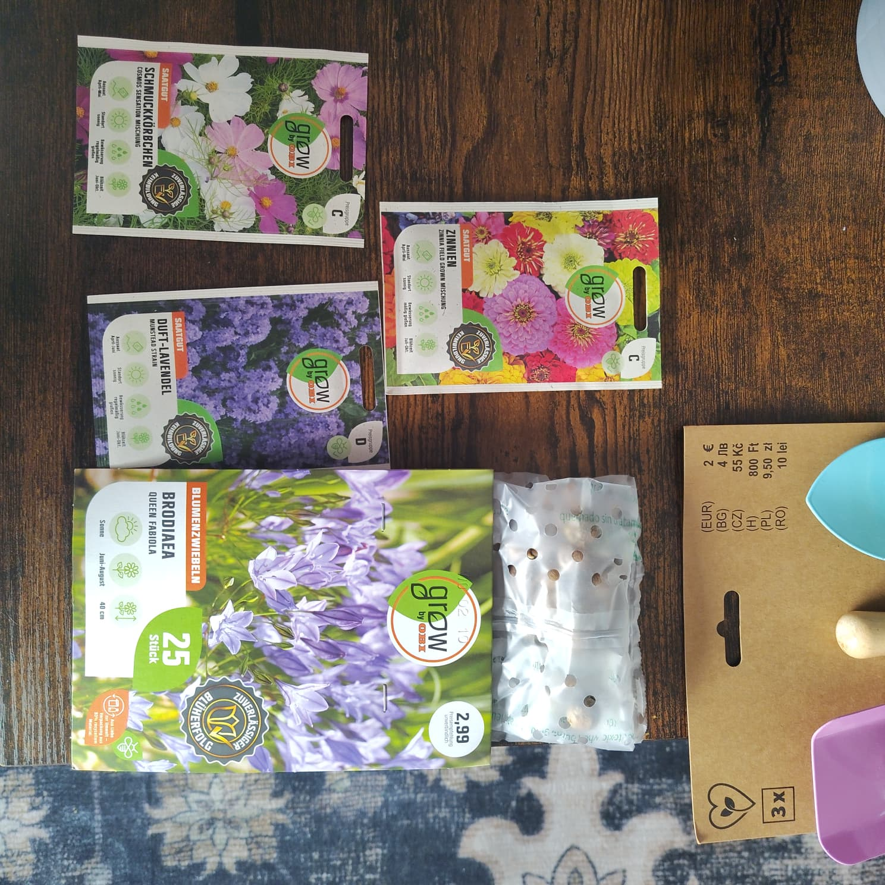
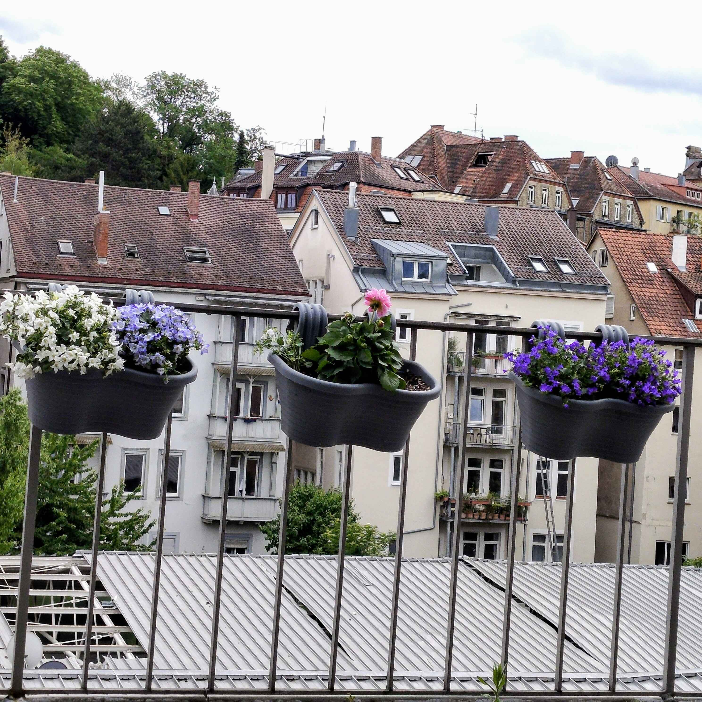
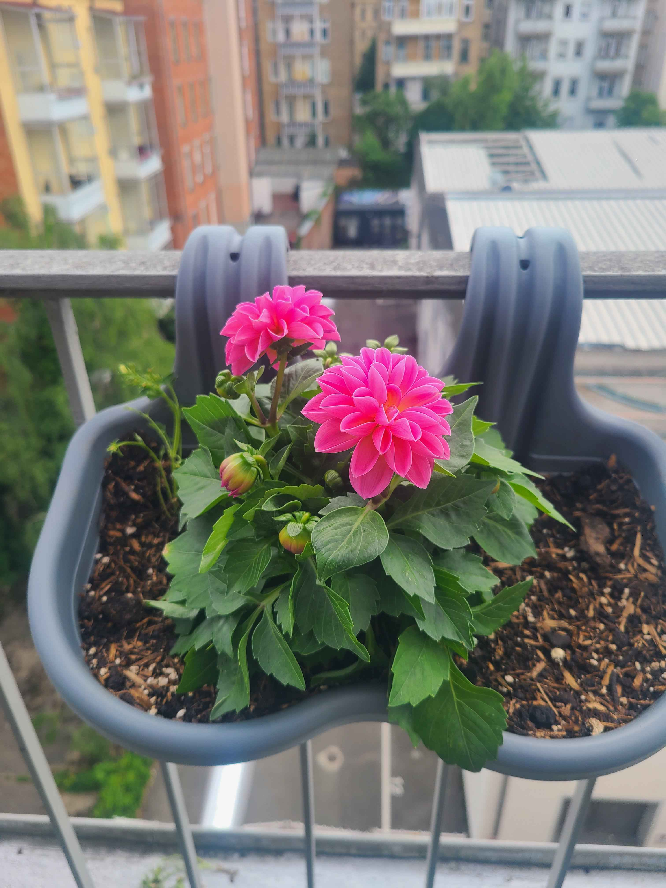
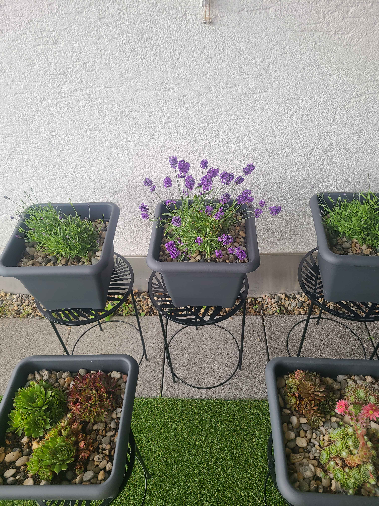
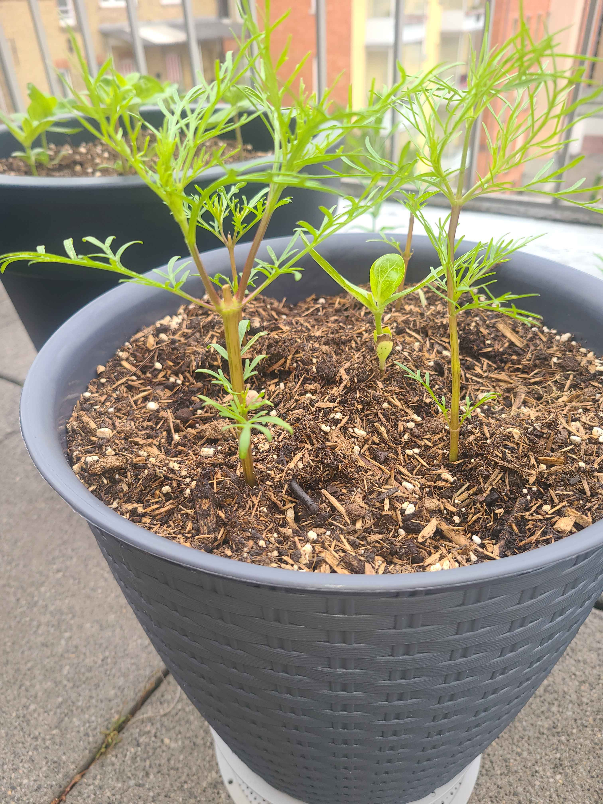
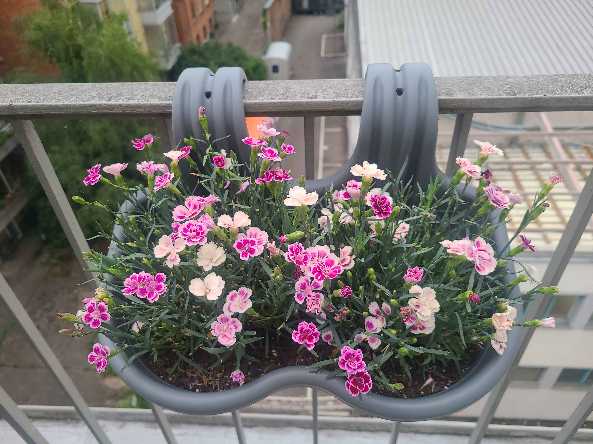

# Emma's Balcony Flower Garden

**Location:** Stuttgart, Germany — Sunny Balcony | **Started:** April 2026 | **Gardener:** Emma (first-time gardener!)

---

Emma is transforming a sunny Stuttgart balcony into a vibrant personal flower garden. What started with a handful of seeds, some bulbs, and a couple of railing planters is growing into a full balcony oasis — more pots, more flowers, more color all summer long.

## What's Growing

| Plant | Type | Bloom Period | Status |
|-------|------|-------------|--------|
| Brodiaea Queen Fabiola | Bulbs (25-pack) | June - August | Both pots active — continue monitoring growth |
| Babiana | Bulbs (15-pack) | Late spring - Summer | Post-emergence — continue monitoring growth |
| Cosmos (Schmuckkörbchen) | Big 52L bins on printed risers | Summer - Fall | Romping ahead — branching hard from the pinch, kept lean (lean soil = more flowers) |
| Zinnia (Field Mix) | 4× big bins on printed risers | Summer - Fall | Bushing out from the pinch — new lateral growth clean; old-leaf scorch is cosmetic, one-time |
| 🌸 Dahlia (compact patio, pink) | Middle grey hanging pot | Summer | First blooms open (June 9), buds queued. On the July 23 feed plan |
| 🤍💙 Campanula (white + light blue) | Left grey hanging pot | Summer | One fused root — no division; hard-pinched after first flush, fed June 10 to drive rebound |
| 💜 Campanula (purple pair) | Right grey hanging pot | Summer | Bold trailing colour. On the July 23 feed plan |
| 🔥 Celosia + 🍃 Coleus (Gorgeous Couple) | Nursery pots → replacement pot | Summer | Awaiting new pot after the June 4 drilling crack; watered, Coleus kept evenly moist |
| Lavandula angustifolia (Lovely) | Potted plant (Zone B) | June - August | Water only when soil reads dry; lean and infrequent |
| Lavandula angustifolia 'Essence Purple' (Itchy + Scratchy) | 2 square grey pots (Zone B) | June - August | Water only when soil reads dry; lean and infrequent |
| Sempervivum — Chicks (Pot 1) | Evergreen succulent (Zone B) | Year-round foliage | **3 mothers × 15–20 chicks** — colony multiplying as designed |
| Sempervivum — Side Chicks (Pot 2, cobweb / S. arachnoideum) | Evergreen succulent (Zone B) | Monocarpic bloom event | **In bloom** — pink star flowers on bolting towers; monocarpic, so flowering rosettes die and chicks replace. Tidy spent rosettes as they go papery |
| Euonymus fortunei (Goldy + Frosty) | 2x variegated shrubs (Zone A) | Evergreen | Light tip-pinch June 10 for branching. Frosty's solid-green reversion shoot — optional snip to preserve variegation |
| Dianthus (Pinky + Gilly) | 4 plants in 2 grey hanging pots | Spring - Summer | Fed June 10 (brought forward ahead of rain). Deadhead rain-spent blooms; stays in full sun |
| 🐍 Cobra — Sansevieria 'Laurentii' | Houseplant (The Nook) | — | On the ~3-week water cycle. Light edge-pour ~50–80ml |
| 🐅 Machali — Aloe variegata "Safari" | Succulent (The Nook) | Spring (flower spike!) | **Flower spike + 2 pups developing** — deep edge watering, no rosette pour |
| 🍍 Phyllis — Mini Pineapple (Ananas nanus) | Bromeliad (The Nook) | Fruiting | **Fruit coloring up, pups healthy** — biweekly soil drink, no rosette cup pour, Michael's stake holding her straight |
| Lavender (Duft-Lavendel, Munstead) | Seeds | Summer | Saved for next season |

## Latest Update — June 10, 2026 — Grey-Sky Full Tour & the Feed Ahead of the Rain

> A cool, overcast Wednesday turned into a full plant-by-plant tour of the whole crew, with the Thursday feed **brought forward a day** to get ahead of the coming rain. The **zinnia pinch is paying off** — fresh lateral growth from every leaf node, while the old-leaf scorch turned out to be a finished, one-time event (indoor-grown leaves with thin cuticles meeting real sun), not a disease — leave it. The **cosmos** are romping on their new risers, kept lean. **Pinky & Gilly's** "empty" flowers were re-diagnosed as rain batter plus a bloom-lag from the earlier heat spell, not this week's cool weather — deadhead and keep them in the sun. The **Sempervivum** troughs are flowering, **Lovely** is in full purple while the first-year lavenders build, and the feed (half-strength Compo BIO, onto damp soil with a 24-hour head start before the rain) went to the Dianthus, cosmos, zinnias, and the post-pinch white/blue Campanula. Plus a clever upgrade: Michael's **3D-printed honeycomb risers** to elevate the bins in style.

> **Content is user-generated and unverified.**

The railing finally has its summer colours — and by June 9 the Dahlia in the middle pot had opened her first pink blooms:

The group shot of the day — three lavender troughs on stands with the two Sempervivum trays anchoring the front, Lovely in full purple bloom while the first-year pair build for next year:

The cosmos romping on their printed risers, and Pinky & Gilly full of bloom on the railing:

*(Earlier in the week: the June 2 OBI haul and the June 4 potting day — see the [Photo Gallery](GALLERY) for the full story, storm and fused root included.)*

## Project Pages

- [Garden Plan](GARDEN-PLAN) — Full planting schedule, dates, to-do lists, and shopping needs
- [Progress Report](PROGRESS-REPORT) — What's been done so far — session logs and milestones
- [Future Ideas](FUTURE-IDEAS) — Fun future expansions and things to try
- [Gardening Research](GARDENING-RESEARCH) — In-depth growing guides, tips, videos, and tool recommendations
- [Photo Gallery](GALLERY) — The visual journey from supplies to soil to planted bulbs

## Quick Facts

- **Balcony:** Full sun — perfect for all chosen plants
- **Key date:** New plants' first feed July 23 (after the Compo Sana 7-week buffer)
- **Philosophy:** More pots = more flowers!

---

*Emma's Balcony — Stuttgart 2026 — First-time Gardener*
*Last updated: June 10, 2026*
